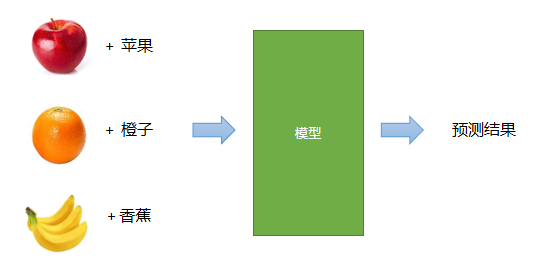

# 一、人工智能课程概述

## 1. 什么是人工智能

人工智能（Artificial Intelligence）是计算机科学的一个分支学科，主要研究用计算机模拟人的 "思考方式" 和 "行为方式"，从而在某些领域 "代替"人进行工作

```javascript
/**

代替： 让机器 做部分

替代： 不要人了，只要机器。

*/

/** 当前所处于的阶段

弱人工智能（当前阶段）
		  （单一职责：下棋的只能下棋，不能看天气）

强人工智能

超人工智能（比人更强）


*/
```

## 2. 人工智能的学科体系

以下是人工智能学科体系图：


- 机器学习（Machine Learning）：人工智能的一个子学科，研究人工智能领域的基本算法、原理、思想方法，机器学习研究的内容在其它子学科都会用到

  ```javascript
  阿尔法狗就是基于 “深度学习”做的 “强化学习”
  
  机器学习：//把学习能力赋予机器
  		做一些算法
  
  		//=========
  		传统机器学习
  		深度学习
  
  		//=========从学习角度
  		监督学习
  		无监督学习
  
  		//=======
  		强化学习
  		阿尔法狗就是苦于  "深度学习"  做的 "强化学习"    
  
  ```

- 计算机视觉（Computer Vision）：研究计算机处理、识别、理解图像、视频的相关技术

  ```javascript
    如何让机器理解  "图像" 和  "视频" 中的内容
    //"视频"的 本质就是一帧一帧的图像，快速播放
    //====================有哪些角度
  		（1）最简单的场景： "图像分类"
  			//这张图是属于什么类别
  		（2）局部图像， "目标检测"
          	//整张图的局部分类
  		（3）图像分割
          	//精确定位，拿到某个物体的精细轮廓。
  		（4）拍照识别
          	//身价证扫描
              //App绑定身价证
          	识别身价证上面的卡号是什么，
              //这种技术
         	    如何识别图像上面的 "文字"， 
              并把 "文字" 提取出来的技术，
              就叫 "光学字符识别-OCR"，它也会结合 "自然语言处理" 来完成一些任务
  ```

- 自然语言处理（Natural Language Processing）：研究计算机理解人类自然语言的相关技术

  ```javascript
        自然语言指：
        		人说的话
        		人写的文章
        		中文、英文这些复杂的语言符号
        		
        让机器 理解人类说话，人类写的文章。
        它比 "计算机器视角" 更复杂，
        因为 "图片" 和 "视屏内容" 是固定的，拍的什么就是什么像素值，什么的是固定的
  
        而语言的组合是不固定的每套语言的规则不一样，表达也不一样。
        相对复杂点， ChatGPT，
  
        "自然语言处理" 被称为：人工智能皇冠上的明珠
  
         图灵测试：
            		最早测试 "机器人是否有智能" 的时候，
                  就是使用 "自然语言处理" 来作来标准的
            		人提出来一个问题：
            			回答这个问题的 "可能是人" ，也可能 “是机器人”
            			如果分辨不出来，就表示这个机器 通过了图灵测试
         
           由于 “自然语言处理” 的特殊性，发展速度要比自然语言处理慢一些。
           
           每种语言的复杂程序也是不一样的
            
            
           一些场景
           汉语：
            		动物保护警察
                  张平平案例到家了
            		干的漂亮
  
            基于 "统计规则" 统计
  
  ```

- 语音处理：研究计算机理解识别、理解、合成语音的相关技术

      文本转语音
       语音转文本
    
       不同民族、方言。

     ```javascript
     		
     文本转语音、语音转文本。
     		
     ```

     

- 专家系统：

  ```javascript
       收集某个行业里专家的解决方案。
  ```

- 规划与推理：

  ```javascript
       导航系统路径规划。
  ```

## 3. 人工智能与传统软件的区别

- 传统软件：

  ```javascript
       执行人的指令和想法，在执行之前人已经有了解决方案，
       无法超越 "人的思想" 和 "认识范围"。
  ```

- 人工智能：

  ```javascript
      尝试突破 "人的思想" 和 "认识范围"，
      让计算机学习到 "新的能力"，尝试解决 "传统软件的难题"。
  ```

## 4. 课程介绍

### 1）课程内容

课程内容主要包括：


```javascript
课程三大内容：
	理论:
		机器学习
        深度学习
	应用
    	计算机视觉：学习 "图像" 中的内容
        自然语言处理：学习 "自然语言处理" 相关内容
	框架
    	//写代码要依赖于框架
        sklearn //机器学习
        
        Tensorflow//深度学习Goole
        飞桨//深度学习百度
        Pytorch//深度学习Pytorch
```


### 2）课程特点

- 内容多：包括机器学习、深度学习、计算机视觉、NLP、常用框架
- 难度大：学习难度较大，入门难、提高难、应用难
- 需要部分数学知识：记住结论、会调用API、能分析公式、公式推导
- 需要反复学习：第一轮听懂主要内容、第二轮理解核心概念、第三轮熟悉代码编写、第四轮深入理解和应用
- 越学越深

### 3）学习方法

- 先听懂、重理解
- 先易后难，先听后写，先粗后细
- 跳过过难的知识点，抓大放小
- 多看不同作者的教材，多听不同老师的讲解

```javascript
知道原理、能实现、解决需求就行。
```


# 二、机器学习基本概念

## 1. 什么是机器学习

1975年图灵奖获得者、1978年诺贝尔经济学奖获得者、著名学者赫伯特.西蒙（Herbert Simon）曾下过一个定义：如果一个系统，能够通过执行某个过程，就此改进了它的性能，那么这个过程就是学习.由此可看出，学习的目的就是改善性能.

```javascript
如果一个系统，能够通过执 "行某个过程" ，就此 "改进了它的性能"，那么这个过程就是学习.由此可看出，学习的目的就是 "改善性能".

赋予机器  "学习的能力"

上学就是在学习。

```

卡耐基梅隆大学机器学习和人工智能教授汤姆.米切尔（Tom Mitchell）在他的经典教材《机器学习》中，给出了更为具体的定义：对于某类任务（Task，简称T）和某项性能评价准则（Performance，简称P），如果一个计算机在程序T上，以P作为性能度量，随着经验（Experience，简称E）的积累，不断自我完善，那么我们称计算机程序从经验E中进行了学习.

```

```


例如，篮球运动员投篮训练过程：球员投篮（任务T），以准确率为性能度量（P），随着不断练习（经验E），准确率不断提高，这个过程称为学习.

```javascript
//====================================================== 机器学习的一般过程（重点）
//====================================================== 机器学习的一般过程（重点）


	"机器学习"代码量不大，因为有对应的框架封装了接口

	"深度学习"的代码量动不动就2000行，比较大

	比如要写一个算法：
			可以动手搭建一个算法
			一般使用现成的接口，一行代码就实现"模型"

	//第一二步一般不属于机器学习，属于数据
	1) 数据收集，手段如手工采集、设备自动化采集、爬虫等
		//对 "预测结果" 有一定影响的数据，
	2) 数据清洗：数据规范、具有较大误差的、没有意义的数据进行清理
		//缺失值、异常值 //数据必须是数字类型
	注：以上称之为数据处理，包括数据检索、数据挖掘、爬虫......


	3) 选择模型（算法）
		//选择一个线性模型 y = kx + b
	4) 训练模型
		//把 "数据" 带到 "模型当中",学习出模型参数是多少，k=? b=?
		//才能匹配于这组样本数据。
	5) 模型评估
		//能不能达到需求，看它准不准
	6) 测试模型
		//测试
		/**
			注：3~6步主要是机-器学习过程，
			包括算法、框架、工具等......

			"每个步骤"  也只需要  "一行代码"  就能行实现
			写代码基本也是这个流程
		*/


	7) 应用模型
	8) 模型维护
		//给新的数据，重新学习

```


## 2. 为什么需要机器学习

1）程序自我升级；

2）解决那些算法过于复杂，甚至没有已知算法的问题；

3）在机器学习的过程中，协助人类获得事物的洞见.

```javascript

小泽老师发一了个朋友圈
  
	下面的回复：
    		哇，真帅
            小泽，我爱死你了
            真丑
            
            一些新词语：yyds
            
     所以我们需要进行文本情绪分析
     解决 "算法过于复杂" 或者 "没有算法" 的问题
     

```


## 3. 机器学习的形式

### 1) 建模问题

所谓机器学习，在形式上可近似等同于在数据对象中通过统计、推理的方法，来寻找一个接受特定输入X，并给出预期输出Y功能函数f，即$ Y = f(x)$. 这个函数以及确定函数的参数被称为模型.

```javascript
机器学习：
	就是要找到一个 "算法" 、找到一个 "模型" ，用这个 “模型” 进行预测，
   
找一个 "接受特定输入X"，并给出 "预期输出Y" 功能函数f
//说白了就是找到一个公式

"函数" 以及 "确定函数的参数" 被称为 "模型".

函数： y = kx + b 
函数参数： k=2, b=1
它们两个结合起来就是模型

怎么用这个模型：
	"接收一个特定输入X，并给给出预期输出Y"
    假设"x=5"带到公式里面去得到一个"y'"
    "y'"就是预测值，它可能和真实值有点误差
    
    就是通过 把x的值带到公式里面得到 一个y'的值，这种方式进行预测
   
	
```

### 2) 评估问题

针对已知的输入，函数给出的输出（预测值）与实际输出（目标值）之间存在一定误差，因此需要构建一个评估体系，根据误差大小判定函数的优劣.

```javascript
根据 "误差" 进行判定函数的 "优劣" 
```


### 3) 优化问题

学习的核心在与改善性能，通过数据对算法的反复锤炼，不断提升函数预测的准确性，直至获得能够满足实际需求的最优解，这个过程就是机器学习.

```javascript
反复训练预测。
优化 "模型" ，改善 "性能"

```

```java

//======================================================  机器学习的基本问题
//======================================================  机器学习的基本问题
	确定是什么问题
			1. 预测薪资
			2. 预测当前图片画的是什么
		"不同的问题" ，选择 "不同的模型" 来解决问题

	首先要 "了解数据"，指 "结果数据"
	//机器学习的 "基本问题"，就是从 "数据角度" 上区分的

//==================== 数据分两类
//==================== 数据分两类
	连续数据:  在某个 "区间范围内 任意的值" 都可能出现的 "情况" 就叫 "连续数据"
		//典型的代表就是 "钱" 
		/**
			例如：我们班同学今天吃饭花了多少钱? 0-200

					19.1 26.6 33.3 18.8 52 66 26 32.1 188.8 ......
					//这组数据有一个什么样的特点? //不是规律，是特点
					//特点 ： 0~200以内的任意值都可能出现
		*/

	离散数据：只有几个 "可选值" 的这种情况
		//
		/**
			收集一下：我们班同学的性别
					男 女 男 女 男  女  女 男  女 男 男 男 女  男 女 男 男 ......
					不是男，就是女，不会出现其它情况
					男 和 女 就是离散值
					只有两个值的就叫 "二元离散值"

					有三个 "离散值" ，就叫三元或多元离散值。

		*/

```


## 4. 机器学习的分类（重点）

### 1) 有监督、无监督、半监督学习

#### a) 有监督学习


```javascript
在 "已知数据" 输出（经过"标注"的）的情况下对模型进行训练，根据输出进行调整、优化的学习方式称为有监督学习.

"正确答案" 在监督 "预测结果"

"图像数据"一般就是X，"输出数据"一般就是y，
就是当 "训练数据" 当中 "有输出数据" 的情况，就是 "有监督学习"

```



```javascript
你写一个1+1 = 3 ，这会被 批评
可以根据输出改进调整，这就是 "有监督"
"正确答案" 在 "监督" 你的预测

但是当你做一个 1****的题，对方也不知道对不对时，这就叫 "无监督" ， 无法通过 "正确答案" 调整和改进。

"半监督"  就是先监督 ,后不监督，
或者先不监督，后"监督"

```


#### b) 无监督学习

没有已知输出的情况下，仅仅根据输入信息的相关性，进行类别的划分.

```javascript
根据输入图片的  "相关性" 进行类别划分，

就是当 "训练数据" 当中 "没有正确答案" 的情况，就是 "无监督学习"

没有正确答案，但是有好坏，

```


#### c) 半监督

先通过无监督学习划分类别，再人工标记通过有监督学习方式来预测输出.例如先对相似的水果进行聚类，再识别是哪个类别.

```javascript

先通过 "无监督学习"，再对结果进行 "人工标注"，再进行 "有监督学习"


```


### 2) 批量学习、增量学习

#### a) 批量学习

将学习过程和应用过程分开，用全部训练数据训练模型，然后再在应用场景中进行预测，当预测结果不够理想时，重新回到学习过程，如此循环.

```java
将 "学习过程" 和 "应用过程" 分开， 预测、循环
    有点像 "闭关修练"
    ------------------------
    
 "人工智能" 大部分都 是 "批量学习"
    
```


#### b) 增量学习

将学习过程和应用过程统一起来，在应用的同时，以增量的方式不断学习新的内容，边训练、边预测.

```

边训练、边预测

```


### 3) 基于模型学习、基于实例学习

#### a) 基于模型的学习

```javascript
根据 "样本数据" 建立 "数学模型",
```

根据样本数据，建立用于联系输出和输出的某种数学模型，将待预测输入带入该模型，预测其结果. 例如有如下输入输出关系：

| 输入（x） | 输出（y） |
| --------- | --------- |
| 1         | 2         |
| 2         | 4         |
| 3         | 6         |
| 4         | 8         |

根据数据，得到模型 $y = 2x$

预测：输入9时，输出是多少？


#### b) 基于实例的学习

```javascript
根据 "以往经验"，寻找与 "待预测输入" 最接近的 "样本" ，以其输出作为预测结果（从 "数据中" 寻找答案）. 例如有如下一组数据：

"相似的输入" 必须产生 "相似的输出"

有点像 "检索" 数据，但是有上百万条数据，数据量非常大，
但会有3个问题
	（1）数据量太大
    （2）相似数据太多，以谁为准呢
    （3）特征相似的，但结果就 "真的" 一样吗
  

```

| 学历(x1) | 工作经验(x2) | 性别(x3) | 月薪(y) |
| :------: | :----------: | :------: | ------: |
|   本科   |      3       |    男    |    8000 |
|   硕士   |      2       |    女    |   10000 |
|   博士   |      2       |    男    |   15000 |

预测：本科，3，男   ==> 薪资？


```java

//====================================================== 基本问题分类
//====================================================== 基本问题分类

1) 回归问题（ 这是"有监督学习"，有对错，在有监督的基础之上得到 "连续的输出" ）地

			.例如：
		- 根据房屋面积、地段、修建年代以及其它条件预测房屋价格  //"价格"指钱，所以说是 "连续数据"
		- 根据各种外部条件预测某支股票的价格		//又是价格，还是"钱"，连续数据
		- 根据农业、气象等数据预测粮食收成		 //收成，以吨为单位，1吨，2吨。。。，所以是连续数据
		- 计算两个人脸的相似度				 //相似度 0 ~ 1 连续数据
			
			/**

			"回归" 这个术语： 使用 "源于统计学"，
				   最初是 "用来描述观测数据" 倾向于 "向平均值回归" 的现象。


			*/

2) 分类问题（ 这也是"有监督学习"，有对错，
		- 手写体识别（10个类别分类问题）//0-9 ，10个数字，其实是想得到，写的到底是1，还是2，所以是分类问题
								   //结果，只会在这3个可 选值之一
		- 水果、鲜花、动物识别		//结果只能是这三个之一。 离散值
		- 工业产品瑕疵检测（良品、次品二分类问题） //不是好的，就是坏的。 离散值
		- 识别一个句子表达的情绪（正面、负面、中性）// 离散值


3) 聚类问题（无"监督"，只有好坏，没有对错）

		/**
			只有输入，没有输出，
		*/
		- 根据 "一批麦粒" 的数据，判断哪些属于 "同一个品种" 				//聚类，分成一类，
		- 根据客户在电商网站的浏览和购买历史，判断哪些客户对某件商品感兴趣	 //聚类，
		- 判断哪些客户具有更高的相似度								 //


4) 降维问题（主要是从数学角度变化数据）

		在 "性能损失尽可能小" 的情况下，降低 "数据的复杂度" ，"数据规模" 缩小都称为 "降维问题".

		"规划缩小" ，计算简单了，都叫 "降维"

		数据 "特别大"，数据 "特别多"，这种情况就需要降维。

		比较数据有5个 特征，我想变成2个特征，
		通过 "正交变换" 、"斜方差举证"，从数据角度把变换、映射

		这样就能：通过用 "两个值" 去表达"5个数据"。

		把更 "高维度的数据" 用更少的特殊去表示。

```


## 5. 机器学习的一般过程(重点)


```javascript

"机器学习"代码量不大，因为有对应的框架封装了接口

"深度学习"的代码量动不动就2000行，比较大

比较要写一个算法：
		可以动手搭建一个算法
        一般使用现成的接口，一行代码就实现"模型"

//第一二步一般不属于机器学习，属于数据
1) 数据收集，手段如手工采集、设备自动化采集、爬虫等
    //对 "预测结果" 有一定影响的数据，
2) 数据清洗：数据规范、具有较大误差的、没有意义的数据进行清理
	//缺失值、异常值 //数据必须是数字类型
注：以上称之为数据处理，包括数据检索、数据挖掘、爬虫......


3) 选择模型（算法）
	//选择一个线性模型 y = kx + b
4) 训练模型
	//把 "数据" 带到 "模型当中",学习出模型参数是多少，k=? b=?
    //才能匹配于这组样本数据。
5) 模型评估
    //能不能达到需求，看它准不准
6) 测试模型
    //测试
	/**
		注：3~6步主要是机-器学习过程，
		包括算法、框架、工具等......
		
		"每个步骤"  也只需要  "一行代码"  就能行实现
		定代码基本也是这个流程
	*/


7) 应用模型
8) 模型维护
    //给新的数据，重新学习


```


3) 

5) 模型评估

6) 测试模型

​	注：3~6步主要是机-器学习过程，包括算法、框架、工具等......

7) 应用模型

8) 模型维护


## 6. 机器学习的典型应用

```javascript

1) 股价预测
2) 推荐系统
		//推荐系统 = 推荐算法 + 推荐引擎 + 推荐环境
		/**
    比较我们现在是一个后端的Djanggo程序，
    在janggo里面搭起来一个推荐引擎
    当一用户访问电商网站，他就会留下一些数据
    当我们拿到这些用户的数据的时候，
    可以把这些数据交给我们的算法，让它拿去计算，得到推荐的结果
    我们把结果进行拼装，交给推荐引擎，得到 "推荐的商品" 之后，
    呈现在前端页面
		*/

	/**
		有些推荐是不可逆的，
		如：买电脑会推荐买鼠标，但是买鼠标不会推荐买电脑。
	*/

3) 自然语言处理
4) 语音处理：语音识别、语音合成
5) 图像识别、人脸识别
6) ……


```


## 7. 机器学习的基本问题（非常重要）(重点)

```javascript
确定是什么问题
		1. 预测薪资
		2. 预测当前图片画的是什么
	不同的问题，选择不同的模型一为解决
```


````javascript
区分问题：
首先要 "了解数据"，指 "结果数据"
//==================== 数据分两类
连续数据:  在某个 "区间范围内 任意的值" 都可能出现的 "情况" 就叫 "连续数据"
	//典型的代表就是 "钱" 
	/**
		例如：我们班同学今天吃饭花了多少钱? 0-200
				
				19.1 26.6 33.3 18.8 52 66 26 32.1 188.8 ......
				//这组数据有一个什么样的特点? //不是规律，是特点
				//特点 ： 0~200以内的任意值都可能出现
	*/		

离散数据：只有几个 "可选值" 的这种情况
	//
	/**
		收集一下：我们班同学的性别
 				男 女 男 女 男  女  女 男  女 男 男 男 女  男 女 男 男 ......
 				不是男，就是女，不会出现其它情况 				
 				男 和 女 就是离散值
 				只有两个值的就叫 "二元离散值"
 				
 				有三个 "离散值" ，就叫三元或多元离散值。

	*/
````

```javascript
机器学习的 "基本问题"，就是从 "数据角度" 上区分的
```

//====================================================以下是分类

### 1) 回归问题（ 这是"有监督学习"，有对错，在有监督的基础之上得到 "连续的输出" ）地

```javascript
根据 "已知" 的 "输入" 和 "输出"，寻找 "某种性能最佳的模型"，
  将 "未知" 输出的输入代入模型，得到 "连续的输出"
  // 所以说 "预测值" 为连续值的，就是回归问题 ""
    .例如：
- 根据房屋面积、地段、修建年代以及其它条件预测房屋价格  //"价格"指钱，所以说是 "连续数据"
- 根据各种外部条件预测某支股票的价格		//又是价格，还是"钱"，连续数据
- 根据农业、气象等数据预测粮食收成		 //收成，以吨为单位，1吨，2吨。。。，所以是连续数据
- 计算两个人脸的相似度				 //相似度 0 ~ 1 连续数据

/**
	回归问题，就得找  "回归模型" 
*/


```

### 2) 分类问题（ 这也是"有监督学习"，有对错，

```javascript
根据已知的  "输入" 和 "输出"，寻找 "性能最佳的模型"，
将未知输出的输入带入模型，得到  "离散的输出"，
例如：

- 手写体识别（10个类别分类问题）//0-9 ，10个数字，其实是想得到，写的到底是1，还是2，所以是分类问题
						   //结果，只会在这3个可 选值之一
- 水果、鲜花、动物识别		//结果只能是这三个之一。 离散值
- 工业产品瑕疵检测（良品、次品二分类问题） //不是好的，就是坏的。 离散值
- 识别一个句子表达的情绪（正面、负面、中性）// 离散值


/**
	分类问题，就得找  "分类模型" ，分类问题有自己的 "评估方式。
*/

```


### 3) 聚类问题（无"监督"，只有好坏，没有对错）

```javascript

/**
	只有输入，没有输出，
*/
根据已知 "输入" 的相似程序，将其 "划分为" 不同的 "群落" ，例如：


根据已知输入的相似程度，将其划分为不同的群落，例如：

- 根据 "一批麦粒" 的数据，判断哪些属于 "同一个品种" 				//聚类，分成一类，
- 根据客户在电商网站的浏览和购买历史，判断哪些客户对某件商品感兴趣	 //聚类，
- 判断哪些客户具有更高的相似度								 //


```


- 

### 4) 降维问题（主要是从数学角度变化数据）


```javascript
在 "性能损失尽可能小" 的情况下，降低 "数据的复杂度" ，"数据规模" 缩小都称为 "降维问题".

"规划缩小" ，计算简单了，都叫 "降维"

数据 "特别大"，数据 "特别多"，这种情况就需要降维。

比较数据有5个 特征，我想变成2个特征，
 通过 "正交变换" 、"斜方差举证"，从数据角度把变换、映射
 
这样就能：通过用 "两个值" 去表达"5个数据"。
 
把更 "高维度的数据" 用更少的特殊去表示。
 
 


```


## 8. 课程内容


