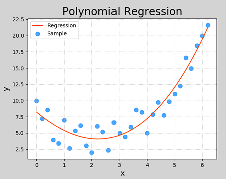

 

# 二、多项式回归

```javascript

前面说过 "正则化" 来降低 "过拟合" ，

//==========================
而 "欠拟合"，模型 "选择比较简单"，数据比较"复杂"，模型比较"简单"了，
导致模型没有 "足够能力" 表达 "这组数据"。
	
	所以需要 "把模型变得比较复杂"。
    //线性不会转变，可以让 线性变得会转弯
    
//==========================多项式
    就是在 "线性回归" 的基础之上，引入了 "高次项"，
    "线性模型" 是：y = kx + b
	"多项式回归" 就是：yx = ax^2 +bx + c

```


## 1. 什么是多项式回归

线性回归适用于数据呈线性分布的回归问题.如果数据样本呈明显非线性分布，线性回归模型就不再适用（下图左），而采用多项式回归可能更好（下图右）.例如：


```javascript

当前数据是非线性分布，如果使用 "一条直线" 就是欠拟合

所以使其 "转一下弯"，

```


## 2. 多项式模型定义

```javascript
与 "线性模型" 相比，多项式模型引入了 "高次项"，自变量的指数大于1，
		
		例如一元二次方程：
```


$$
y = w_0 + w_1x + w_2x^2
$$
一元三次方程：
$$
y = w_0 + w_1x + w_2x^2 + w_3x ^ 3
$$
推广到一元n次方程：
$$
y = w_0 + w_1x + w_2x^2 + w_3x ^ 3 + ... + w_nx^n
$$
上述表达式可以简化为：
$$
y = \sum_{i=1}^N w_ix^i
$$

```javascript
所以"多项式模型"，可以有一个 "自变量"，也可以有 "多个自变量"，
但自变量的 "最高次幂" 一定要大于>1

//=======================
"线性回归" 麻雀虽小，五脏俱全
许多模型都是在 "线性回归" 基础上变通而来的

所以 "多项式回归"，也可以通过底层为线性来解决。

```


## 3. 与线性回归的关系

```javascript
多项式回归可以理解为线性回归的扩展，在线性回归模型中添加了 "新的特征值".
		//一般是 x^2 x^3
例如，要预测一栋房屋的价格，有$x_1, x_2, x_3$三个特征值，分别表示房子长、宽、高，则房屋价格可表示为以下线性模型：
```

$$
y = w_1 x_1 + w_2 x_2 + w_3 x_3 + b
$$
对于房屋价格，也可以用房屋的体积，而不直接使用$x_1, x_2, x_3$三个特征：
$$
y = w_0 + w_1x + w_2x^2 + w_3x ^ 3
$$
相当于创造了新的特征$x, x$ = 长 * 宽 * 高.  以上两个模型可以解释为：

- 房屋价格是关于长、宽、高三个特征的线性模型
- 房屋价格是关于体积的多项式模型

因此，可以将一元n次多项式变换成n元一次线性模型.

```javascript
假设：我用一个 "线性模型" 去表达我的数据，
y = wx + b
但是后来发现数据不是成 "线性分布" 的，
我想让它 "转一下弯"，于是
y = Wx^2 + W2x + c
增加了一个高次项目，这意味着，
我可以把 x的值带入到 W2x^2，
同时可以把 x的值带入到 wx 中，
这就相当于 我在数据中增加了一列数据叫 "x^2"

所以 "多项式回归" 模型就是：
			在公式中增加了"多次项"
            在数据里面也增加了"多次项"
自变量也还是X，因为X^2也是通过X得到的。

//======================
当前只有一个x 决定一个Y
换一个角度思考
	x 对 y 的影响表现为w
    x^2 对 y 主也有影响，就是w2

那是不是可以把 x^2 换个名字叫 X2
只不过 x2 是通过 x^2 得到的
	//=======================
	所以这就相当于在原来的 x 决定y的基础上变成:
	x 和 x2 决定 y
    公式 变成      y = w * x2 - w2* x +c
	//就变成了 "二元一次" 方程
	//"二元一次" 方程，也就是线性模型
	//它的解法是：
	∑( w * x2 +  w2 * x + b -y)^2 / b
	//这就是前面所讲的 "损失函数"

	这里要找的就是：w、w2和b的值为什么的时候，
    损失函数达到最小值，

	//=======================
    同样当这三个值出来的时候，模型也就出来了。
    
	//=======================
	所以 "多项式回归" 模型的套路 就是在 "数据里面"增加高次项，
    然后交给 "线性回归处理"
	//sklearn的接口里面也是这样做。
	//我们要找的其实是参数，
    
	//=======================
	所以 "多项式回归" 模型的套路 就是在 "数据里面"增加高次项，
    再去求 "解参数的过程"

 
//========================================== 注意：
//========================================== 注意：
"最高次幂"是一个超参数，它的值是多少合适 在所以不能给太高

可以使用for循环的方式，看看哪个得分高，再决定


```


## 4. 多项式回归实现


```java

//========================================== 多项式回归，它的接口
//========================================== 多项式回归，它的接口
"多项式回归"，它的接口长什么样子
    "多项式回归"的接口比之前的"线性回归"、"拉索回归"、"岭回归"复杂一点
	
    不同的模型 从接口的角度来看，它就是 "构建方式" 不同。

    训练、预测、评估。


```


对于一元n次多项式，同样可以利用梯度下降对损失值最小化的方法，寻找最优的模型参数$w_0, w_1, w_2, ..., w_n$.可以将一元n次多项式，变换成n元一次线性模型，求线性回归.以下是一个多项式回归的实现.

```python
# 多项式回归示例
import numpy as np
# 线性模型
import sklearn.linear_model as lm
# 模型性能评价模块
import sklearn.metrics as sm
import matplotlib.pyplot as mp
# 管线模块
import sklearn.pipeline as pl
import sklearn.preprocessing as sp

train_x, train_y = [], []   # 输入、输出样本
with open("poly_sample.txt", "rt") as f:
    for line in f.readlines():
        data = [float(substr) for substr in line.split(",")]
        train_x.append(data[:-1])
        train_y.append(data[-1])

train_x = np.array(train_x)  # 二维数据形式的输入矩阵，一行一样本，一列一特征
train_y = np.array(train_y)  # 一维数组形式的输出序列，每个元素对应一个输入样本
# print(train_x)
# print(train_y)

# 将多项式特征扩展预处理，和一个线性回归器串联为一个管线
# 多项式特征扩展：对现有数据进行的一种转换，通过将数据映射到更高维度的空间中
# 进行多项式扩展后，我们就可以认为，模型由以前的直线变成了曲线
# 从而可以更灵活的去拟合数据
# pipeline连接两个模型
//==============================================
						/**
    						#sp 是预处理模块，多项式扩展处理器, "扩展到" 最高次幂为3
    						PolynomialFeatures(3)
             				# 多项式特征扩展，扩展最高次项为3
    					*/
model = pl.make_pipeline(sp.PolynomialFeatures(3), 
                         lm.LinearRegression() 
                         #扩展之后的数据，次给线性回归处理，传入线性回归
                        )
				/**
    				"扩展高次项" 和 "创建线性模块" 这两步不能一起处理
        			交给 make_pipeline"扩展管线、数据管线来处理" 来处理
    				 类似于linux的 "管道符号"， 将上一个命令的输出作为下一个命令的输入
                    //===========
                    这里所要表达的就是将 "多项式回归处理后的数据、交给线性回归处理"

                    //=========== 它有一个小小问题，就是
                    当我们扩展到 x^2 的时候，它有一个x1 、x^2 ，还有一列1
                    了解之后

    			*/
# 用已知输入、输出数据集训练回归器
model.fit(train_x, train_y)
			// train_x 会先进行扩展，之后次给LinearRegression,再训练

//==============================================


# print(model[1].coef_)
# print(model[1].intercept_)

# 根据训练模型预测输出
pred_train_y = model.predict(train_x)

# 评估指标
err4 = sm.r2_score(train_y, pred_train_y)  # R2得分, 范围[0, 1], 分值越大越好
print(err4)

# 在训练集之外构建测试集
test_x = np.linspace(train_x.min(), train_x.max(), 1000)
pre_test_y = model.predict(test_x.reshape(-1, 1)) # 对新样本进行预测

# 可视化回归曲线
mp.figure('Polynomial Regression', facecolor='lightgray')
mp.title('Polynomial Regression', fontsize=20)
mp.xlabel('x', fontsize=14)
mp.ylabel('y', fontsize=14)
mp.tick_params(labelsize=10)
mp.grid(linestyle=':')
mp.scatter(train_x, train_y, c='dodgerblue', alpha=0.8, s=60, label='Sample')

mp.plot(test_x, pre_test_y, c='orangered', label='Regression')

mp.legend()
mp.show()
```

打印输出：

```
0.9224401504764776
```

执行结果：




```javascript
//=====================================
一些经典的数据集，它们在框架当中已经封装好了
	"波士顿房屋价格" 数据预测
  乳腺癌的预测、鸢尾花的分类
  /**
  当你在：pip、sklearn、install的时候，
  这些数据 就已经被下载到电脑里面了。
  */
  
  怎么拿已经下载好的数据呢？
  sklearn不光提供了这些数据，它还提供了拿到这些数据的接口
  并且这些数据，并且这些数据早就帮我处理好了。 
  		//============这些数据封装到了一个模块当中
      	sklearn.datasets  //数据集合
//=====================================
```


```javascript


```


## 5. 过拟合与欠拟合

```javascript
什么叫"拟合"，用 "模型" 表达 "当前样本分布状态" 和 "分布情况"
			//拟合的有好有坏

过拟合 ：  模型相对比较复杂，过于拟合训练样本，训练过的数据很准，没训练过的就很差。
		  //过于拟合训练集，做过的都会，没做过的，都不会以
		  //拟合的过头了，太好了，
		  //泛化能力（新样本的适应能力）变差，
		  //必须针对 大部分样本都能预测很准，才可以
		  

欠拟合 ：  数据比较"复杂"，模型比较"简单"了，
		  导致模型没有"足够能力"表达这组数据
 		  //拟合的不够，


```


### 1）什么是欠拟合、过拟合

在上一小节多项式回归示例中，多项特征扩展器PolynomialFeatures()进行多项式扩展时，指定了最高次数为3，该参数为多项式扩展的重要参数，如果选取不当，则可能导致不同的拟合效果.下图显示了该参数分别设为1、20时模型的拟合图像：


这两种其实都不是好的模型. 前者没有学习到数据分布规律，模型拟合程度不够，预测准确度过低，这种现象称为“欠拟合”；后者过于拟合更多样本，以致模型泛化能力（新样本的适应性）变差，这种现象称为“过拟合”. **欠拟合模型一般表现为训练集、测试集下准确度都比较低；过拟合模型一般表现为训练集下准确度较高、测试集下准确度较低.  **一个好的模型，不论是对于训练数据还是测试数据，都有接近的预测精度，而且精度不能太低.


【思考1】以下哪种模型较好，哪种模型较差，较差的原因是什么？

| 训练集R2值 | 测试集R2值 |
| ---------- | ---------- |
| 0.6        | 0.5        |
| 0.9        | 0.6        |
| 0.9        | 0.88       |

【答案】

```javascript
第一个模型欠拟合；  //训练和测试都很差

第二个模型过拟合；  //训练得好，测的差

第三个模型适中，为可接受的模型.
```


【思考2】以下哪个曲线为欠拟合、过拟合，哪个模型拟合最好？


【答案】

```javascript
第一个模型欠拟合；
	
第三个模型过拟合； //最高次幂为4

第二个模型拟合较好. //x的最高次幂为2，就可以表达

```


### 2）如何处理欠拟合、过拟合


```javascript

 (1)欠拟合：提高模型复杂度，如增加特征、增加模型最高次幂等等；

（2）过拟合：降低模型复杂度，如减少特征、降低模型最高次幂等等. 

```


# 三、线性回归模型变种

```javascript

"线性模型的变种" ，本质上还是 "逃离不了线性回归" 。

在 "线性模型" 的基础之上，做了一些 "稍微的修改" 。


以 Salary_Data2.csv 为例，
这组数组和上一组Salary_Data.csv数据有点像，
但是又不一样

主要表现为：有3个样本的数据 "薪资涨的比较高"，它们拉高了 "模型" 的斜率

我们管这三个样本叫 "强势样本"，其它的样本叫 "普通样本"

由于 "模型"会拟合全部数据， "强势样本" 会影响整体斜率，

这样 ,针对 "普通样本" 的预测误差，就变大了
而我们大部分 "需求" 是 考虑的我们 "普通人" 预测的需求。


//======================================== 所以
我们要降低 "强势样本" 对模型的影响，
让 "模型" 更好的匹配 "普通样本" 就好了。 
		/**
			强势样本不能直接删除，（有时候可以）
			但有时候必须要求存在。
		*/
//========================================
'''
	    当前对 "Salary_Data2.csv" 的样本，
    结果说明 ： 当前模型 "就用线性模型去表达" 属于 "过拟合"
              // 当前这条线一定是针对全部样本，拟合最好的情况

			  // 如果当前一组数据用 "线性模型" 能达到要求
			  // 用 "非线性模型" 也能达到要求，
			  // 那一定是使用 "线性模型"

			  // 因为我们主要考虑 "普通样本"，而普通样本是 "线性分布"

	解决办法：	降低拟合度

'''
 

```


$$
loss = \frac{1}{2}\sum_{i=1}^{n}(\hat{y_i} - y_i)^2 + \lambda \sum{\omega}_i^2
$$

```javascript
//======================================== 线性模型变种
底层上还是我们的线性模型，

"整体的思路"  和  "整体的流程" 和之前是一样的。
		 构建损失函数，
         求损失函数的极小值。
         
         不同的是，它在损失函数的基本之上又加了一个  λ*∑(wi)^2
         //这一项也叫正则化

//========================================
```


## 1. 正则化

### 1）什么是正则化

```javascript
"过拟合" 还有一个 "常见的原因"，
就是模型 "参数值太大"，
		//模型的 "参数值越大" ，对 "整体的预测越大"
		//
所以可以通过 "抑制参数的方式" 来解决过拟合问题.

如下图所示，右图产生了一定程度过拟合，可以通过弱化高次项的系数（但不删除）来降低过拟合. 
```


```javascript

//=======================左边
θ0 + θ1x + θ2x^2  //这个就是一元二次方程
y = ax^2 + bx + c

//=======================右边
还是同样的数据
增加了 θ3x^3 + θ4x^4
//这时变成了一元4次方程

从图上面看，当前这个模型使用2次方就可以解决了
但是增加了3次方 和 4次方之后，模型变得更加复杂，出现过拟合的情况
怎么解决这个情况情，我们可以让  3次 和 4次 不产生太大的影响，

它们是通过 θ3 和 θ4来控制的，
假设 θ3 和 θ4 为 0 ，那就是 和一元二次相同了。
所以我们要压缩 3次 和 4次 的系数，从而降低拟合度

```


```javascript
例如，可以通过
在 θ3, θ4的系数上 "添加一定的系数"，来压制这两个高次项的系数，这种方法称为 "正则化".


但在实际问题中，可能有更多的系数，
我们并不知道应该压制哪些系数，所以，可以通过收缩所有系数来避免过拟合.


//==============================
上例中，通过图片就能知道要压缩的是  θ3 和 θ4，
但是  "数据非常复杂的时候"，你不能直接知道需要压缩的是谁


所以就需要压缩 "所有的系数"
//==============================
在 "θ3、θ4"的系数上， "添加一定的系数"
添加的系数就是：λ*∑(wi)^2
```

### 2）正则化的定义

```javascript
正则化是指，在 "目标函数后面" 添加一个 "范数" ，来 "防止过拟合" 的手段。

		//==========================
		因为我们要 "压缩都有的"，所以 "不用区分压缩谁"，
        就压缩"所有的"

//==============================================
y = θ0 + θ1x + θ2x^2 + θ3x^3 + θ4x^4
//==============================================

常用的范围有两个，如下：
当p=1时，称为L1范数（即"所有系数绝对值之和"）：
		// ∑|x| ：x的绝对值再求和，x指 w1 w2 w 3，就是上面θ1 θ2 θ3
```

$$
||x||_1 = (\sum_{i=1}^N |x|)
$$
```javascript

当p=2时，称为L2范数（即 "所有系数平方之和"）：
		// ∑|x|^2 : 

```

$$
||x||_2 = (\sum_{i=1}^N |x|^2)
$$
通过对目标函数添加正则项，整体上压缩了参数的大小，从而防止过拟合.

````javascript

所以当我们有了范数之后，我们就在损失函数后面加上 "范数" 来防止 "过拟合"

````

## 2. Lasso回归与岭回归

Lasso 回归和岭回归（Ridge Regression）都是在标准线性回归的基础上修改了损失函数的回归算法.

```javascript

"Lasso 回归" 和 "岭回归（Ridge Regression）"都是"线性回归"

如果在 "圴方误差" 后面加上（γ*）L1范数，它就是 "lasso回归"
	//	范数前面还有一个 γ，指范数的系数，正则化系数

如果在 "圴方误差" 后面加上（γ*）L2范数，它就是 "岭回归"
	//	范数前面还有一个 γ，指范数的系数，正则化系数


```


 Lasso回归全称为 Least absolute shrinkage and selection operator，

又译“最小绝对值收敛和选择算子”、”套索算法”，其损失函数如下所示：
$$
E = \frac{1}{n}(\sum_{i=1}^N y_i - y_i')^2 + \lambda ||w||_1
$$
岭回归损失函数为：
$$
E = \frac{1}{n}(\sum_{i=1}^N y_i - y_i')^2 + \lambda ||w||_2
$$
```javascript

//============================
以 "岭回归" 为例，所有系数，
 "所有系数平方之和" ，前面还有一个 λ， 叫 "正则化系数"。

 		它和 "学习率" 一样，也是一个 "常数"
		 "正则化系数" 也叫 "惩罚项系数"
				// 就是拟合的太好，需要 惩罚 一下
		如果 λ = 0，就和线性回归是一样的

 λ 给的越大， "强势样本" 对 "模型" 的影响越小 //降低的 "拟合度" 就越低，

```


从逻辑上说，Lasso回归和岭回归都可以理解为通过调整损失函数，减小函数的系数，从而避免过于拟合于样本，降低偏差较大的样本的权重和对模型的影响程度.


线性模型变种模型： 在损失函数后面 + 正则项	

​					损失函数  + L1范数  ----》  Lasso回归

​					损失函数  + L2范数  ----》  岭回归				


```javascript

以下关于 "Lasso回归" 与 "岭回归" 的sklearn实现：
```

```python
# Lasso回归和岭回归示例
import numpy as np
# 线性模型
import sklearn.linear_model as lm
			# "Lasso回归" 与 "岭回归" 的接口也在 linear_model里面
# 模型性能评价模块
import sklearn.metrics as sm
import matplotlib.pyplot as mp

x, y = [], []  # 输入、输出样本
with open("abnormal.txt", "rt") as f:
    for line in f.readlines():
        data = [float(substr) for substr in line.split(",")]
        x.append(data[:-1])
        y.append(data[-1])

x = np.array(x)  # 二维数据形式的输入矩阵，一行一样本，一列一特征
y = np.array(y)  # 一维数组形式的输出序列，每个元素对应一个输入样本
# print(x)
# print(y)

# 创建线性回归器
model = lm.LinearRegression()
# 用已知输入、输出数据集训练回归器
model.fit(x, y)
# 根据训练模型预测输出
pred_y = model.predict(x)

# ============================= 创建岭回归器并进行训练
# Ridge: 第一个参数为正则强度，该值越大，异常样本权重就越小
model_2 = lm.Ridge(alpha=200, max_iter=1000)  # 创建对象, 
	# alpha 就是前面λ，指"正则化系数"，值越大，"强势样本"对"模型"的影响就越小。"正则化系数" 设置多大，这个需要自己评估，它也是超参数。
    # max_iter 这个参数一般不给，
    # 默认为None ,-1自适应

max_iter为最大迭代次数
model_2.fit(x, y)  # 训练
pred_y2 = model_2.predict(x)  # 预测


# ============================= 
# lasso回归   
model_3 = lm.Lasso(alpha=0.5,  # L1范数相乘的系数
                   max_iter=1000)  # 最大迭代次数
			#参数和 "岭回归" 是一样的
model_3.fit(x, y)  # 训练
pred_y3 = model_3.predict(x)  # 预测


# 可视化回归曲线
mp.figure('Linear & Ridge & Lasso', facecolor='lightgray')
mp.title('Linear & Ridge & Lasso', fontsize=20)
mp.xlabel('x', fontsize=14)
mp.ylabel('y', fontsize=14)
mp.tick_params(labelsize=10)
mp.grid(linestyle=':')
mp.scatter(x, y, c='dodgerblue', alpha=0.8, s=60, label='Sample')
sorted_idx = x.T[0].argsort()

mp.plot(x[sorted_idx], pred_y[sorted_idx], c='orangered', label='Linear')  # 线性回归
mp.plot(x[sorted_idx], pred_y2[sorted_idx], c='limegreen', label='Ridge')  # 岭回归
mp.plot(x[sorted_idx], pred_y3[sorted_idx], c='blue', label='Lasso')  # Lasso回归

mp.legend()
mp.show()
```

以下是执行结果：


```javascript
对于 "模型优化"
	"模化优化" 里面有一项就是调整 "模型参数"，
    
    在 "模化优化" 调整参数里面，在sklearn机器学习的框架当中，
    它也是有接口的， 
    它的原理是： 自己给上所有参数取值，用每个一个参数去构建模型，
    去比较谁的分更高，也就意味着我们可以 "构建我们的参数"，用for循环去遍历，每一个参数，打印它们的评分，把这些代码封装起来做成一个接口，就是sklearn里面提供的接口
    


```


# 四、模型保存与加载

```javascript

模型的 "保存" 和 "加载" 功能非常强大，
		但它用起来是非常简单的。

```

可以使用Python提供的功能对模型对象进行保存.使用方法如下：

```Python
import pickle
		#pickle 是一个序列化模块，可以将想要保存的数据，
		#序列化之后， 将模型保存到 "文件" 之中

# 保存模型  # dump 数据库备份也是 dump 函数
pickle.dump(模型对象, 文件对象) 
			#把模型对象保存到这个文件当中去，
    		#注意第二个参数是文件对象


# 加载模型
model_obj = pickle.load(文件对象)
			# 加载的 model_obj ，就可以用来执行predict方法了。

```

保存训练模型应该在训练完成或评估完成之后，完整代码如下：

```Python
# 模型保存示例
import numpy as np
import sklearn.linear_model as lm # 线性模型
import pickle

x = np.array([[0.5], [0.6], [0.8], [1.1], [1.4]])  # 输入集
y = np.array([5.0, 5.5, 6.0, 6.8, 7.0])  # 输出集

# 创建线性回归器
model = lm.LinearRegression()
# 用已知输入、输出数据集训练回归器
model.fit(x, y)

print("训练完成.")

# 保存训练后的模型
with open('linear_model.pkl', 'wb') as f:
    pickle.dump(model, f)
    print("保存模型完成.")
```

执行完成后，可以看到与源码相同目录下多了一个名称为linear_model.pkl的文件，这就是保存的训练模型.使用该模型代码：

```Python
# 模型加载示例
import numpy as np
import sklearn.linear_model as lm  # 线性模型
import sklearn.metrics as sm  # 模型性能评价模块
import matplotlib.pyplot as mp
import pickle

x = np.array([[0.5], [0.6], [0.8], [1.1], [1.4]])  # 输入集
y = np.array([5.0, 5.5, 6.0, 6.8, 7.0])  # 输出集

# 加载模型
with open('linear_model.pkl', 'rb') as f:
    model = pickle.load(f)
    print("加载模型完成.")

# 根据加载的模型预测输出
pred_y = model.predict(x)

# 可视化回归曲线
mp.figure('Linear Regression', facecolor='lightgray')
mp.title('Linear Regression', fontsize=20)
mp.xlabel('x', fontsize=14)
mp.ylabel('y', fontsize=14)
mp.tick_params(labelsize=10)
mp.grid(linestyle=':')
mp.scatter(x, y, c='blue', alpha=0.8, s=60, label='Sample')

mp.plot(x, pred_y, c='orangered', label='Regression')

mp.legend()
mp.show()
```

执行结果和训练模型预测结果一样.


# 五、总结

（1）什么是线性模型：线性模型是自然界最简单的模型之一，反映自变量、因变量之间的等比例增长关系

（2）什么时候使用线性回归：线性模型只能用于满足线性分布规律的数据中

（3）如何实现线性回归：给定一组样本，给定初始的w和b，通过梯度下降法求最优的w和b


# 六、练习

（1）说明线性回归的特点、过程

（2）列举生活中常见的线性回归应用场景

（3）什么是梯度下降？梯度下降的作用是什么？为什么要使用梯度下降？

（4）已知某公司电视广告投入和营业收入之间的关系如下表格所示：

| 广告投入 | 销售收入 |
| -------- | -------- |
| 230.1    | 22.1     |
| 44.5     | 10.4     |
| 17.2     | 9.3      |
| 151.5    | 18.5     |
| 180.8    | 12.9     |
| 57.5     | 11.8     |
| 120.2    | 13.2     |
| 8.6      | 4.8      |

编写代码，使用线性回归模型预测，电视广告投入300/400/500，销售收入为多少？计算并打印.

（5）编写代码，实现以下功能：

- 给出10个x值，计算y， y=2x

- 在计算出的y值上加入噪声值（噪声值范围1~3之间）

- 使用第一步、第二步产生的x,y作为样本数据，执行线性回归

- 可视化原始样本、预测结果

  

# 补充知识

## 1. R2系数详细计算

R2系数详细计算过程如下：

若用$y_i$表示真实的观测值，用$\bar{y}$表示真实观测值的平均值，用$\hat{y_i}$表示预测值则，有以下评估指标：

- 回归平方和（SSR）

  

$$
SSR = \sum_{i=1}^{n}(\hat{y_i} - \bar{y})^2
$$

估计值与平均值的误差，反映自变量与因变量之间的相关程度的偏差平方和.

- 残差平方和（SSE）

$$
SSE = \sum_{i=1}^{n}(y_i-\hat{y_i} )^2
$$


即估计值与真实值的误差，反映模型拟合程度.

- 总离差平方和（SST）

$$
SST =SSR + SSE= \sum_{i=1}^{n}(y_i - \bar{y})^2
$$

即平均值与真实值的误差，反映与数学期望的偏离程度.

- R2_score计算公式

R2_score，即决定系数，反映因变量的全部变异能通过回归关系被自变量解释的比例.计算公式：
$$
R^2=1-\frac{SSE}{SST}
$$
即：
$$
R^2 = 1 - \frac{\sum_{i=1}^{n} (y_i - \hat{y}_i)2}{\sum_{i=1}{n} (y_i - \bar{y})^2}
$$
进一步化简为：

```

真实值和预测值越接近，R2越接近于1
当平均值和预测值越接近时，R2越接近于0，还可能有负数

```


$$
R^2 = 1 - \frac{\sum\limits_i(y_i - y_i)^2 / n}{\sum\limits_i(y_i - \hat{y})^2 / n} = 1 - \frac{RMSE}{Var}
$$
分子就变成了常用的评价指标均方误差MSE，分母就变成了方差，对于$R^2$可以通俗地理解为使用均值作为误差基准，看预测误差是否大于或者小于均值基准误差.

R2_score = 1，样本中预测值和真实值完全相等，没有任何误差，表示回归分析中自变量对因变量的解释越好.

R2_score = 0，此时分子等于分母，样本的每项预测值都等于均值.

## 2. 线性回归损失函数求导过程

线性函数定义为：
$$
y = w_0 + w_0 x_1
$$
采用均方差损失函数：
$$
loss = \frac{1}{2} (y - y')^2
$$
其中，y为真实值，来自样本；y'为预测值，即线性方程表达式，带入损失函数得：
$$
loss = \frac{1}{2} (y - (w_0 + w_1 x_1))^2
$$
将该式子展开：
$$
loss = \frac{1}{2} (y^2 - 2y(w_0 + w_1 x_1) + (w_0 + w_1 x_1)^2) \\
\frac{1}{2} (y^2 - 2y*w_0 - 2y*w_1x_1 + w_0^2 + 2w_0*w_1 x_1 + w_1^2x_1^2) \\
$$
对$w_0$求导：
$$
\frac{\partial loss}{\partial w_0} = \frac{1}{2}(0-2y-0+2w_0 + 2w_1 x_1 +0) \\
=\frac{1}{2}(-2y + 2 w_0 + 2w_1 x_1) \\
= \frac{1}{2} * 2(-y + (w_0 + w_1 x_1)) \\
=(-y + y') = -(y - y')
$$
对$w_1$求导：
$$
\frac{\partial loss}{\partial w_1} = \frac{1}{2}(0-0-2y*x_1+0+2 w_0 x_1 + 2 w_1 x_1^2) \\
= \frac{1}{2} (-2y x_1 + 2 w_0 x_1 + 2w_1 x_1^2) \\
= \frac{1}{2} * 2 x_1(-y + w_0 + w_1 x_1) \\
= x_1(-y + y') = - x_1(y - y')
$$
推导完毕.

