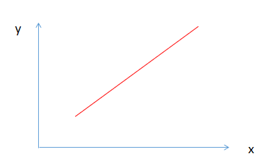
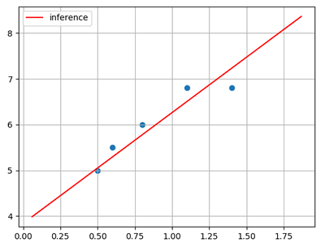
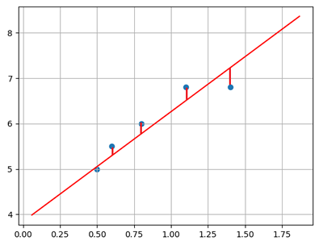
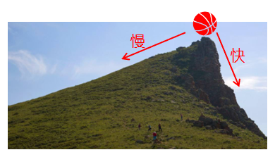
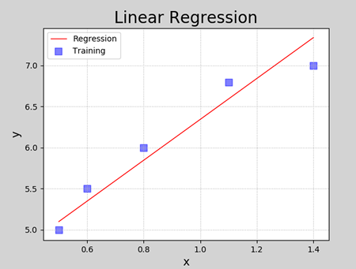
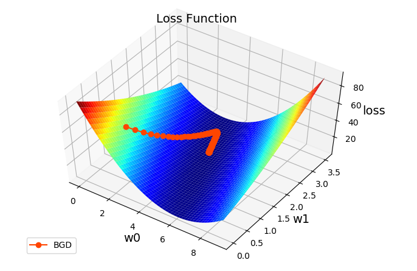
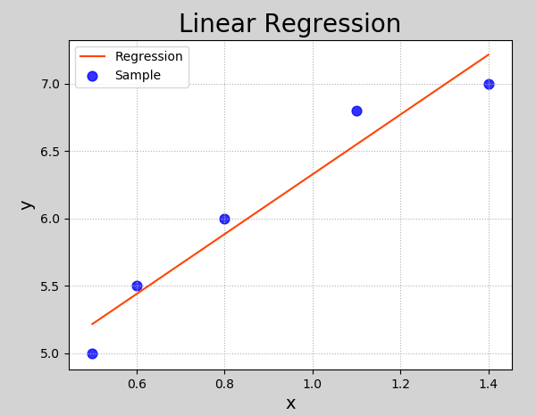
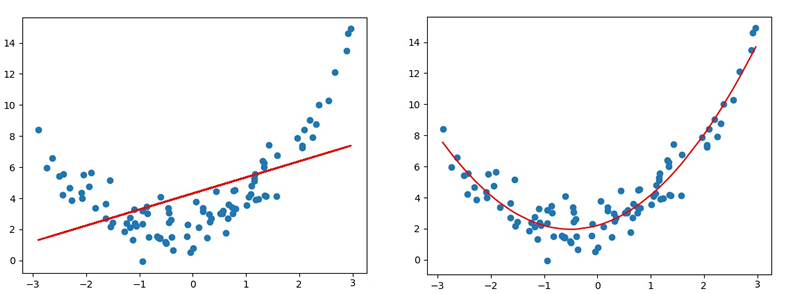

# 一、线性模型

## 1. 概述

**线性模型**是自然界最简单的模型之一，它描述了一个（或多个）自变量对另一个因变量的影响是呈简单的比例、线性关系.例如： 

```javascript
（1）住房每平米单价为1万元，
        100平米住房价格为100万元，
        120平米住房为120万元；
        y = 10000 * x
        //y 就是因变量
        //x 就是自变量
（2） 一台挖掘机每小时挖 100m^3沙土，
	 工作4小时可以挖掘400m^3 沙土. 
     	y = 100 * x
        //y 就是因变量
        //x 就是自变量

```


```javascript
线性模型在 "二维空间" 内表现为一条直线，
 在 "三维空间" 内表现为一个平面，
 		/**
            当我们进入到三维空间中，线性模型预测的依然是这种线性关系，但现在我们有两个自变量。所以模型变为 
            z=ax+by+c，
            其中 z 是因变量，
            x 和 y 是自变量，
            a 和 b 是系数，c 是截距。
            在三维空间中，这个方程描述的是一个平面。
 		*/
 "更高维度" 下的线性模型很难用几何图形来表示（称为 "超平面"）.
如下图所示：
```




<center><font size=2>二维空间下线性模型表现为一条直线</font></center>


<center><font size=2>三维空间下线性模型表现为一个平面</font></center>
```javascript
"线性回归" 是要根据一组输入值和输出值（称为样本），寻找一个 "线性模型"，
能 "最佳程度" 上拟合于 "给定的数值分布"，从而再给定新的输入时预测输出.

		//========================================= 线性回归 要做的就是
		//========================================= 线性回归 要做的就是
		怎么去把 "这个模型" 给它 "找出来"

			/**
				什么叫 "拟合"，假设我有一组数据，
				我想用一个 "线性模型" 来表达这组数据，
				这个过程就叫 "拟合"
				
			*/

            /**
            我们要把 "数据" 带到 "线性模型" 里面去，找到k和b 的值的过程，就是 "线性回归"的过程

                "回归"： 在有监督的基础之上得到连续输出 

                "线性回归" 是要根据 一组 "输入值和输出值" ，
                寻找一个线性模型:
                    能 "最佳程度"上 "拟合" 于 "给定的数值" 分布，
                    从而再 "给定新的输入时" 预测输出，
            */


样本如下表所示:
	//首先有这样一组数据
```


| 输入(x) | 输出(y) |
| ------- | ------- |
| 0.5     | 5.0     |
| 0.6     | 5.5     |
| 0.8     | 6.0     |
| 1.1     | 6.8     |
| 1.4     | 6.8     |

根据样本拟合的线性模型如下图所示：



```javascript
		//然后用一个散点图，画出了这一组数据
		//然后用一个线性模型拟合这组数据
		//然后带入新的值，预测它的结果
```


## 2. 线性模型定义

设给定一组属性$x, x=(x_1;x_2;...;x_n)$，线性方程的一般表达形式为：
$$
y = w_1x_1 + w_2x_2 + w_3x_3 + ... + w_nx_n + b
$$
```javascript
					// x 是自变量
					// y 是因变量
					// w 是权重，每个 自变量 都有一个权重，权重越高，影响越大。
	//===========================================================
```

写成向量形式为：
$$
y = w^Tx + b
$$
```javascript
				// X乘以W的T次方  + b
				/**
					w转字乘以x  加B。
					这个和上面的公式表达内容相同 
					用矩阵 相乘 便可以证明
					列 乘以 行
				*/
```

其中，$w=(w_1;w_2;...;w_n), x=(x_1;x_2;...;x_n)$，w和b经过学习后，模型就可以确定. 

```javascript
			模型经过不断学习之后，模型就可以确定 w 和 b当前取值多少，
			就可以确定模型了。
```

```javascript
	//===========================================================
	当 "自变量数量为1" 时，上述线性模型即为平面下的直线方程：
			//意思是：只有一个X
```

$$
y = wx + b
$$
```javascript
					// 当自变量只有一个的时候，
					//		公式就变成了 y = w1x1 + b
					//		w1 也就是k，y = kx + b
                    /**
                        y  = kx + b		//k叫斜率  b 叫截距
                        y  = wx + b		//w叫权重  b 叫偏置
                        有多少个x,就有多少个w
                    */

					// 自变量可以有一个，也可以有多个
					// 但是自变量的 "最高次幂" 只有是1 ，就是最高是x的1次方
					// 如果是2，如x的2次方，这条线就不是直线了

```

```javascript
//===============================================================这段话很重要
"线性模型" 形式简单、易于建模，却蕴含着 "机器学习"中一些重要的 "基本思想".
	//麻雀虽小，五脏俱全
    许多 "功能强大" 的 "非线性模型" 可以在 "线性模型" 基础上 "引入层级结构" 或 "高维映射"而得. 
    此外，由于$w$直观表达了各属性在预测中的重要性，因此线性模型具有很好的可解释性.例如，判断一个西瓜是否为好瓜，可以用如下表达式来判断：
```

$$
f_{好瓜}(x) = 0.2x_{色泽} + 0.5x_{根蒂} + 0.3x_{敲声} + 1
$$
上述公式可以解释为，一个西瓜是否为好瓜，可以通过色泽、根蒂、敲声等因素共同判断，其中根蒂最重要(权重最高)，其次是敲声和色泽.


```java
	/** 数组和数组相乘：对应位置相乘
		>>> import numpy as np
		>>> ary = np.arange(1,10).reshape(3,3)
		>>> ary
		array([[1, 2, 3],
			   [4, 5, 6],
			   [7, 8, 9]])
		>>> print(ary)
		[[1 2 3]
		 [4 5 6]
		 [7 8 9]]
		>>> ary *ary
		array([[ 1,  4,  9],
			   [16, 25, 36],
			   [49, 64, 81]])
		>>>
	*/


//================================================================== 矩阵
//================================================================== 矩阵
另一种写法
m = np.mat('1 2;3 4')

//================================================================== 矩阵 与 矩阵  相乘
//================================================================== 矩阵 与 矩阵  相乘

	/**
		示例2：
		>>> a = np.mat([[1,2],[3,4]])
		>>> b = np.mat([[1,2],[3,4]])
		>>> a * b
		matrix([[ 7, 10],
				[15, 22]])
		>>>
	*/
//==================================================================
//==================================================================
矩阵 是二维的，有行有列的值

1 2		1 2
3 4		3 4
a		b

"a的所有行" 乘以 "b的所有列"
"对应位置" 相乘之后 "再相加（也就是内积）"
   
/**
	"A的第一行  1 2" 乘以 "B的第一列 1 3" ，就是 1*1 + 2*3  = 7
	"A的第一行  1 2" 乘以 "B的第二列 2 4" ，就是 1*2 + 2*4  = 10

	"A的第二行  3 4" 乘以 "B的第一列 1 3" ，就是 3*1 + 4*3  = 15
	"A的第二行  3 4" 乘以 "B的第二列 2 4" ，就是 3*2 + 4*4  = 22

	最后得到
		7 10
		15 22
*/

//================================================================== 并不是  "所有矩阵" 都能相乘
//================================================================== 并不是  "所有矩阵" 都能相乘

		（1）//"A的列数" 和 "B的行数" 相等才能相乘
			(2,2) (2,2)		//中间两个值相等才能相乘

		（2）相乘结果：A的行数，B的列数
			(2,2) (2,2)		//相乘结果，由两边决定

		//======================== 举例：
		//======================== 举例：
		(3861,24) 与 (24,18) 两个矩阵

		中间相同：可以相乘，
		相乘结果：3861行，18列
//================================================================== 没有 乘法交换律
//================================================================== 没有 乘法交换律

// 矩阵 和 矩阵 之间没有 "乘法交换律" 的
	a * b  != b * a

	(2,4) * (4,3)  //可以相乘，结果为 (2,3)形状

	而(4,3) * (2,4) //不可以相乘

	//但是：有 乘法结合律
    // ( a * b ) * c = a * ( b * c) 

//================================================================== 矩阵相乘 和线性回归有什么关系
//================================================================== 矩阵相乘 和线性回归有什么关系


线性模型 写成向量的形式， y= x*wT +b    //X乘以W的T次方  + b

	如：
		x1   x2   x3  			W1   W2   W3
		//====================================
		//然后把 w转字 			//转字可以减少对 "原始矩阵" 的访问次数（重点）

		x1   x2   x3			
								w1
								w2
								w3

		//这样就变成了行转列，也就是矩阵的乘法。
		//"a的所有行" 乘以 "b的所有列"
		//这里只有一行一列，所以就变成 了
		//y = w1x1 + w2x2 + w3x3 + b
		//所以说 矩阵相乘 就可以实现线性回归。
//==================================================================
//矩阵相乘  和 线性回归有什么关系，是不是 "矩阵相乘  " 可以更加形象的表示 线性回归
//==================================================================
"矩阵相乘" 在 "线性回归" 中起着 "核心作用"，
    因为它提供了：一种 "计算效率高" 且 "表达简洁的方式" 来描述和计算线性回归模型。


```


## 3. 模型训练

```javascript
在 "二维平面" 中，"给定两点" 可以确定 "一条直线.

但在实际工程中，可能有 "很多个样本点" ，无法找到 "一条直线精确穿过所有样本点"，
只能找到一条与样本"足够接近" 或 "距离足够小" 的直线，近似 "拟合" 给定的样本.如下图所示：

```



```javascript

我们的目的是让 "这条直线" 到达 "所有样本点" 的  "距离" 达到最小值


			怎么表达："每一个样本" 到 "这条直线" 的 "距离" 呢？
					// "真实值"  和 "预测值" 之间的差异，
					// 就是 "真实值" -  "预测值"  = 距离
					  // Y1 - Y1' 得到这个距离  // Y1 表示真实值，Y1' 表示预测值
					  // Y2 - Y2' 得到这个距离
					  // Y3 - Y3' 得到这个距离

			怎么让 "所有距离" 都  "同时达到"  最小的值？
					  // 其实就是： 针对 "所有样本它的真实值" 到 "模型预测值" 的距离，
            		  //=========================（重点）=========================================
            		  //=========================（重点）=========================================
           			  //=============================(重点：平均值)
					  // 它们（指上面所有这些距离）的 "平均值" 达到最小 

					  //现 在就可以把每一个样本点，它们的 "真实值" 和 "预测值"  的 "差异" ，
					  //加到一起，求一个平均值：
								∑(Yi - Yi')^2 / n
									//∑(Yi - Yi')表示所有点的误差加到一起
									//  除以 n，是为了求平均值，
									// "平方"是为了防止负数,也可以使用绝对值，
									// 这里为什么使用平方，因为 "平方它的曲线" 的最低点，
									// 是可V的。因为后面要对它进行求导

				            		//=========================（重点） =======（核心）=======================
				            		//=========================（重点） =======（核心）=======================
				            		//=========================（这就是机器学习的核心）===============
									//	(Yi - Yi') 的平方 求和 然后除以n
									//它表达的含义，就是 "当前这个模型" 距离 "每一个样本点" 的 "平均距离"
									//让它达到 "极小值"，就是 "模型" 针对所有样本预测的 "最准的状态"。
 
 				            		//=========================（问题转换）===============
 				            		//=========================（问题转换）===============
                                    ∑(Yi - Yi')^2 / n 
                                    我们就是为了找到 "最优的" 模型参数，让这个参数最准，
                                    "寻找最优模型参数" 的问题，转换成了: 求 "这个公式" 极小值的问题
   
```


### 1）损失函数

```javascript
其实 ∑(Yi - Yi')^2 / n  这种函数叫：损失函数

如何确定 "直线到所有样本" 足够近呢？
		可以使用 "损失函数" 来进行度量
		
损失函数用来度量 "真实值（由样本中给出）" 和 "预测值（由模型算出）" 之间的差异.
损失函数值越小，表明模型预测值和真实值之间差异越小，模型性能越好；
损失函数值越大，模型预测值和真实值之间差异越大，模型性能越差.
     /**
     	 “损失函数”是机器学习中的一个 “广义概念”，用于衡量 “模型的预测值” 与 “真实值” 之间的 “不一致程度”。
     	 而“均方差函数”（Mean Squared Error, MSE）是一种 “具体的损失函数” ，通常用于 “回归问题”。
     	
     */
在回归问题中，"均方差" 是常用的损失函数，其表达式如下所示：
```

$$
E = \frac{1}{2}\sum_{i=1}^{n}{(y - y')^2}
$$
```javascript
								"乘以 1/2"  和  "乘以 1/n"   
								//乘以 1/2 指缩小两倍，乘以 1/N 缩小N倍
								单调性不会变，
                                另外：2分之1，求导更加方便。
                                //=========================为什么求导方便：
                                //因为：1/2 * W0^ 2 ，可以约掉，两个2
                                
                                
/**
"均方差"
            //均：指平均，求和除以个数，差指误差
            //均方差: 名字由 "平均、平方、误差" 而来。
*/
                                
                                
当我们拿到损失函数之后，我们就要去求极它的极小值了

```


```javascript
其中，y为模型 "预测值"，y' 为真实值. 
"均方差" 具有非常好的几何意义，对应着常用的 "欧几里得距离"（简称欧式距离）. 


"线性回归" 的任务是要 "寻找" 最优 "线性模型"，
			 是的 "损失函数" 值最小，即：

```


$$
(w^*, b^*) = arg min \frac{1}{2}\sum_{i=1}^{n}{(y - y')^2}   \\ 
    = arg min \frac{1}{2}\sum_{i=1}^{n}{(y' - wx_i - b)^2}
$$


```javascript
//==========================================================================
//==========================================================================

	loss = 1/2 * ∑(Yi' - Yi)^2			 // 这就是损失函数，现在就要求它的极小值
		 = 1/2 * ∑((WX + B) - Y )^2
				// Yi' 是预测值，因为 y = wx +b ，所以把 Yi' 替换成 (wx + b)
				// Yi' 就是预测值
				// loss 就是因变量 ，我们要求 loss 的极小值，
				// 当 loss 的值达到多少的时候，
				// 当我们的 "自变量" 是多少时，loss 才能达到极小值
				// 1/2 * ∑((WX + B) - Y )^2 
				// 影响 loss 的  "自变量"  有哪些
				//  		w 和  b   //  Y 和 x 都是真实样本数据 
				//========================（重点）========================================
				// w 和 b 的值是多少的时候， lose损失函数 能达到极小值
				// 不断的更新w 和 b，让lose函数达到极小值，
				// 学习就是为了改善性能，
				// 机器学习的套路，就是求 "损失函数" 的极小值，


一个 w 和 b 决定 loss，那就是两个x决定一个y，它们就是一个 "3维关系"
```

```javascript
//=============================================================== 最小二乘法
//=============================================================== 最小二乘法

基于 "均方误差最小化" 来进行 模型求解的方法称为 "最小二乘法". 
线性回归中，最小二乘法：就是试图找到一条直线，
是所有样本到直线的 "欧式距离" 之和最小.  可以将损失函数 "对w和b分别求导" ，
得到损失函数的 "导函数" ，并令 "导函数为0" 即可得到 "w和b的最优解".
		//======================
		其实，如果想求 w 和 b 的最小值的时候，
        我们会把数据转成矩阵，就是把x和y转成矩阵，通过矩阵求逆的方式，
        把矩阵和W解出来，如果矩阵有逆，可以直接求
        如果矩阵没有逆则不可以求

//=============================================================== 最小二乘法 与 导数
//=============================================================== 最小二乘法 与 导数     
        最小二乘法通常会用到 "导数"。
        最小二乘法是一种 "数学优化技术"，
        用于找到一组参数，使得这些参数的模型与数据之间的 "误差平方和最小"。
在 "最小二乘法" 的应用中，通常涉及到 "以下几个步骤"：
（1）定义误差函数：首先，定义一个误差函数，通常是 "预测值" 与 "实际值" 之间差的平方和。
（2）应用导数：为了找到使误差函数最小的参数，需要对 "误差函数" 关于 "每个参数" 求导。
（3）求导数的零点：找到这些 "导数等于零" 的点。这些点可能是 "误差函数的极小值点" 。
（4）解方程组：通过解这些 "导数等于零" 的方程组，可以找到使误差最小化的参数值。

在实际应用中，尤其是在 "处理线性回归问题" 时， "最小二乘法" 的使用非常广泛。
"求导" 在这个过程中扮演着 "关键角色"，因为它 "帮助确定了在哪些参数值" 下，"误差函数" 达到最小值。
        
//=============================================================== 最小二乘法 除了求导还有 "其它解法" 吗
//=============================================================== 最小二乘法 除了求导还有 "其它解法" 吗
"最小二乘法" 确实不仅限于 "求导数的方法" 来找到 "误差函数的极小值"
尽管在许多情况下，使用 "导数" 是一种有效的方式来找到这些极小值点，
但还有 "其他方法" 可以用于 "特定的情形或者更加复杂的模型"。这些方法包括：
	（1）解析解法
	（2）数值优化方法
	（3）迭代法：
    （4）蒙特卡洛方法
	（5）正则化方法：
//=============================================================== 为什么叫 "最小二乘法"
//=============================================================== 为什么叫 "最小二乘法"
 "最小二乘法（Least Squares Method）" 这个名字的含义直接源于 "其核心原理"：
 	 "最小化误差" 的 "平方和"。
     这里的 "二乘" 指的是 "平方"（即"数的二次方"），而 "最小" 指的是 "寻找参数值" 使得这个 "平方和" 尽可能小。
     具体来说：
    	（1）误差的平方：在最小二乘法中，误差通常是指 "预测值" 与 "实际观测值" 之间的差异。
    	（2）和（Sum）：将所有数据点的误差平方求和，得到一个总的误差度量。
        （3）最小化（Minimization）："最小二乘法" 的目标是找到 "一组参数"，使得这个 "误差平方和最小"。
     因此，"最小二乘法" 这个名称直接反映了 "该方法的核心目标" 和 "操作"：通过 "最小化误差的平方和" 来找到 "最佳的模型参数"。

```


```javascript
 但是：在 "人工智能领域" 里面求损失函数的极小值，使用的是是 "梯度下降法"
```

### 2）梯度下降法

#### ① 为什么使用梯度下降

```javascript

在实际计算中，通过 "最小二乘法" 求解 "最优参数" 有一定的问题：

```

（1）最小二乘法需要计算逆矩阵，有可能逆矩阵不存在；

```javascript

在实际计算中，通过 "最小二乘法" 求解最优参数有一定的问题：

（1）最小二乘法需要计算逆矩阵，有可能 "逆矩阵" 不存在；
			/**
					//=================== 什么叫 "单位矩阵"
					主对角线为1，
					其它 "对角线" 都为0的矩阵
					如：
						1 0
						0 1

					"一个矩阵" * "单位矩阵" = "原矩阵"
					这就好像： 6 * 1 = 6

					//=================== 什么叫 "逆矩阵"
					如果：  A * B = E //E表示单位矩阵
					A矩阵 * B矩阵 = 单位矩阵
					那就称 B为A的逆
					//=================== 
					A 矩阵 * 单位矩阵  = A矩阵
					1 2            1  0
					3 4            0  1
					        *
					        等到
					        1 2 
					        3 4
					//=================== 示例
					m = np.mat('1 4 7;2 3 8; 1 4 5')
					m
					m.I
						//I表示求逆矩阵

					//=================== 但不是所有矩阵都有逆
			*/
（2）当样本特征数量较多时，计算逆矩阵非常耗时甚至不可行. 
		/**
			逆矩阵 本身非常的慢，
			比如：ChatGPT模型，就有几亿个参数
				 意思就是说这几亿个参数在取什么值的时候，
				 损失函数能达到最小值
		*/
		/**
		 	比如：深度学习中，假设有一张图像，大小为 200 * 200
		 			它有 40000 个像素值，
		 			它就代表 x 为 40000 个
		 			
		 		全连接神经网络，里面有5个神经元
		 		//这是人工智能里面的 "神经元"， 又叫感知机制
		 		//它是对生物学进行模仿的结果
		 		
		 		//生物神经元的工作机器，它是怎么调用钾钠离子进行放电的?
		 		
		 		当前有4000个x 和 5个神经元，
		 		它每一个x都会分别和 每个神经元进行计算。
		 		所以它就是计算20万次，
		 		就代表它表20万条线，20万个权重(w)。
		 */

所以，在实际计算中，通常采用 "梯度下降法" 来求解损失函数的极小值，从而找到模型的最优参数.
		/**

		用 "梯度下降法" 求损失函数的极小值

		不管是深度学习，还是机器学习，它都是同样的套路，
		都是求损失函数的最小值的过程。
		
		只不过不同的任务，它的损失函数不一样。

		*/

```


#### ② 什么是梯度下降

```javascript

求损失  "函数的极小值" ,使用 "梯度下降法"

```

```javascript
"梯度(gradient)下降" 它其实就是一个简单的基本公式


梯度（gradient）是一个向量（矢量，有方向），
表示 "某一函数" 在该点处的 "方向导数" 沿着 "该方向" 取得 "最大值"，
				//===================================== 什么是梯度？
				//===================================== 什么是梯度？
				该方向的 "导数" ，沿着该方向 "取得最大值"
                /**
           		 梯度 ：指的就是导数， //指函数的 "导数"， 也就是 "导函数"
                    只不过不会让导数为0
                    而是使用 "另一种方式" ，沿着 "导数（覆梯度）"相反方向，
                    去更新参数
                */


即函数在该点处沿着该方向（此梯度的方向）变化最快，变化率最大.
"损失函数" 沿 "梯度相反方向" 收敛最快（即能最快找到极值点）.
当 "梯度向量为零"（或接近于零），
说明到达一个 "极值点"，这也是 "梯度下降算法" 迭代计算的 "终止条件".


```


```javascript
//======================================================== 核心
//======================================================== 核心
这种按照 "负梯度" 不停地 "调整函数权值" 的过程就叫作 "梯度下降法".
		/**
			什么是负梯度：
				（1）如果导数是5，负梯度就是-5
                    //如梯度是5， 负梯度就是 -5 ，往小的走就是-5(减5)
            	 	"减去梯度" 就是 ”负梯度“
            
            	（2）如果导数是-5，负梯度就是5

			//================================= 这里还是比较巧妙的
			//================================= 这里还是比较巧妙的
            "负梯度"比较小的时候，你会往大的加 
            你比极小值大的时候，你会往小的减
            不管怎样，你都会向 "极小值的方向" 出发的。
		*/
通过这样的方法， "改变权重" 让损失函数的值 "下降得更快"，
进而将值收敛到 "损失函数" 的 "某个极小值".


梯度下降法算法描述如下：
（1）损失是否足够小？如果不是，计算损失函数的梯度.
（2）按梯度的反方向走一小步，以缩小损失.
（3）循环到（1）

```

 

```javascript

//==============================================  "梯度下降法" 的 "外号"
//==============================================  "梯度下降法" 的 "外号"
/**
	梯度下降法有个外号： "蒙眼下山法"
		蒙住眼睛手拿木棍，下山
*/
//============================================== 更新公式


如果不按梯度下降法处理，那可能就会错过极小值
如：按固定步长2来取
	第一次取10
	第一次取8
	第一次取6
    	 极小值在这里
	第一次取4
    //=================
    	按固定步长去寻找，可能会错过极小值，
        所以我们会按照梯度的方向去找
    //================= 更新公式 
        按照梯度的 "方向去找"
        所以我们会有一个 "更新公式"
        x = x - α * f'(x)
       	  = 12 - 0.1 * 7.00 = 11.30
          // x 指初始值，当一步的值是多少
          // α 是一个常量
          // f'(x) 指导数，当前x的梯度
          // - f'(x)就是指 "负梯度"
		  /**
		   意思是说： x现在要取多少，就等于x上一步的值12减去它导数*α
		  */

		  //====================================================== 学习率（重要）
		  //====================================================== 学习率（重要）
           * α 或 η (zata)，它的中文叫 "学习率",它的作用是 "控制学习速度"
				// 如：0.1，乘以 0.1，相当于把原来的值缩小了，通过这种方式控制 "它的下降速度"
          学习速度由我们去控制，如果这个值比较大，一次就减的比较多，
          // 那我下降的更快，学习的更快，更快的找到极小值
          // 学习率设的小，学习的慢，找到"损失函数的极小值"就慢一些
          // 学习率 是一个常量，可以设置0.1，
          // 也可以设置0.01，也可以设置0.001

          "学习率" 是我们建立人工智能模型中的 "非常重要的超参数"

		 //====================================================== 超参数
		 //====================================================== 超参数

 
         超参数 指：当我们在构建模型时，需要提前设定一些参数，
		          "这些参数" 可以决定 "模型的精度" ,这些参数就叫 "超参数"。
		       
		        ****** 超参数的取值一般来自于经验。******
		         
		         // 它与模型的 "性能" 和  "精度" 有关
		        
		        假设我们要训练50轮，意思就是我们要更新50次参数
		        "训练多少轮" 就是指 "我们要更新多少次参数"
		        
		        此时，如果 "学习率" 太小，可能没有达到 "极小值"，
		        50轮就做完了，精度就不高
		        如果 如果 "学习率" 太大，可能已经超过极小值了。
 
		     	//====================================================== 
		     	//======================================================
		     	****** 超参数的取值一般来自于经验。******   
		     	//所以说它没有固定值
		     	如果设置错误，可以调整，
		     	其实很多现成的模形早就有了，通过一行代码都能实现了。
		     	我们要做的就是，用 "这个模型" 匹配 "我们的数据"
		     	当 "你的数据" 不同的时候，"这些参数" 也是不同的
		     	
		     	那就要解决"针对这个模型"，我们的参数设置为多少的时候
		     	才能  "更好的匹配" 这组数据，说的简单点，谁的参数调的好，
		     	谁的模型就更厉害
		     	
		     	如果你以后做了 "图像算法工程师"，
		     	你们用的那些算法都是 被 "科学家们" 
		     	和 "一些工程师们"研究好的，我们拿过来直接用
		     	
		     	我们做的是：怎么让它更好的匹配 "我们的数据"
		     	
		     	我们的参数设置为多少，我们需要调整
		     	
		     	所以我们现在要学习 "它的原理"
		     	
		     	//=======================
		     	当然我们也可以设计模型，但是我们还达不到它的高度。
		     	我们是站在巨人的肩上学习，
		     	什么问题用什么模型，科学家们已经设计好了，
		     	咱们就拿到用就可以了。（现在大部分人都是做这个事情）
		     	
		     	但是你必须知道这些模型的 "特点" 和 "使用场景"，
		     	怎么使用
		     	我们其实就在学习别人的模型如何使用。

         */
          
	x = 12，下一步取多少，是通过梯度更新公式算出来的。
    x = x - α * f'(x)
      = 12 - 0.1 * ( 12 - 5 )
      = 11.3

下一步x = 11.3
    x = x - α * f'(x)
      = 11.3 - 0.1 (11.3 - 5)
      = 10.67

下一步x = 10.67

    ..直到  "损失函数不再变化了" ，或者 "变化微乎其微" 了。
    就认为 当前达到了 "损失函数" 的极小值了
    
//======================== α 取1.5
  α 取3，会越来越大，这种情况叫 "梯度爆炸"
  α 取2，会 "形成死循环"
  α 取1.5 我们管它叫："收敛的比较震荡"
  α 取0.1 而0.1那种是 "比较平缓"，比较理想的状态。
//======================== 学习率一般设置
  不同数据它的大小范围不同的
  一般设置： 
  			0.1 
			0.01 
			0.001
//======================== 动态变化的学习率

现在学习率比较简单，是一个固定的值
后面情况复杂，学习率会变
	如：我训练500轮
    		100-200轮的时候，学习率用0.1
    		200-300轮的时候，学习率用0.01，学习率会衰减。
//======================== 2014年 大规模图像挑战赛的亚军
2014年 "大规模图像挑战赛" 的亚军：vgg
它的学习率就是：0.000001
//======================== 

12 的时候降低了 0.7
8  的时候降低了 0.3 
6  的时候降低了 0.1
5  的时候降低了 0.05

//======================== 重要
说明
越远下降的越多
越近下降的越少

因为你越接近你的极小值，你的梯度越接近于0，
减的值就越来越少
//========================一句话

"梯度下降" 就是沿着 "梯度的反方向" 进行 "参数更新"

怎么更新？
	使用 "参数更新" 公式： x = x - α * f'(x)
	"当前值" - "学习率" * "导数"

使用 "参数更新公式" 来更新我们的参数？

```

```javascript

//===============================  真正的需求
实际当中，"真正的需求" 并不是一个  "二维"的，之前示例

（1）目标函数：
Y = W1*X  + W0
或
Y = W1*X  + b

（2）根据 "目标函数" 写出它的 "损失函数" 为：

loss = 1/2 * ∑((W1*X + W0) -Y)^2
       //在这里要更新的是 w1 和 w0 两个 "自变量"//两个参数

（3）通过两个"更新公式"，更新 w1 和 w0 
//之前是一个  "自变量" 可以用 求导的方法
//现在是 "两个自变量"
w1 的更新方法是：w1 - α * f'(w1)
w0 的更新方法是：w0 - α * f'(w0)

w1 和 w0是两个初始参数，自己设定的
两个 α也是我们自己设定的

//现在就要求 f'(w1) 和 f'(w0) 的导数
（4）当前的梯度
    这里 "梯度下降" 中 "梯度" 就是指： 
              "w0的导数" 和 "w1的导数" 组成的向量
              [w0的导数,w1的导数] //
                //梯度里面有 "几个值" ，有几个 "自变量"，
                //要更新 "几个参数"，它里面就有 "几个值"
                /**
                    这个值是什么？
                       是 每一个自变量的 "偏导" 
                */
	当前的梯度：		"w1的偏导数" 和 "w0的偏导数" 组成的向量
    公式表示为：
```

$$
[\frac{\Delta loss}{\Delta w_0},\frac{\Delta loss}{\Delta w_1}]
$$

```javascript
当我们有了"梯度"之后，
我们就可以用 "w1的偏导数" 更新w1的值，
用 "w0的偏导数" 更新w0的值了

//========================= 怎么更新？

依据 "参数更新方法"，
在直线方程中，有两个参数 "需要学习"， w0 和 w1 ，
梯度 "下降过程" 中，分别对 "这两个参数" 单独进行调整:
```

$$
w_0 = w_0 - \eta \frac{\Delta loss}{\Delta w_0}   \\

w_1 = w_1 - \eta \frac{\Delta loss}{\Delta w_1}
$$

```javascript

w0 = w0  - eta * w0的导数
w1 = w1  - eta * w1的导数

其中，η（eta）称为学习率，    Δloss/Δw1为梯度（即损失函数关于参数wi的偏导数）

/**

机器学习就是：使用"梯度下降法" 求损失函数的极小值的  "过程"

*/

w0 和 w1可以自己设置
η 也可以自己设
现在只需要求出 w0的导数 和 w1的导数

求偏导？和直接求导没有太大区别
	针对 "损失函数" 去求偏导
//=======================================================  "求偏导数" 和 "求导数" 
//=======================================================  "求偏导数" 和 "求导数" 
  "求偏导数" 和 "求导数" 都是微积分中的基本概念
    	（1）求导数（Derivative）
        		1）应用于 "单变量函数" ：当我们谈论求导数时，
                     通常指的是 "单变量函数的导数"。
                     比如，给定一个关于变量x的函数f(x)，其导数描述了f在x点的变化率。 
         		2）物理意义：在物理学中，导数可以表示速度、加速度等概念。
                	 例如，位置 "关于时间的导数" 是速度。
                3）数学表示：导数通常表示为 f'(x) 或 df/dx。
		（2）求偏导数（Partial Derivative）：
                1）应用于 "多变量函数"：偏导数用于 "多变量函数"。
                	例如，对于函数f(x,y)，我们可能对x的偏导数感兴趣，同时将 y 视为常数。
				2）描述函数在特定方向的变化率：
                	"偏导数" 描述了当 "其他变量" 保持不变时，
                    函数沿着 "某一特定变量" 的变化率。
                    例如， ∂f/∂x描述了在y保持固定时，f随x变化的速度。
                3）数学表示：偏导数通常表示为∂f/∂X或fx。
 
 总结来说：
 	（1）求导数是 "单变量函数" 的概念，关注函数随一个变量的变化率；
 	（2）而 "求偏导数" 是 "多变量函数的概念"，关注函数在保持其他变量不变时，
    	 沿某一个特定变量的变化率。
 在多变量函数的分析中，偏导数是一个重要的工具，因为它帮助我们理解函数在多维空间中如何变化。

//=======================================================           	
//=======================================================              
    
    
 			//损失函数
    		loss = 1/2 *∑ (w1*x + w0 -y)^2
    		
    		求w1的时候，直接把w0当成常数项就好了。w0常数项直接忽略不计
    			
    		求w0的时候，把w1当成常数项就可以了。
    		//===================（1）先求w1的偏导，变下公式//求谁就把谁单独列出来
            loss = 1/2 *∑ (w1*x + w0 -y  )^2  
            		//因为 + - 是同级运算，所以可以优先计算w0-y
            	 = 1/2 *∑ (w1*x + (w0 -y) )^2 //W0 - y 加上括号， 把w1的那一级，单独列出来
            		//此时  w1*x 看成一部分
            		// 而 (w0 - y)看成一部分，
            		// 相当于 (a + b )^2   //初中学的完全平方公式
            		// 其实它就是 a^2 + 2ab + b^2
            	 = 1/2 * ∑( w1^2*x^2 + 2*w1*x*(w0-y) +(w0-y)^2 )
					//此时， (w0-y)^2 又出现一个完全平方公式
 					//但是这里不能展开，因为需要把w0当常数处理。

            	 = ∑( 1/2*w1^2*x^2 + w1*x*(w0-y) + 1/2*(w0-y)^2)
					//此时，把1/2移动到括号里面去。
                    //中间的 1/2 * 2 约了
    		//=================== 求偏w1导数
			∂loss/∂w1  = ∑(w1*x^2  + x*(w0 -y))
                	//∂表示偏导的意思，读dee，德
					//============第 一 项
					// 1/2 * w1^2 * x^2 中有w1
					//指数是: 2
					//系数是: 1/2*X^2  //X^2也是已知数，样本数据
					//指数 * 系数 ，降次 w1^2 降成 w1^1 就是w1
					// 2 * 1/2 = 1，
					// 最后变成 1 * X^2 * w1 
					//相当于w1^2中的平方给降次和 1/2相乘被 约掉了
					//============第 二 项
					//w1*x*(w0-y) 里面也有w1
					//指数：w1，它的指数为1
					//系数：x*(w0-y)
					//指数 * 系数 ，降次 w1^1 降成 w1^0 就是1
					//最后 变成 1 * x * (w0 -y)
					//============第 三 项
					//1/2(w0-y)^2 里面没有w1，直接干掉
				    = ∑(w1*x^2  + x*(w0 -y))
					//里面两部分都有x，提取一个x
					= ∑( x *(w1*x   + w0 - y) )
    		//===================（2）求w0的偏导，变下公式//求谁就把谁单独列出来
            loss = 1/2 * ∑ (w1*x + w0 -y  )^2  
                 = 1/2 * ∑ (w0 + (w1*x -y)  )^2 //换一下位置， 把w0的那一组，单独列出来
                 = 1/2 * ∑ (w0^2 + 2* w0 * (w1*x -y) + (w1*x -y)^2) //完全平方公式
                 =  ∑ (1/2 * w0^2 +  w0 * (w1*x -y) + 1/2* (w1*x -y)^2) //1/2放进去
    		//=================== 求偏w0导数
			∂loss/∂w0  = ∑ (w0 + w1*x -y)
					//============第 一 项："w0的指数" * 系数 * w0降次
                	//1/2 * w0^2  其中有w0
                	// w0 指数：2
                	//系数是： 1/2
					// 2 * 1/2 = 1，w0^2降次为w0^1
                	//得到w0
					//============第 二 项
                    // w0 * (w1*x -y) 里面有w0，
                    // w0 指数为1
                    // 系数为:(w1*x -y)
                    // W0^1 B降次为w0^0 = 1
                    // 得到 (w1*x -y)
					//============第 三 项
                    //第三项里面没有w0，直接干掉
            	 	= ∑ ( w1*x + w0   -y) //换一位置得到


//============================================== 到这里
//============================================== 到这里
我们现在只需要设定 w0 和 w1，再设置 η
然后带到下面的公式去，就可以按照 "参数更新公式" 去更新，模形参数了。
```

$$
w_0 = w_0 - \eta \frac{\Delta loss}{\Delta w_0}   \\

w_1 = w_1 - \eta \frac{\Delta loss}{\Delta w_1}
$$

```javascript

/**注意：
   不要以为求一下面的内容，就能解决所有问题了
   前面只是求的 y = w1*x  + w0 的目标函数
   
   如果有两个x决定一个y ： y = w1*x1 + w2*x2+ w0
   这时的的损失函数：
   				loss = 1/2 * ∑((w1*x1 + w2*x2+ w0) - y )^2
   						//这里除以2，也可以除以n
   				这时就有 "3个自变量" 了，w0、w1、w2
   			此时，就需要根据这个损失函数，去求导，
   				 求它们这3个参数的 导数
   				 
   		  所以前面求的是针对：一个x决定一个y的这种线性模型，
   		  并不是一劳永逸的
   		  
   		  所有的代码在写的时候，都要自己设计损失函数，
   		  自己去求导?自己去实现参数更新公式?
   		  其实不用，因为接口都已经写好了的。   				

*/

```




梯度下降法中通过沿着梯度负方向不断调整参数，从而逐步接近损失函数极小值所在点. 如下图所示：


#### ③ 参数更新法则

在直线方程中，有两个参数需要学习，$w_0$和$w_1$，梯度下降过程中，分别对这两个参数单独进行调整，调整法则如下：
$$
w_0 = w_0 + \Delta w_0\\
w_1 = w_1 + \Delta w_1
$$
$\Delta w_0$和$\Delta w_1$可表示为：
$$
\Delta w_0 = -\eta \frac{\Delta loss}{\Delta w_0}\\
\Delta w_1 = -\eta \frac{\Delta loss}{\Delta w_1}\\
$$
其中，$\eta$称为学习率，$\frac{\Delta loss}{\Delta w_i}$为梯度（即损失函数关于参数$w_i$的偏导数）. 损失函数表达式为：
$$
loss =\frac{1}{2}\sum(y - y')^2 =  \frac{1}{2}\sum((y-(w_0+w_1x))^2)
$$
对损失函数求导（求导过程见补充知识），可得$w_0, w_1$的偏导数为：
$$
\frac{\Delta loss}{\Delta w_0} = \sum((y - y')(-1)) = -\sum(y - y')\\
\frac{\Delta loss}{\Delta w_1} = \sum((y - y')(-x)) = -\sum(x(y - y'))
$$

## 4. 实现线性回归


#### ① 自己编码实现

以下是实现线性回归的代码：

```Python
# 线性回归示例
import numpy as np
import matplotlib.pyplot as mp
from mpl_toolkits.mplot3d import axes3d
import sklearn.preprocessing as sp

# 训练数据集
train_x = np.array([0.5, 0.6, 0.8, 1.1, 1.4])  # 输入集
train_y = np.array([5.0, 5.5, 6.0, 6.8, 7.0])  # 输出集

n_epochs = 1000  # 迭代次数
lrate = 0.01  # 学习率
epochs = []  # 记录迭代次数
losses = []  # 记录损失值

w0, w1 = [1], [1]  # 模型初始值

for i in range(1, n_epochs + 1):
    epochs.append(i)  # 记录第几次迭代

    y = w0[-1] + w1[-1] * train_x  # 取出最新的w0,w1计算线性方程输出
    # 损失函数(均方差)
    loss = (((train_y - y) ** 2).sum()) / 2
    losses.append(loss)  # 记录每次迭代的损失值

    print("%d: w0=%f, w1=%f, loss=%f" % (i, w0[-1], w1[-1], loss))

    # 计算w0,w1的偏导数
    d0 = -(train_y - y).sum()
    d1 = -(train_x * (train_y - y)).sum()

    # 更新w0,w1
    w0.append(w0[-1] - (d0 * lrate))
    w1.append(w1[-1] - (d1 * lrate))
```

程序执行结果：

```
1 w0=1.00000000 w1=1.00000000 loss=44.17500000
2 w0=1.20900000 w1=1.19060000 loss=36.53882794
3 w0=1.39916360 w1=1.36357948 loss=30.23168666
4 w0=1.57220792 w1=1.52054607 loss=25.02222743
5 w0=1.72969350 w1=1.66296078 loss=20.71937337
......
996 w0=4.06506160 w1=2.26409126 loss=0.08743506
997 w0=4.06518850 w1=2.26395572 loss=0.08743162
998 w0=4.06531502 w1=2.26382058 loss=0.08742820
999 w0=4.06544117 w1=2.26368585 loss=0.08742480
1000 w0=4.06556693 w1=2.26355153 loss=0.08742142
```

可以给数据加上可视化，让结果更直观.添加如下代码：

```Python
###################### 训练过程可视化 ######################
# 训练过程可视化
## 损失函数收敛过程
w0 = np.array(w0[:-1])
w1 = np.array(w1[:-1])

mp.figure("Losses", facecolor="lightgray")  # 创建一个窗体
mp.title("epoch", fontsize=20)
mp.ylabel("loss", fontsize=14)
mp.grid(linestyle=":")  # 网格线：虚线
mp.plot(epochs, losses, c="blue", label="loss")
mp.legend()  # 图例
mp.tight_layout()  # 紧凑格式

## 显示模型直线
pred_y = w0[-1] + w1[-1] * train_x  # 根据x预测y
mp.figure("Linear Regression", facecolor="lightgray")
mp.title("Linear Regression", fontsize=20)
mp.xlabel("x", fontsize=14)
mp.ylabel("y", fontsize=14)
mp.grid(linestyle=":")
mp.scatter(train_x, train_y, c="blue", label="Traing")  # 绘制样本散点图
mp.plot(train_x, pred_y, c="red", label="Regression")
mp.legend()

# 显示梯度下降过程(复制粘贴即可，不需要编写)
# 计算损失函数曲面上的点 loss = f(w0, w1)
arr1 = np.linspace(0, 10, 500)  # 0~9间产生500个元素的均匀列表
arr2 = np.linspace(0, 3.5, 500)  # 0~3.5间产生500个元素的均匀列表

grid_w0, grid_w1 = np.meshgrid(arr1, arr2)  # 产生二维矩阵

flat_w0, flat_w1 = grid_w0.ravel(), grid_w1.ravel()  # 二维矩阵扁平化
loss_metrix = train_y.reshape(-1, 1)  # 生成误差矩阵（-1,1）表示自动计算维度
outer = np.outer(train_x, flat_w1)  # 求外积（train_x和flat_w1元素两两相乘的新矩阵）
# 计算损失：((w0 + w1*x - y)**2)/2
flat_loss = (((flat_w0 + outer - loss_metrix) ** 2).sum(axis=0)) / 2
grid_loss = flat_loss.reshape(grid_w0.shape)

mp.figure('Loss Function')
ax = mp.gca(projection='3d')
mp.title('Loss Function', fontsize=14)
ax.set_xlabel('w0', fontsize=14)
ax.set_ylabel('w1', fontsize=14)
ax.set_zlabel('loss', fontsize=14)
ax.plot_surface(grid_w0, grid_w1, grid_loss, rstride=10, cstride=10, cmap='jet')
ax.plot(w0, w1, losses, 'o-', c='orangered', label='BGD', zorder=5)
mp.legend(loc='lower left')

mp.show()
```

数据可视化结果如下图所示：



<center><font size=2>回归得到的线性模型</font></center>


<center><font size=2>损失函数收敛过程</font></center>


<center><font size=2>梯度下降过程</font></center>
#### ② 通过sklearn API实现

```javascript

在sklearn中有一个模块叫做：linear_model ，线性模型，
				//关于线性模型的，不只有 "线性回归"，还有其它的
				//其实关于线性的模型，都在linear_model 模块下。


```


同样，可以使用sklearn库提供的API实现线性回归.代码如下：

```Python
# 利用LinearRegression实现线性回归
import numpy as np
import sklearn.linear_model as lm  # 线性模型
import sklearn.metrics as sm  # 模型性能评价模块
import matplotlib.pyplot as mp

train_x = np.array([[0.5], [0.6], [0.8], [1.1], [1.4]])  # 输入集
				#注意：输入数据必须是二维数据
train_y = np.array([5.0, 5.5, 6.0, 6.8, 7.0])  # 输出集
				#输出数据：输入数据必须是一维数据，也可以是二维数据。

# （1）创建线性回归器
model = lm.LinearRegression() 
					# y= w1x1 + w2x2 + ... + wnxn + w0
    				# 这个线性模型，不管有几个 "自变量" 它都可以接收。
        			# 此时，只有模型，并没有参数

# （2）用已知输入、输出数据集训练回归器
model.fit(train_x, train_y) #把 "数据" 交给 "模型" 进行 "训练"  
					        #此时能得到w1是多少，w0是多少......等等等
    						#此时 "模型参数" 就在 model 上面
        					#此时，就能拿模型，进行新的参数进行预测

# （3）根据训练模型预测输出
pred_y = model.predict(train_x)  #进行预测，把训练数据拿去预测

'''
	学习率 和 训练次数什么的不用我们自己设置，
	
	因为在sklearn里面并不是使用 "梯度下降法" 来求参数最优值（"极小值"）的
			//所以没有学习率 和 轮数
	但是在后面 "深度学习" 里面使用的就是 "梯度下降法"
	同理：不管使用什么样的方式，只要能把 "最优模型参数" 求出来就可以了。
	所以：上面三行解决就能解决前面所有的问题
	
	
'''


print("coef_:", model.coef_)  # 系数， 所有的w  	#训练完之后，就能拿到所有的w
print("intercept_:", model.intercept_)  # 截距  也就是w0或b #


# 可视化回归曲线
mp.figure('Linear Regression', facecolor='lightgray')
mp.title('Linear Regression', fontsize=20)
mp.xlabel('x', fontsize=14)
mp.ylabel('y', fontsize=14)
mp.tick_params(labelsize=10)
mp.grid(linestyle=':')

# 绘制样本点
mp.scatter(train_x, train_y, c='blue', alpha=0.8, s=60, label='Sample')

# 绘制拟合直线
mp.plot(train_x,  # x坐标数据
        pred_y,  # y坐标数据
        c='orangered', label='Regression')

mp.legend()
mp.show()
```

执行结果：



```javascript

人工智能里面 "很多机器模型" : 在sklearn里面都有实现

以后实现不同的模型，步骤其实都是一样的：
（1）整理输入和输出
（2）构建模型
（3）训练模型
（4）测试模型


不同模型之间：构建模型不一样。

//=============================================
model = lm.LinearRegression()
这里模型的超参数呢？
		学习率 和 轮数 ，它们都是基于 "梯度下降法" 来求极小值才有的 "超参数"
如果不是梯度下降的话：就不涉及太多超参数

它这里使用的是 "最小2乘法" ，它通过解方程得到的就是 "最优模型参数"
意味着，你能够拿到 "最优模型参数" 了。

那我们当前的模型是不是可以使用了？
		/**
			举例：比如，你喜欢一个女生，你说你给了她全部，你们就可以结婚吗？
			     肯定不可以
		*/
当前你确实已经达到了最优的一个参数了

但是能不能满足要求是另一回事

所以，还需要做专门的 "模型评估"

//======================划分 "训练集" 和 "测试集"
一般情况，拿到全部样本数据的时候，并不会把全部数据都去训练
会把数据划分成两份：
		一份叫：训练集，比较多的
        一份叫：测试集，比较少的
        它们的比例：一般是9:1、8:2、3这种

    "训练集" 不能用来测试，而 "测试集" 不能用来训练
    
    但是 "训练集"  和 "测试集" 必须是同一批数据，同一个规则的数据
    
    另外数据量不能太少，比如：只有10条、30条少量数据，就不能进行划分了，太少。
    
//====================== 另一种划分：划分成3份
     "训练集"
	 "验证集"：
     		训练一轮，验证一轮，训练一轮，验证一轮，
            训练完之后，再用整体的 "测试集" 评估一下。
	 "测试集"
	

```


## 5. 模型评价指标

````javascript
比较真实值 和 预测值它们之前的差异
		怎么比较？
				使用相关的指标：

（1）平均绝对误差（Mean Absolute Deviation）：
				单个 "观测值" 与 "预测值" 的偏差的绝对值的平均；
                // ∑|Y -Y'| /n
                // 每个样本都有误差，我们求样本误差的平均值
                /*
                	假设薪资是80000，平均绝对误差是2000
                	就是说预测值，在8200 - 7800 之间
                	如果这个误差你能接收，那这个模型就能使用了
                	如果不能接收，则需要优化
                */
                //======================接口
                mean_absulote_error

（2）均方误差：
				单个 "样本" 到"预测值" 的平方平均值；
                //================================
				一般缩写MSE
                平均、平方、误差
                // ∑(Y -Y')^2 / n
                // 就是前面的损失函数
                
（3）MAD(中位数绝对偏差)：
				与数据中值绝对偏差的中值；		
                //===============================
                对误差的绝对值求 "中位数"
````


```javascript
（4）R2决定系数：
				趋向于1，模型越好；趋向于0，模型越差. 
				
				//=====================================
				R2_score //R2得分
				它对模型打分。
                假设我们有两个模型，
                我们就可以对他们打分
                //===================================== R2得分的计算过程
				//参数最下面
                
//========================================================== 如何实现评估
//========================================================== 如何实现评估

sklearn.metrics as sm  模型性能评估模埠
			// metrics 和 matrix 有点像，但不是
            // 矩阵 matrix
            // 度量标准 metrics  评估
            /**
           	 		metrics 是评估模块
              "回归问题" 有自己的评估方式
              "分类问题" 也有自己的评估方式
              "聚类问题" 也有自己的评估方式 
			
            
             不管什么类型问题，它的评估全部在 metrics 上面

            */

```

```javascript
比如说：
    张三训练出一个模型，针对 "工作年龄" 和 "薪资"  预测的非常准。
    那李四说：“你给我用一下吧， 这是我的数据，这是我的代码，给你，你自己跑一下，
    跑出来之后，你去用”，这种情况可以吗？
    
    可以的，模型比较简单，数据量比较少的时候，是可以的。
    
    但是,当我们的"模型超级复杂"，数据量"非常庞大"，
    其实我们 "训练模型的过程" 是 "非常漫长"的。
    
    在上面的 "线性回归" 模型的例子中，训练的过程非常快的，
    但是实际当中 "训练模型" 非常慢，因为：
    		因为在 "很复杂的任务中"，参数量很庞大的任务中，
            我们都是选择 "迭代求解法"，也就是 "梯度下降法"，来更新 "模型参数"
			
			这就会涉及到要  "训练多少轮" 的问题，
            		比如，
                    我只训练500轮，速度快，因为我们的模型态简单，
                    它要更新的参数就2个。数据量只有30个。

              到了后面涉及到 "更复杂的数据" 和 "更复杂的模型"，
              可能 你的电脑都跳不出来。
              因为我们的电脑一般都是 "CPU"，使用 "CUP" 计算的，
              "CPU整体计算效率是比较慢的"
  			 //==============================
			 在 "真正的项目" 当中 ，
             在 "真正的工程" 当中，使用的是 "GPU"
			
			 去 "公式上班"，
             "训练模型" 的时候，使用的是 "GPU" ，也就是显卡，
  			 //==============================
		      使用 "GPT" 训练一轮，需要多久的时间呢? 
                  	服务器级别的 "GPU"。
              		1. 和设备有关
              		2. 和模型的复杂程度有关
              		3. 样本多少有关，样本越复杂，数据越多。
              所以这个不是一个绝对的东西。
              		
              做到 "目标检测" 的时候，
              		400 * 400 的图像，用V100的GPU去计算，全模式开起来
	  	            大概使用一轮的时间在：20~30分钟左右。
  			 //==============================
              所以这种情况，李四肯定不愿意再训练一次跑：
              
              我们在各种APP、各种软件、各种网页上面、各种手机上面
              我们用到的 "人脸识别"、"图像识别" 等相关技术，
              都是别人提前训练好了的		
              		人家拿到一大堆数据，为什么 "你的人脸识别系统能识别很准"
              		是因为人家提前 "把模型训练" 好了，保存下 "这个模型"。
              		部署到 "某个设备" 上面，
              		然后  "它能够直接进行预测"，
              所以 "训练出一个人工智能的模型" 它其实很不容易的。
              因为你 "除了搞模型" 还要"搞数据"。
  			 //==============================
              比如：之前做的一个NLB，还没到模型预处理数据
              用了2个月到3个月，
              所以相对你 "训练一个比较好的模型，精度比较高的模型，它是比较不容易的"，
//==============================
所以 "不管什么样的框架"，它都提供了一个保存模型的 "需求"
就是：将 "你训练好的模型" 给它保存下来
//==============================一定要在训练完成之后保存吗？
针对 "闭式解" 的方式，一下就能出来"模型参数"，所以都是"训练完成之后保存"
如果要用 "迭代求解" 的方式，一轮训练 "需要30分钟"
训练300轮的时候，要很久时间，突然停电了，
这时就需要从头开始训练。
//==============================
所以我们可以选择增量模型，先训练1000轮后，保存模型，
              保存之后，我在上一次的基础之上继续训练。
         //============================
         好比，我先训练100轮，训练100轮之后，发现精度不够，我现把轮数改成200，这样之前训练的就浪费了。
         //============================
         这时，就可以，先训练100轮，保存评估，这时如果还想训练，可以再增加100轮，在上一轮基础上进行。

```


# 二、多项式回归

```javascript

前面说过 "正则化" 来降低 "过拟合" ，

//==========================
而 "欠拟合"，模型 "选择比较简单"，数据比较"复杂"，模型比较"简单"了，
导致模型没有 "足够能力" 表达 "这组数据"。
	
	所以需要 "把模型变得比较复杂"。
    //线性不会转变，可以让 线性变得会转弯
    
//==========================多项式
    就是在 "线性回归" 的基础之上，引入了 "高次项"，
    "线性模型" 是：y = kx + b
	"多项式回归" 就是：yx = ax^2 +bx + c

```


## 1. 什么是多项式回归

线性回归适用于数据呈线性分布的回归问题.如果数据样本呈明显非线性分布，线性回归模型就不再适用（下图左），而采用多项式回归可能更好（下图右）.例如：



```javascript

当前数据是非线性分布，如果使用 "一条直线" 就是欠拟合

所以使其 "转一下弯"，

```


## 2. 多项式模型定义

```javascript
与 "线性模型" 相比，多项式模型引入了 "高次项"，自变量的指数大于1，
		
		例如一元二次方程：
```


$$
y = w_0 + w_1x + w_2x^2
$$
一元三次方程：
$$
y = w_0 + w_1x + w_2x^2 + w_3x ^ 3
$$
推广到一元n次方程：
$$
y = w_0 + w_1x + w_2x^2 + w_3x ^ 3 + ... + w_nx^n
$$
上述表达式可以简化为：
$$
y = \sum_{i=1}^N w_ix^i
$$

```javascript
所以"多项式模型"，可以有一个 "自变量"，也可以有 "多个自变量"，
但自变量的 "最高次幂" 一定要大于>1

//=======================
"线性回归" 麻雀虽小，五脏俱全
许多模型都是在 "线性回归" 基础上变通而来的

所以 "多项式回归"，也可以通过底层为线性来解决。

```


## 3. 与线性回归的关系

```javascript
多项式回归可以理解为线性回归的扩展，在线性回归模型中添加了 "新的特征值".
		//一般是 x^2 x^3
例如，要预测一栋房屋的价格，有$x_1, x_2, x_3$三个特征值，分别表示房子长、宽、高，则房屋价格可表示为以下线性模型：
```

$$
y = w_1 x_1 + w_2 x_2 + w_3 x_3 + b
$$
对于房屋价格，也可以用房屋的体积，而不直接使用$x_1, x_2, x_3$三个特征：
$$
y = w_0 + w_1x + w_2x^2 + w_3x ^ 3
$$
相当于创造了新的特征$x, x$ = 长 * 宽 * 高.  以上两个模型可以解释为：

- 房屋价格是关于长、宽、高三个特征的线性模型
- 房屋价格是关于体积的多项式模型

因此，可以将一元n次多项式变换成n元一次线性模型.

```javascript
假设：我用一个 "线性模型" 去表达我的数据，
y = wx + b
但是后来发现数据不是成 "线性分布" 的，
我想让它 "转一下弯"，于是
y = Wx^2 + W2x + c
增加了一个高次项目，这意味着，
我可以把 x的值带入到 W2x^2，
同时可以把 x的值带入到 wx 中，
这就相当于 我在数据中增加了一列数据叫 "x^2"

所以 "多项式回归" 模型就是：
			在公式中增加了"多次项"
            在数据里面也增加了"多次项"
自变量也还是X，因为X^2也是通过X得到的。

//======================
当前只有一个x 决定一个Y
换一个角度思考
	x 对 y 的影响表现为w
    x^2 对 y 主也有影响，就是w2

那是不是可以把 x^2 换个名字叫 X2
只不过 x2 是通过 x^2 得到的
	//=======================
	所以这就相当于在原来的 x 决定y的基础上变成:
	x 和 x2 决定 y
    公式 变成      y = w * x2 - w2* x +c
	//就变成了 "二元一次" 方程
	//"二元一次" 方程，也就是线性模型
	//它的解法是：
	∑( w * x2 +  w2 * x + b -y)^2 / b
	//这就是前面所讲的 "损失函数"

	这里要找的就是：w、w2和b的值为什么的时候，
    损失函数达到最小值，

	//=======================
    同样当这三个值出来的时候，模型也就出来了。
    
	//=======================
	所以 "多项式回归" 模型的套路 就是在 "数据里面"增加高次项，
    然后交给 "线性回归处理"
	//sklearn的接口里面也是这样做。
	//我们要找的其实是参数，
    
	//=======================
	所以 "多项式回归" 模型的套路 就是在 "数据里面"增加高次项，
    再去求 "解参数的过程"

 
//========================================== 注意：
//========================================== 注意：
"最高次幂"是一个超参数，它的值是多少合适 在所以不能给太高

可以使用for循环的方式，看看哪个得分高，再决定


```


## 4. 多项式回归实现


```java

//========================================== 多项式回归，它的接口
//========================================== 多项式回归，它的接口
"多项式回归"，它的接口长什么样子
    "多项式回归"的接口比之前的"线性回归"、"拉索回归"、"岭回归"复杂一点
	
    不同的模型 从接口的角度来看，它就是 "构建方式" 不同。

    训练、预测、评估。


```


对于一元n次多项式，同样可以利用梯度下降对损失值最小化的方法，寻找最优的模型参数$w_0, w_1, w_2, ..., w_n$.可以将一元n次多项式，变换成n元一次线性模型，求线性回归.以下是一个多项式回归的实现.

```python
# 多项式回归示例
import numpy as np
# 线性模型
import sklearn.linear_model as lm
# 模型性能评价模块
import sklearn.metrics as sm
import matplotlib.pyplot as mp
# 管线模块
import sklearn.pipeline as pl
import sklearn.preprocessing as sp

train_x, train_y = [], []   # 输入、输出样本
with open("poly_sample.txt", "rt") as f:
    for line in f.readlines():
        data = [float(substr) for substr in line.split(",")]
        train_x.append(data[:-1])
        train_y.append(data[-1])

train_x = np.array(train_x)  # 二维数据形式的输入矩阵，一行一样本，一列一特征
train_y = np.array(train_y)  # 一维数组形式的输出序列，每个元素对应一个输入样本
# print(train_x)
# print(train_y)

# 将多项式特征扩展预处理，和一个线性回归器串联为一个管线
# 多项式特征扩展：对现有数据进行的一种转换，通过将数据映射到更高维度的空间中
# 进行多项式扩展后，我们就可以认为，模型由以前的直线变成了曲线
# 从而可以更灵活的去拟合数据
# pipeline连接两个模型
//==============================================
						/**
    						#sp 是预处理模块，多项式扩展处理器, "扩展到" 最高次幂为3
    						PolynomialFeatures(3)
             				# 多项式特征扩展，扩展最高次项为3
    					*/
model = pl.make_pipeline(sp.PolynomialFeatures(3), 
                         lm.LinearRegression() 
                         #扩展之后的数据，次给线性回归处理，传入线性回归
                        )
				/**
    				"扩展高次项" 和 "创建线性模块" 这两步不能一起处理
        			交给 make_pipeline"扩展管线、数据管线来处理" 来处理
    				 类似于linux的 "管道符号"， 将上一个命令的输出作为下一个命令的输入
                    //===========
                    这里所要表达的就是将 "多项式回归处理后的数据、交给线性回归处理"

                    //=========== 它有一个小小问题，就是
                    当我们扩展到 x^2 的时候，它有一个x1 、x^2 ，还有一列1
                    了解之后

    			*/
# 用已知输入、输出数据集训练回归器
model.fit(train_x, train_y)
			// train_x 会先进行扩展，之后次给LinearRegression,再训练

//==============================================


# print(model[1].coef_)
# print(model[1].intercept_)

# 根据训练模型预测输出
pred_train_y = model.predict(train_x)

# 评估指标
err4 = sm.r2_score(train_y, pred_train_y)  # R2得分, 范围[0, 1], 分值越大越好
print(err4)

# 在训练集之外构建测试集
test_x = np.linspace(train_x.min(), train_x.max(), 1000)
pre_test_y = model.predict(test_x.reshape(-1, 1)) # 对新样本进行预测

# 可视化回归曲线
mp.figure('Polynomial Regression', facecolor='lightgray')
mp.title('Polynomial Regression', fontsize=20)
mp.xlabel('x', fontsize=14)
mp.ylabel('y', fontsize=14)
mp.tick_params(labelsize=10)
mp.grid(linestyle=':')
mp.scatter(train_x, train_y, c='dodgerblue', alpha=0.8, s=60, label='Sample')

mp.plot(test_x, pre_test_y, c='orangered', label='Regression')

mp.legend()
mp.show()
```

打印输出：

```
0.9224401504764776
```

执行结果：


```javascript
//=====================================
一些经典的数据集，它们在框架当中已经封装好了
	"波士顿房屋价格" 数据预测
  乳腺癌的预测、鸢尾花的分类
  /**
  当你在：pip、sklearn、install的时候，
  这些数据 就已经被下载到电脑里面了。
  */
  
  怎么拿已经下载好的数据呢？
  sklearn不光提供了这些数据，它还提供了拿到这些数据的接口
  并且这些数据，并且这些数据早就帮我处理好了。 
  		//============这些数据封装到了一个模块当中
      	sklearn.datasets  //数据集合
//=====================================
```


```javascript


```


## 5. 过拟合与欠拟合

```javascript
什么叫"拟合"，用 "模型" 表达 "当前样本分布状态" 和 "分布情况"
			//拟合的有好有坏

过拟合 ：  模型相对比较复杂，过于拟合训练样本，训练过的数据很准，没训练过的就很差。
		  //过于拟合训练集，做过的都会，没做过的，都不会以
		  //拟合的过头了，太好了，
		  //泛化能力（新样本的适应能力）变差，
		  //必须针对 大部分样本都能预测很准，才可以
		  

欠拟合 ：  数据比较"复杂"，模型比较"简单"了，
		  导致模型没有"足够能力"表达这组数据
 		  //拟合的不够，


```


### 1）什么是欠拟合、过拟合

在上一小节多项式回归示例中，多项特征扩展器PolynomialFeatures()进行多项式扩展时，指定了最高次数为3，该参数为多项式扩展的重要参数，如果选取不当，则可能导致不同的拟合效果.下图显示了该参数分别设为1、20时模型的拟合图像：


这两种其实都不是好的模型. 前者没有学习到数据分布规律，模型拟合程度不够，预测准确度过低，这种现象称为“欠拟合”；后者过于拟合更多样本，以致模型泛化能力（新样本的适应性）变差，这种现象称为“过拟合”. **欠拟合模型一般表现为训练集、测试集下准确度都比较低；过拟合模型一般表现为训练集下准确度较高、测试集下准确度较低.  **一个好的模型，不论是对于训练数据还是测试数据，都有接近的预测精度，而且精度不能太低.


【思考1】以下哪种模型较好，哪种模型较差，较差的原因是什么？

| 训练集R2值 | 测试集R2值 |
| ---------- | ---------- |
| 0.6        | 0.5        |
| 0.9        | 0.6        |
| 0.9        | 0.88       |

【答案】

```javascript
第一个模型欠拟合；  //训练和测试都很差

第二个模型过拟合；  //训练得好，测的差

第三个模型适中，为可接受的模型.
```


【思考2】以下哪个曲线为欠拟合、过拟合，哪个模型拟合最好？


【答案】

```javascript
第一个模型欠拟合；
	
第三个模型过拟合； //最高次幂为4

第二个模型拟合较好. //x的最高次幂为2，就可以表达

```


### 2）如何处理欠拟合、过拟合


```javascript

 (1)欠拟合：提高模型复杂度，如增加特征、增加模型最高次幂等等；

（2）过拟合：降低模型复杂度，如减少特征、降低模型最高次幂等等. 

```


# 三、线性回归模型变种

```javascript

"线性模型的变种" ，本质上还是 "逃离不了线性回归" 。

在 "线性模型" 的基础之上，做了一些 "稍微的修改" 。


以 Salary_Data2.csv 为例，
这组数组和上一组Salary_Data.csv数据有点像，
但是又不一样

主要表现为：有3个样本的数据 "薪资涨的比较高"，它们拉高了 "模型" 的斜率

我们管这三个样本叫 "强势样本"，其它的样本叫 "普通样本"

由于 "模型"会拟合全部数据， "强势样本" 会影响整体斜率，

这样 ,针对 "普通样本" 的预测误差，就变大了
而我们大部分 "需求" 是 考虑的我们 "普通人" 预测的需求。


//======================================== 所以
我们要降低 "强势样本" 对模型的影响，
让 "模型" 更好的匹配 "普通样本" 就好了。 
		/**
			强势样本不能直接删除，（有时候可以）
			但有时候必须要求存在。
		*/
//========================================
'''
	    当前对 "Salary_Data2.csv" 的样本，
    结果说明 ： 当前模型 "就用线性模型去表达" 属于 "过拟合"
              // 当前这条线一定是针对全部样本，拟合最好的情况

			  // 如果当前一组数据用 "线性模型" 能达到要求
			  // 用 "非线性模型" 也能达到要求，
			  // 那一定是使用 "线性模型"

			  // 因为我们主要考虑 "普通样本"，而普通样本是 "线性分布"

	解决办法：	降低拟合度

'''
 

```


$$
loss = \frac{1}{2}\sum_{i=1}^{n}(\hat{y_i} - y_i)^2 + \lambda \sum{\omega}_i^2
$$

```javascript
//======================================== 线性模型变种
底层上还是我们的线性模型，

"整体的思路"  和  "整体的流程" 和之前是一样的。
		 构建损失函数，
         求损失函数的极小值。
         
         不同的是，它在损失函数的基本之上又加了一个  λ*∑(wi)^2
         //这一项也叫正则化

//========================================
```


## 1. 正则化

### 1）什么是正则化

```javascript
"过拟合" 还有一个 "常见的原因"，
就是模型 "参数值太大"，
		//模型的 "参数值越大" ，对 "整体的预测越大"
		//
所以可以通过 "抑制参数的方式" 来解决过拟合问题.

如下图所示，右图产生了一定程度过拟合，可以通过弱化高次项的系数（但不删除）来降低过拟合. 
```


```javascript

//=======================左边
θ0 + θ1x + θ2x^2  //这个就是一元二次方程
y = ax^2 + bx + c

//=======================右边
还是同样的数据
增加了 θ3x^3 + θ4x^4
//这时变成了一元4次方程

从图上面看，当前这个模型使用2次方就可以解决了
但是增加了3次方 和 4次方之后，模型变得更加复杂，出现过拟合的情况
怎么解决这个情况情，我们可以让  3次 和 4次 不产生太大的影响，

它们是通过 θ3 和 θ4来控制的，
假设 θ3 和 θ4 为 0 ，那就是 和一元二次相同了。
所以我们要压缩 3次 和 4次 的系数，从而降低拟合度

```


```javascript
例如，可以通过
在 θ3, θ4的系数上 "添加一定的系数"，来压制这两个高次项的系数，这种方法称为 "正则化".


但在实际问题中，可能有更多的系数，
我们并不知道应该压制哪些系数，所以，可以通过收缩所有系数来避免过拟合.


//==============================
上例中，通过图片就能知道要压缩的是  θ3 和 θ4，
但是  "数据非常复杂的时候"，你不能直接知道需要压缩的是谁


所以就需要压缩 "所有的系数"
//==============================
在 "θ3、θ4"的系数上， "添加一定的系数"
添加的系数就是：λ*∑(wi)^2
```

### 2）正则化的定义

```javascript
正则化是指，在 "目标函数后面" 添加一个 "范数" ，来 "防止过拟合" 的手段。

		//==========================
		因为我们要 "压缩都有的"，所以 "不用区分压缩谁"，
        就压缩"所有的"

//==============================================
y = θ0 + θ1x + θ2x^2 + θ3x^3 + θ4x^4
//==============================================

常用的范围有两个，如下：
当p=1时，称为L1范数（即"所有系数绝对值之和"）：
		// ∑|x| ：x的绝对值再求和，x指 w1 w2 w 3，就是上面θ1 θ2 θ3
```

$$
||x||_1 = (\sum_{i=1}^N |x|)
$$
```javascript

当p=2时，称为L2范数（即 "所有系数平方之和"）：
		// ∑|x|^2 : 

```

$$
||x||_2 = (\sum_{i=1}^N |x|^2)
$$
通过对目标函数添加正则项，整体上压缩了参数的大小，从而防止过拟合.

````javascript

所以当我们有了范数之后，我们就在损失函数后面加上 "范数" 来防止 "过拟合"

````

## 2. Lasso回归与岭回归

Lasso 回归和岭回归（Ridge Regression）都是在标准线性回归的基础上修改了损失函数的回归算法.

```javascript

"Lasso 回归" 和 "岭回归（Ridge Regression）"都是"线性回归"

如果在 "圴方误差" 后面加上（γ*）L1范数，它就是 "lasso回归"
	//	范数前面还有一个 γ，指范数的系数，正则化系数

如果在 "圴方误差" 后面加上（γ*）L2范数，它就是 "岭回归"
	//	范数前面还有一个 γ，指范数的系数，正则化系数


```


 Lasso回归全称为 Least absolute shrinkage and selection operator，

又译“最小绝对值收敛和选择算子”、”套索算法”，其损失函数如下所示：
$$
E = \frac{1}{n}(\sum_{i=1}^N y_i - y_i')^2 + \lambda ||w||_1
$$
岭回归损失函数为：
$$
E = \frac{1}{n}(\sum_{i=1}^N y_i - y_i')^2 + \lambda ||w||_2
$$
```javascript

//============================
以 "岭回归" 为例，所有系数，
 "所有系数平方之和" ，前面还有一个 λ， 叫 "正则化系数"。

 		它和 "学习率" 一样，也是一个 "常数"
		 "正则化系数" 也叫 "惩罚项系数"
				// 就是拟合的太好，需要 惩罚 一下
		如果 λ = 0，就和线性回归是一样的

 λ 给的越大， "强势样本" 对 "模型" 的影响越小 //降低的 "拟合度" 就越低，

```


从逻辑上说，Lasso回归和岭回归都可以理解为通过调整损失函数，减小函数的系数，从而避免过于拟合于样本，降低偏差较大的样本的权重和对模型的影响程度.


线性模型变种模型： 在损失函数后面 + 正则项	

​					损失函数  + L1范数  ----》  Lasso回归

​					损失函数  + L2范数  ----》  岭回归				


```javascript

以下关于 "Lasso回归" 与 "岭回归" 的sklearn实现：
```

```python
# Lasso回归和岭回归示例
import numpy as np
# 线性模型
import sklearn.linear_model as lm
			# "Lasso回归" 与 "岭回归" 的接口也在 linear_model里面
# 模型性能评价模块
import sklearn.metrics as sm
import matplotlib.pyplot as mp

x, y = [], []  # 输入、输出样本
with open("abnormal.txt", "rt") as f:
    for line in f.readlines():
        data = [float(substr) for substr in line.split(",")]
        x.append(data[:-1])
        y.append(data[-1])

x = np.array(x)  # 二维数据形式的输入矩阵，一行一样本，一列一特征
y = np.array(y)  # 一维数组形式的输出序列，每个元素对应一个输入样本
# print(x)
# print(y)

# 创建线性回归器
model = lm.LinearRegression()
# 用已知输入、输出数据集训练回归器
model.fit(x, y)
# 根据训练模型预测输出
pred_y = model.predict(x)

# ============================= 创建岭回归器并进行训练
# Ridge: 第一个参数为正则强度，该值越大，异常样本权重就越小
model_2 = lm.Ridge(alpha=200, max_iter=1000)  # 创建对象, 
	# alpha 就是前面λ，指"正则化系数"，值越大，"强势样本"对"模型"的影响就越小。"正则化系数" 设置多大，这个需要自己评估，它也是超参数。
    # max_iter 这个参数一般不给，
    # 默认为None ,-1自适应

max_iter为最大迭代次数
model_2.fit(x, y)  # 训练
pred_y2 = model_2.predict(x)  # 预测


# ============================= 
# lasso回归   
model_3 = lm.Lasso(alpha=0.5,  # L1范数相乘的系数
                   max_iter=1000)  # 最大迭代次数
			#参数和 "岭回归" 是一样的
model_3.fit(x, y)  # 训练
pred_y3 = model_3.predict(x)  # 预测


# 可视化回归曲线
mp.figure('Linear & Ridge & Lasso', facecolor='lightgray')
mp.title('Linear & Ridge & Lasso', fontsize=20)
mp.xlabel('x', fontsize=14)
mp.ylabel('y', fontsize=14)
mp.tick_params(labelsize=10)
mp.grid(linestyle=':')
mp.scatter(x, y, c='dodgerblue', alpha=0.8, s=60, label='Sample')
sorted_idx = x.T[0].argsort()

mp.plot(x[sorted_idx], pred_y[sorted_idx], c='orangered', label='Linear')  # 线性回归
mp.plot(x[sorted_idx], pred_y2[sorted_idx], c='limegreen', label='Ridge')  # 岭回归
mp.plot(x[sorted_idx], pred_y3[sorted_idx], c='blue', label='Lasso')  # Lasso回归

mp.legend()
mp.show()
```

以下是执行结果：


```javascript
对于 "模型优化"
	"模化优化" 里面有一项就是调整 "模型参数"，
    
    在 "模化优化" 调整参数里面，在sklearn机器学习的框架当中，
    它也是有接口的， 
    它的原理是： 自己给上所有参数取值，用每个一个参数去构建模型，
    去比较谁的分更高，也就意味着我们可以 "构建我们的参数"，用for循环去遍历，每一个参数，打印它们的评分，把这些代码封装起来做成一个接口，就是sklearn里面提供的接口
    


```


# 四、模型保存与加载

```javascript

模型的 "保存" 和 "加载" 功能非常强大，
		但它用起来是非常简单的。

```

可以使用Python提供的功能对模型对象进行保存.使用方法如下：

```Python
import pickle
		#pickle 是一个序列化模块，可以将想要保存的数据，
		#序列化之后， 将模型保存到 "文件" 之中

# 保存模型  # dump 数据库备份也是 dump 函数
pickle.dump(模型对象, 文件对象) 
			#把模型对象保存到这个文件当中去，
    		#注意第二个参数是文件对象


# 加载模型
model_obj = pickle.load(文件对象)
			# 加载的 model_obj ，就可以用来执行predict方法了。

```

保存训练模型应该在训练完成或评估完成之后，完整代码如下：

```Python
# 模型保存示例
import numpy as np
import sklearn.linear_model as lm # 线性模型
import pickle

x = np.array([[0.5], [0.6], [0.8], [1.1], [1.4]])  # 输入集
y = np.array([5.0, 5.5, 6.0, 6.8, 7.0])  # 输出集

# 创建线性回归器
model = lm.LinearRegression()
# 用已知输入、输出数据集训练回归器
model.fit(x, y)

print("训练完成.")

# 保存训练后的模型
with open('linear_model.pkl', 'wb') as f:
    pickle.dump(model, f)
    print("保存模型完成.")
```

执行完成后，可以看到与源码相同目录下多了一个名称为linear_model.pkl的文件，这就是保存的训练模型.使用该模型代码：

```Python
# 模型加载示例
import numpy as np
import sklearn.linear_model as lm  # 线性模型
import sklearn.metrics as sm  # 模型性能评价模块
import matplotlib.pyplot as mp
import pickle

x = np.array([[0.5], [0.6], [0.8], [1.1], [1.4]])  # 输入集
y = np.array([5.0, 5.5, 6.0, 6.8, 7.0])  # 输出集

# 加载模型
with open('linear_model.pkl', 'rb') as f:
    model = pickle.load(f)
    print("加载模型完成.")

# 根据加载的模型预测输出
pred_y = model.predict(x)

# 可视化回归曲线
mp.figure('Linear Regression', facecolor='lightgray')
mp.title('Linear Regression', fontsize=20)
mp.xlabel('x', fontsize=14)
mp.ylabel('y', fontsize=14)
mp.tick_params(labelsize=10)
mp.grid(linestyle=':')
mp.scatter(x, y, c='blue', alpha=0.8, s=60, label='Sample')

mp.plot(x, pred_y, c='orangered', label='Regression')

mp.legend()
mp.show()
```

执行结果和训练模型预测结果一样.


# 五、总结

（1）什么是线性模型：线性模型是自然界最简单的模型之一，反映自变量、因变量之间的等比例增长关系

（2）什么时候使用线性回归：线性模型只能用于满足线性分布规律的数据中

（3）如何实现线性回归：给定一组样本，给定初始的w和b，通过梯度下降法求最优的w和b


# 六、练习

（1）说明线性回归的特点、过程

（2）列举生活中常见的线性回归应用场景

（3）什么是梯度下降？梯度下降的作用是什么？为什么要使用梯度下降？

（4）已知某公司电视广告投入和营业收入之间的关系如下表格所示：

| 广告投入 | 销售收入 |
| -------- | -------- |
| 230.1    | 22.1     |
| 44.5     | 10.4     |
| 17.2     | 9.3      |
| 151.5    | 18.5     |
| 180.8    | 12.9     |
| 57.5     | 11.8     |
| 120.2    | 13.2     |
| 8.6      | 4.8      |

编写代码，使用线性回归模型预测，电视广告投入300/400/500，销售收入为多少？计算并打印.

（5）编写代码，实现以下功能：

- 给出10个x值，计算y， y=2x

- 在计算出的y值上加入噪声值（噪声值范围1~3之间）

- 使用第一步、第二步产生的x,y作为样本数据，执行线性回归

- 可视化原始样本、预测结果

  

# 补充知识

## 1. R2系数详细计算

R2系数详细计算过程如下：

若用$y_i$表示真实的观测值，用$\bar{y}$表示真实观测值的平均值，用$\hat{y_i}$表示预测值则，有以下评估指标：

- 回归平方和（SSR）

  

$$
SSR = \sum_{i=1}^{n}(\hat{y_i} - \bar{y})^2
$$

估计值与平均值的误差，反映自变量与因变量之间的相关程度的偏差平方和.

- 残差平方和（SSE）

$$
SSE = \sum_{i=1}^{n}(y_i-\hat{y_i} )^2
$$


即估计值与真实值的误差，反映模型拟合程度.

- 总离差平方和（SST）

$$
SST =SSR + SSE= \sum_{i=1}^{n}(y_i - \bar{y})^2
$$

即平均值与真实值的误差，反映与数学期望的偏离程度.

- R2_score计算公式

R2_score，即决定系数，反映因变量的全部变异能通过回归关系被自变量解释的比例.计算公式：
$$
R^2=1-\frac{SSE}{SST}
$$
即：
$$
R^2 = 1 - \frac{\sum_{i=1}^{n} (y_i - \hat{y}_i)2}{\sum_{i=1}{n} (y_i - \bar{y})^2}
$$
进一步化简为：

```

真实值和预测值越接近，R2越接近于1
当平均值和预测值越接近时，R2越接近于0，还可能有负数

```


$$
R^2 = 1 - \frac{\sum\limits_i(y_i - y_i)^2 / n}{\sum\limits_i(y_i - \hat{y})^2 / n} = 1 - \frac{RMSE}{Var}
$$
分子就变成了常用的评价指标均方误差MSE，分母就变成了方差，对于$R^2$可以通俗地理解为使用均值作为误差基准，看预测误差是否大于或者小于均值基准误差.

R2_score = 1，样本中预测值和真实值完全相等，没有任何误差，表示回归分析中自变量对因变量的解释越好.

R2_score = 0，此时分子等于分母，样本的每项预测值都等于均值.

## 2. 线性回归损失函数求导过程

线性函数定义为：
$$
y = w_0 + w_0 x_1
$$
采用均方差损失函数：
$$
loss = \frac{1}{2} (y - y')^2
$$
其中，y为真实值，来自样本；y'为预测值，即线性方程表达式，带入损失函数得：
$$
loss = \frac{1}{2} (y - (w_0 + w_1 x_1))^2
$$
将该式子展开：
$$
loss = \frac{1}{2} (y^2 - 2y(w_0 + w_1 x_1) + (w_0 + w_1 x_1)^2) \\
\frac{1}{2} (y^2 - 2y*w_0 - 2y*w_1x_1 + w_0^2 + 2w_0*w_1 x_1 + w_1^2x_1^2) \\
$$
对$w_0$求导：
$$
\frac{\partial loss}{\partial w_0} = \frac{1}{2}(0-2y-0+2w_0 + 2w_1 x_1 +0) \\
=\frac{1}{2}(-2y + 2 w_0 + 2w_1 x_1) \\
= \frac{1}{2} * 2(-y + (w_0 + w_1 x_1)) \\
=(-y + y') = -(y - y')
$$
对$w_1$求导：
$$
\frac{\partial loss}{\partial w_1} = \frac{1}{2}(0-0-2y*x_1+0+2 w_0 x_1 + 2 w_1 x_1^2) \\
= \frac{1}{2} (-2y x_1 + 2 w_0 x_1 + 2w_1 x_1^2) \\
= \frac{1}{2} * 2 x_1(-y + w_0 + w_1 x_1) \\
= x_1(-y + y') = - x_1(y - y')
$$
推导完毕.

