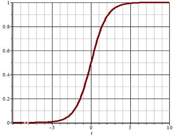
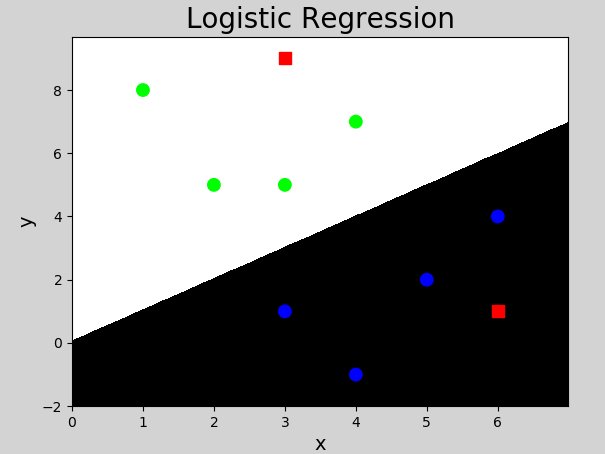
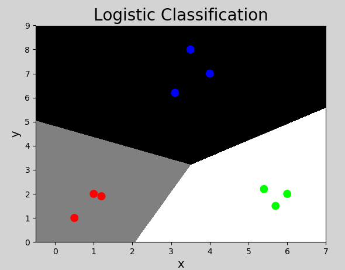

# 一、逻辑回归

## 1. 概述

### 1）什么是逻辑回归

```javascript

逻辑回归（Logistic Regression） 虽然被称为 "回归"，但其实际上是 "分类模型"，常用于二分类。
逻辑回归因其简单、可并行化、可解释强而受到广泛应用。

		 /**
			 预测值： 是连续的，称为回归业务。
			 预测值： 是离散的，称为分类业务。
		 */

		 /**
		 	//===================名字的由来
		 	逻辑 + 回归
			//逻辑 指逻辑函数
			//回归是指线性

		 */

 "二分类"（也称为逻辑分类）是 "常见的分类方法"，是将一批样本或数据划分到两个类别，
		//分类结果只有两类		


例如一次考试，根据成绩可以分为及格、不及格两个类别，如下表所示：

```


| 姓名  | 成绩 | 分类 |
| ----- | ---- | ---- |
| Jerry | 86   | 1    |
| Tom   | 98   | 1    |
| Lily  | 58   | 0    |
| ……    | ……   | ……   |

这就是逻辑分类，将连续值映射到两个类别中。

```javascript

//========================================= “逻辑回归” 的套路
//========================================= “逻辑回归” 的套路

（1）.根据样本数据，构建一个 "线性回归模型"，预测输出（连续）
				// "连续的" 、 "线性的"

（2）.将连续的预测数据，带入到逻辑函数中
				//为什么要带入 "逻辑函数"

（3）.逻辑函数，将预测值映射到0-1区间范围内（将线性转为非线性）
				//将 "线性" 转为 "非线性"
				//====================================== 为什么要 将 "线性" 转为 "非线性"？
				// 因为 "线性模型" 的表达能力不是那么强。
				// "水果的直径" 示例，能说明这个问题


（4）.找到一个阈值 0.5
		//

（5）.大于0.5--->1   小于0.5 ---》 0


```


### 2）逻辑函数


```javascript

"逻辑回归" 是一种 "广义的线性回归"，其原理是利用线性模型根据输入计算输出（线性模型输出值为连续），
并在 "逻辑函数" 作用下，将连续值转换为 "两个离散值（0或1）"，其表达式如下：

//====================================== "逻辑函数" 的图像，像一个S形
//====================================== "逻辑函数" 的图像，像一个S形


```


$$
y = h(w_1x_1 + w_2x_2 + w_3x_3 + ... + w_nx_n + b)
$$


其中，括号中的部分为线性模型，计算结果在函数$h()$的作用下，做二值化转换，函数$h()$的定义为：


$$
h= \frac{1}{1+e^{-t}}
$$
$$
\quad t=w^Tx+b
$$

```javascript


h = 1 / ( 1 +e^(-t) )


e 约等于 2.71828，它是一个无理数

负无穷，无限接近于0
正无穷，无限接近于1


```

该函数称为Sigmoid函数（又称逻辑函数），能将$(-\infty, +\infty)$的值映射到$(0, 1)$之间，其图像为：



可以设定一个阈值（例如0.5），当函数的值大于阈值时，分类结果为1；当函数值小于阈值时，分类结果为0. 也可以根据实际情况调整这个阈值. 

### 3）分类问题的损失函数

```javascript

//==============================  "分类问题" 与 "回归问题" 的评估方式不一样
//==============================  "分类问题" 与 "回归问题" 的评估方式不一样

 "分类问题" 与  "回归问题" 的评估方式一定不一样。
 
 "分类问题" 里面， "对了" 就好，"不对" 就不好。
 "回归问题" 里面是要 "越接近越好"。
 
//==============================
//==============================
（1）对于 "回归问题"，可以使用 "均方差" 作为 "损失函数"，

（2）对于 "分类问题"， 如何度量预测值与真实值之间的差异？
	 分类问题采用 "交叉熵" 作为 "损失函数"，
     //================================================
     //================================================ 
	 当只有 "两个类别" 时，损失函数表达式为：
     
```

$$
E(y, \hat{y}) = -[y \ log(\hat{y}) + (1-y)log(1-\hat{y})]
$$

```javascript

log 指对数

//=========================================
//=========================================

"交叉熵"  是度量  "两个类别"  之间的  "概率"  的差异信息的。

这个值越小越准

//========================================= 演示交叉熵函数的计算过程
//========================================= 演示交叉熵函数的计算过程
//============ 举例说明:
//============ 举例说明:
真实类别为0 ： 概率[1.0 0.0]  	 //[1.0 0.0]  表示: "是0的概率为100%"，"是1的概率为0%" 
真实类别为1 ： 概率[0.4 0.6]     //[0.4 0.6]  表示: "是0的概率为40%"， "是1的概率为60%"
//============ 那么结果：
//============ 那么结果：
真实类别0 ： 概率1.0
预测类别0 :  概率0.6  得到 0.51
        //============ 带到公式里面去
          - 1 * log(0.6) + (1-1) *log(1-0.6)
        = - 1 * log(0.6) +  0 
        = - math.log(0.6)
        = - -0.5108256237659907
        = 0.51
预测类别0 :  概率0.9  得到 0.10
        //============ 带到公式里面去
          - 1 * log(0.9) + (1-1) *log(1-0.9)
        = - 1 * log(0.9) +  0 
        = - math.log(0.9)   //这里的log是以e为底的
        = - -0.10536051565782628
        = 0.10
//======================= 说明：
//======================= 说明：
这个值越小越准
0.6 的概率是 0 时，得到0.51
0.9 的概述是 0 时，得到0.10

预测越准，"损失函数" 的值越小。


//=======================计算熵的时候
一般是以 e 为底 //2.71828
或者以2为底
或者以10为底


```

其中，y为真实值，$\hat{y}$为预测值.  

- 当$y=1$时，预测值$\hat{y}$越接近于1，$log(\hat{y})$越接近于0，损失函数值越小，表示误差越小，预测的越准确；当预测时$\hat{y}$接近于0时，$log(\hat{y})$接近于负无穷大，加上符号后误差越大，表示越不准确；
- 当$y=0$时，预测值$\hat{y}$越接近于0，$log(1-\hat{y})$越接近于0，损失函数值越小，表示误差越小，预测越准确；当预测值$\hat{y}$接近于1时，$log(1-\hat{y})$接近于负无穷大，加上符号后误差越大，表示越不准确.


## 2. 逻辑回归实现

sklearn中，逻辑回归相关API如下：

```javascript
//=========================================
"逻辑回归" 底层使用的是 "线性回归"，所以它也是在 sklearn.linear_model 里面的

//========================================= 回归问题 和 分类问题
//========================================= 回归问题 和 分类问题
主要的不同还是构建模型不同，其它的流程都相同

```


```python


# 创建模型
# solver参数： "逻辑函数" 中  "指数的"  函数关系（ liblinear 表示线性关系）
						// "逻辑函数" 中  "指数的"  函数关系: 指线性模型 "怎么去求它的参数"
    					// 指求 "损失函数" 极小值的 "方式"。
                        // liblinear 指坐标轴下降法
            			// newton-cg 拟牛顿法的一种
                		// lbfgs 拟牛顿法  //默认值lbfgs
                        // sag 随机平均梯度下降
                        ......

# C参数：正则强度，越大拟合效果越小，通过调整该参数防止过拟合
						//防止 "过拟合" 的 "正则化系数（惩罚项系数）",前面学的。
                        //默认是l2范数

        一般 penalty='l2'时， solver= 可以选择所有，
        一般 penalty='l1'时， solver= 只能选择liblinear。

        
model = lm.LogisticRegression(solver='liblinear', C=1)

# 训练
model.fit(x, y) 

# 预测
pred_y = model.predict(x)
```


以下是使用sklearn库提供的逻辑分类器（LogisticRegression）实现的代码：

```python
# 逻辑分类器示例
import numpy as np
import sklearn.linear_model as lm
import matplotlib.pyplot as mp

x = np.array([[3, 1], [2, 5], [1, 8], [6, 4],
              [5, 2], [3, 5], [4, 7], [4, -1]])
y = np.array([0, 1, 1, 0, 0, 1, 1, 0])

# 创建逻辑分类器对象
model = lm.LogisticRegression()
model.fit(x, y)  # 训练

# 预测
test_x = np.array([[3, 9], [6, 1]])
test_y = model.predict(test_x)  # 预测
print(test_y)

# 计算显示坐标的边界
left = x[:, 0].min() - 1
right = x[:, 0].max() + 1
buttom = x[:, 1].min() - 1
top = x[:, 1].max() + 1

# 产生网格化矩阵
grid_x, grid_y = np.meshgrid(np.arange(left, right, 0.01),
                             np.arange(buttom, top, 0.01))

print("grid_x.shape:", grid_x.shape)
print("grid_y.shape:", grid_y.shape)

# 将x,y坐标合并成两列
mesh_x = np.column_stack((grid_x.ravel(), grid_y.ravel()))
print("mesh_x.shape:", mesh_x.shape)

# 根据每个点的xy坐标进行预测，并还原成二维形状
mesh_z = model.predict(mesh_x)
mesh_z = mesh_z.reshape(grid_x.shape)

mp.figure('Logistic Regression', facecolor='lightgray')
mp.title('Logistic Regression', fontsize=20)
mp.xlabel('x', fontsize=14)
mp.ylabel('y', fontsize=14)
mp.tick_params(labelsize=10)
mp.pcolormesh(grid_x, grid_y, mesh_z, cmap='gray')
mp.scatter(x[:, 0],  # 样本x坐标
           x[:, 1],  # 样本y坐标
           c=y, cmap='brg', s=80)
mp.scatter(test_x[:, 0], test_x[:, 1], c="red", marker='s', s=80)
mp.show()
```

执行结果：




## 3. 多分类实现

逻辑回归产生两个分类结果，可以通过 "多个二元分类器" 实现多元分类（一个多元分类问题转换为多个二元分类问题）. 如有以下样本数据：

| 特征1 | 特征2 | 特征3 | 实际类别 |
| ----- | ----- | ----- | -------- |
| $x_1$ | $x_2$ | $x_3$ | A        |
| $x_1$ | $x_2$ | $x_3$ | B        |
| $x_1$ | $x_2$ | $x_3$ | C        |

进行以下多次分类，得到结果：

第一次：分为A类（值为1）和非A类（值为0）

第二次：分为B类（值为1）和非B类（值为0）

第三次：分为C类（值为1）和非C类（值为0）

……

以此类推.


```javascript

//========================== 实现多分类：

有几个类别：就搞几个分类器。

```

利用逻辑分类器实现多元分类示例代码如下：

```python
# 多元分类器示例
import numpy as np
import sklearn.linear_model as lm
import matplotlib.pyplot as mp

# 输入
x = np.array([[4, 7],
              [3.5, 8],
              [3.1, 6.2],
              [0.5, 1],
              [1, 2],
              [1.2, 1.9],
              [6, 2],
              [5.7, 1.5],
              [5.4, 2.2]])
# 输出（多个类别）
y = np.array([0, 0, 0, 1, 1, 1, 2, 2, 2])

# 创建逻辑分类器对象
model = lm.LogisticRegression(C=200) # 调整该值为1看效果
model.fit(x, y)  # 训练

# 坐标轴范围
left = x[:, 0].min() - 1
right = x[:, 0].max() + 1
h = 0.005

buttom = x[:, 1].min() - 1
top = x[:, 1].max() + 1
v = 0.005

grid_x, grid_y = np.meshgrid(np.arange(left, right, h),
                             np.arange(buttom, top, v))

mesh_x = np.column_stack((grid_x.ravel(), grid_y.ravel()))
mesh_z = model.predict(mesh_x)
mesh_z = mesh_z.reshape(grid_x.shape)

# 可视化
mp.figure('Logistic Classification', facecolor='lightgray')
mp.title('Logistic Classification', fontsize=20)
mp.xlabel('x', fontsize=14)
mp.ylabel('y', fontsize=14)
mp.tick_params(labelsize=10)
mp.pcolormesh(grid_x, grid_y, mesh_z, cmap='gray')
mp.scatter(x[:, 0], x[:, 1], c=y, cmap='brg', s=80)
mp.show()
```

执行结果：



## 4. 总结

1）逻辑回归是分类问题，用于实现二分类问题

2）实现方式：利用线性模型计算，在逻辑函数作用下产生分类

3）多分类实现：可以将多分类问题转化为二分类问题实现

4）用途：广泛用于各种分类问题

