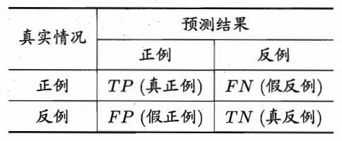

# 一、模型评估

```javascript


 
    置信度 = 模型认为某个类别成立的概率大小

//==================================================================== 置信度
//==================================================================== 置信度

置信度 = 模型认为某个类别成立的概率大小

假设你训练了随机森林（100棵树）。

现在输入：
	13888888888
模型内部发生什么？
    100棵树分别判断
    其中 95棵认为是手机号
    5棵认为是身份证
那么：
    predict_proba = [0.95, 0.05]

模型对“这个手机号”判断的置信度

每一次预测样本，都会对应一组概率（置信度）。

👉 置信度本身不是评估指标
👉 但它是很多评估指标的基础

```


## 1. 模型评估


### 1）（分类问题）性能度量

#### ① 错误率与精度

错误率和精度是 "分类问题" 中常用的  "性能度量指标"，既适用于 "二分类" 任务，也适用于 "多分类" 任务。

- 错误率（error rate）：指 "分类错误的样本"占样本总数的比例，即 （ 分类错误的数量 / 样本总数数量）

- 精度（accuracy）：指分类正确的样本占样本总数的比例，即 （分类正确的数量 / 样本总数数量）

  $$
  精度 = 1 - 错误率
  $$

​	

```javascript

一个用错误的去除，一个是用正确的去除，它们正好相反。
/**
假设有 10 个样本（二分类：猫 / 狗）
    真实结果：猫  狗  猫  狗  猫  狗  猫  狗  猫  狗
    模型预测：猫  狗  猫  猫  猫  狗  狗  狗  猫  狗

统计一下
	一共 10 个样本
预测错误的有：
    第 4 个（狗 → 预测成猫）
    第 7 个（猫 → 预测成狗）

错误率（Error Rate）:
	错误率=2/10=0.2 		错误率（Error Rate） = 20%
	精度=8/10=0.8=80		 正确率（Accuracy）80%


*/

```


#### ② 查准率、召回率与F1得分

```javascript


//================================================ 背景
"错误率" 和 "精度" 虽然常用，但并不能满足 "所有的任务需求"。

//================================================ 示例：
场景：新冠检测（正类 = 感染）
一共 100 人
感染：40 人
未感染：60 人
//============== 模型预测结果：
预测感染：50 人：
    其中 30 人感染 ✅
    其中 20 人没感染 ❌

预测未感染：50 人
    其中 10 人感染 ❌
    其中 40 人未感染 ✅
//============== 现在算两个指标
（1）查准率（Precision） //预测为正的准不准
	预测为感染的人中，有多少是真的？
    预测感染 50 人
    其中真的感染 30 人
    30 / 50 = 60 %
（2）召回率（Recall）
    真实感染 40 人
    找出来 30 人
	30 / 40 = 75 %
//================================================ 总结：
       查准率：好比抓坏人，抓到的坏人中，真坏人占比多少
       召回率：好比抓坏人，抓到的坏占总坏人的多少。

Precision 看“抓得准不准”
Recall 看“抓得全不全”

//================================================
F1=2×(Precision×Recall)/(Precision+Recall)

F1 得分就是把“准不准”和“全不全”压缩成一个分数。


```

例如，在一次疾病检测中，我们更关注以下两个问题：

- 检测出感染的个体中有多少是 "真正病毒携带者"？

- 所有真正病毒携带者中，有多大比例被检测了出来？

```javascript

"类似的问题" 在很多分类场景下都会出现，"查准率（precision）" 与 "召回率（recall）" 是更为适合的 "度量标准"。
对于二分类问题，可以将真实类别、预测类别组合为“真正例”（true positive）、“假正例”（false positive）、“真反例”（true negative）、“假反例”（false negative）四种情形，见下表：

```




```javascript

//======================================================
正例：我要预测 "狗" ，狗就是 "正例"。
 真： 预测 "对" 的， 假：预测 "错" 的

```


- 样例总数：TP + FP + TN + FN

  

- 查准率： TP / (TP + FP)，表示分的准不准

  ​			// 针对某一个类型，"对的个数"/ "预测出来的值" = "查准率"

  ​                        // 每个类别都有自己的"查准率"

- 召回率：TP / (TP + FN)，表示分的全不全，又称为“查全率”

  ​			//针对某一个类型，"对的个数" /  "全部的值" = "查全率"


- F1得分：
  $$
  f1 = \frac{2 * 查准率 * 召回率}{查准率 + 召回率}
  $$


```javascript

"查准率" 和 "召回率" 是一对矛盾的度量。一般来说，查准率高时，召回率往往偏低；召回率高时，查准率往往偏低。
例如：
	（1）在病毒感染者检测中，若要提高查准率，只需要采取更严格的标准即可，这样会导致漏掉部分感染者，召回率就变低了；
	（2）放松检测标准，更多的人被检测为感染，召回率升高了，查准率又降低了. 
     通常只有在一些简单任务中，才能同时获得： "较高查准率" 和 "较高召回率"。
//====================================
在复杂的任务中要么保证 "查准率" ，要么保证 "召回率"。


```

```javascript
再次举例 说明： "查准率" 和 "召回率" 是一对矛盾的度量

//==================================示例一：
发现有100个人聚集在一起，打架斗殴，只有5个人在打架，剩下在围观，

热心的朝阳群众，拨打了110

警察来了，警察说："我们绝对不会放过任务一个闹事者（召回率/查全率）"
于是把100个人全抓回去了，
这时：召回率 / 查全率 = 5/5
	 查准率 = 5 / 100 

//==================================示例二：
发现有100个人聚集在一起，打架斗殴，只有5个人在打架，剩下在围观，

热心的朝阳群众，拨打了110，其中打架的两个人看到了有人报警了，默默躲进了人群中

警察来了，警察说： "我们绝不会错抓一个好人，警察抓走了3个人。（）"

于是把100个人全抓回去了，
这时：召回率 / 查全率 = 3 / 5
	 查准率 = 3 / 3


```


```javascript
//==================================
"查准率" 和 "召回率" 在不同应用中 "重要性" 也不同。
例如：
	 （1）在商品推荐中，为了尽可能少打扰客户，更希望推荐的内容是用户感兴趣的，此时查准率更重要；
	 （2）而在逃犯信息检索系统中，希望让更少的逃犯漏网，此时召回率更重要。

     
```


#### ③ 混淆矩阵


```javascript

"混淆矩阵" 也称 "误差矩阵"，
是表示 "精度评价" 的一种 "标准格式"，用n行n列的矩阵形式来表示。
//==============================================  看懂 “混淆矩阵” 的 “关键”
（1）每一行（数值之和）表示一个真实类别的样本， // "当前类别" 真实样本个数。	
（2）每一列（数值之和）表示一个预测类别的样本。 // "当前类别" 预测的样本个数。

//==============================================     
以下是一个 "预测结果准确" 的 "混淆矩阵"：

对的个数   	  ：主对角线上的值
真实的样本个数 ：当前行的和
预测出来的个数 ：当前列的和

//==============================================
通过接口拿到：
      对的个数，预测出来的样本，真实的样本个数。


```


|       | A类别 | B类别 | C类别 |
| ----- | ----- | ----- | ----- |
| A类别 | 5     | 0     | 0     |
| B类别 | 0     | 6     | 0     |
| C类别 | 0     | 0     | 7     |

```javascript

//===========================================
这里只有 "主对角线上有值"，它是一种理想的状态。
//===========================================


```


上述表格表示的含义为：

​			A类别实际有5个样本，

​			B类别实际有6个样本，

​		       C类别实际有7个样本；

预测结果中，

​			预测结果为A类别的为5个，

​			预测结果为B类别的为6个，

​			预测结果为C类别的为7个。


以下是一个预测结果不准确的混淆矩阵：

|       | A类别 | B类别 | C类别 |
| ----- | ----- | ----- | ----- |
| A类别 | 3     | 1     | 1     |
| B类别 | 0     | 4     | 2     |
| C类别 | 0     | 0     | 7     |

```javascript

//===========================================
这里就不是理想的状态
//===========================================

```


上述表格表示的含义为：A类别实际有5个样本，B类别实际有6个样本，C类别实际有7个样本；预测结果中，A类别有3个样本预测准确，另外各有1个被预测成了B和C；B类别有4个预测准确，另外2个被预测成了C类别；C类别7个全部预测准确，但有1个本属于A类别、2个本属于B类别的被预测成了C类别。


```javascript

根据混淆矩阵，查准率、召回率也可表示为：
    查准率 = 主对角线上的值 / 该值所在列的和
    召回率 = 主对角线上的值 / 该值所在行的和

```

#### ④ 分类报告

```javascript

比"混淆矩阵"更全面，

它有单独的 "查准率" 和 "召回率"

sm.classification_report(test_y,pred_test_y)
```


#### ⑤实验

利用sklearn提供的朴素贝叶斯分类器分类，并打印查准率、召回率、R2得分和混淆矩阵：

```python
# 混淆矩阵示例
import numpy as np
import sklearn.model_selection as ms
import sklearn.metrics as sm
import sklearn.naive_bayes as nb

# 输入，输出
x, y = [], []

# 读取数据文件
with open("../data/multiple1.txt", "r") as f:
    for line in f.readlines():
        data = [float(substr) for substr in line.split(",")]
        x.append(data[:-1])  # 输入样本：取从第一列到导数第二列
        y.append(data[-1])  # 输出样本：取最后一列

# 样本转数组
x = np.array(x)
y = np.array(y, dtype=int)

# 划分训练集和测试集
train_x, test_x, train_y, test_y = ms.train_test_split(
    x, y, test_size=0.25, random_state=7)

# 创建高斯朴素贝叶斯分类器对象
model = nb.GaussianNB()
model.fit(train_x, train_y)  # 使用划分的训练集来训练模型
pred_test_y = model.predict(test_x)  # 预测


//==========================================================  召回率/查全率
print("recall:", sm.recall_score(test_y,  # 真实值
                                 pred_test_y,  # 预测值
                                 average="macro"))  # 计算平均值，不考虑样本权重
								 //==============================  macro表示：不考虑权重计算平均值
								 //==============================  多个类别必须加 average 这个参数

    
//==========================================================  查准率

print("precision:", sm.precision_score(test_y,  # 真实值
                                       pred_test_y,  # 预测值
                                       average="macro"))  # 计算平均值，不考虑样本权重

//==========================================================  F1得分
print("F1:", sm.f1_score(test_y, pred_test_y,average="macro"))

//==========================================================  混淆举证
# 计算并打印模型预测的混淆矩阵
print("\n Confusion Matrix:")
cm = sm.confusion_matrix(test_y, pred_test_y)
print(cm)

```

打印输出：

```
recall: 0.9910714285714286
precision: 0.9903846153846154
F1: 0.9905525846702318

 Confusion Matrix:
[[22  0  0  0]
 [ 0 27  1  0]
 [ 0  0 25  0]
 [ 0  0  0 25]]
```

 