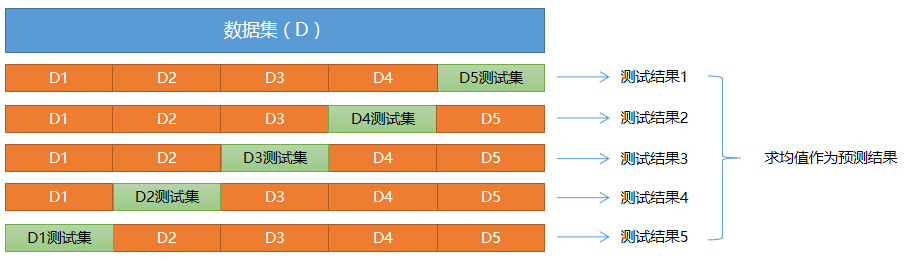

### 2）训练集与测试集

```javascript

//==============================================

这个就是前面讲的 "训练集" 和 "测试集" 的划分


通常情况下，评估一个模型性能的好坏，将样本数据划分为两部分，一部分专门用于模型训练，这部分称为“训练集”，一部分用于对模型进行测试，这部分被称为“测试集”，训练集和测试集一般不存在重叠部分. 常用的训练集、测试集比例有：9:1, 8:2, 7:3等. 

训练集和测试的划分，尽量保持 "均衡"、"随机"，"不能集中于某个或少量类别". 
		//==============重要
		//分类问题：不同类别样本数量不同，划分类别之后，可能测试和训练都是只有各自的类别
		//可能出现：相当于，我练习的是语文，而我测试的是数据

		//回归问题：不会有这样的情况。
		
		//==============================所以：分类问题，要按照类别，等比划分。
		如 0 1 2 3个类别，按9:1划分
        0类别 9：1
        1类别 9：1
        2类别 9：1
        
//==============================================所以，分类业务，
        划分训练集和测试集的接口里面要多一个参数
        
       train_x,test_x,train_y,test_y = ms.train_test_split(x,y,
                                                    test_size=0.1
                                                    , random_state=7 #样本的随机种子
                                                    , stratify=y     #按照y进行等比划分
                                                          ); 

```


有些公共数据集在创建时，已经进行了划分. 有时候，我们需要自己对数据集进行划分，划分的方式是先打乱数据集，然后使用一种计算方法，将一部分数据划入训练集，一部分数据划入测试集. 


### 3）交叉验证法

#### ① 什么是交叉验证

在样本数量较少的情况下，如果将样本划分为训练集、测试集，可能导致单个集合样本数量更少，可以采取交叉验证法来训练和测试模型. 

```javascript

将 "训练集" 和 "训练集"：8：2
//=============================================
构建了模型：决策树
训练：
预测：
评估：
//============================================= 当我们模型不能达标的时候，
可以调整模型，但是调整的模型是针对 8：2 的数据

交叉验证的套路就是：用 100 % 样本训练，用 100 %样本都去测试


//=============================================
将所有数据，划分成N等分，用每份都去训练，用每份都去测试
所有的数据，都去训练，所有的数据都去测试

```


"交叉验证法"（cross validation）先将数据集D划分为k个大小相同（或相似）的、互不相交的子集，每个子集称为一个"折叠"（fold），每次训练，轮流使用其中的一个作为测试集、其它作为训练集. 这样，就相当于获得了k组训练集、测试集，最终的预测结果为k个测试结果的平均值.




```javascript

每次 "训练集" 和 "测试集" 不重叠，每次都得到F1得分。


```


#### ② 如何实现交叉验证

sklearn中，提供了cross_val_score函数来实现交叉验证并返回评估指标值：

```python


import sklearn.model_selection as ms

n = ms.cross_val_score(model, #模型
                       train_x, train_y,# 样本输入、输出
                       cv,  # 折叠数量
                       scoring) # 指定返回的指标


```


拿到鸢尾花数据集，想要去做分类预测

我想用  逻辑回归

先用交叉验证，验证一下当前模型是否可用

再去进行训练。。。。。。。


以下是关于朴素贝叶斯模型的交叉验证实现：

```python
# 交叉验证示例
import numpy as np
import sklearn.model_selection as ms
import sklearn.naive_bayes as nb
import matplotlib.pyplot as mp

x, y = [], []  # 输入，输出

# 读取数据文件
with open("../data/multiple1.txt", "r") as f:
    for line in f.readlines():
        data = [float(substr) for substr in line.split(",")]
        x.append(data[:-1])  # 输入样本：取从第一列到导数第二列
        y.append(data[-1])  # 输出样本：取最后一列

train_x = np.array(x)
train_y = np.array(y, dtype=int)

# 划分训练集和测试集
#train_x, test_x, train_y, test_y = ms.train_test_split(
#    x, y, test_size=0.25, random_state=7)

# 创建高斯朴素贝叶斯分类器对象
model = nb.GaussianNB()
# 先做交叉验证，如果得分结果可以接受，再执行训练和预测
pws = ms.cross_val_score(model, x, y,
                         cv=5,  # 折叠数量
                         scoring='precision_weighted')  # 查准率
print("precision:", pws.mean())

rws = ms.cross_val_score(model, x, y, cv=5,
                         scoring='recall_weighted')  # 召回率
print("recall:", rws.mean())

f1s = ms.cross_val_score(model, x, y, cv=5,
                         scoring='f1_weighted')  # F1得分
print("f1:", f1s.mean())

acc = ms.cross_val_score(model, x, y,
                         cv=5, scoring='accuracy')  # 准确率
print("acc:", acc.mean())
```

执行结果：

```
precision: 0.996822033898305
recall: 0.9966101694915255
f1: 0.9966063988235516
acc: 0.9966101694915255
```

