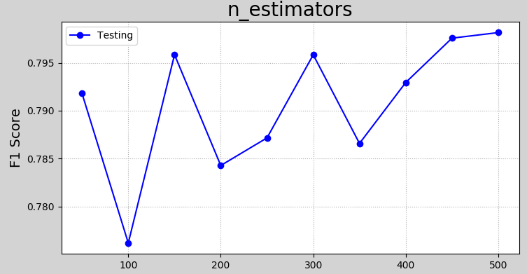
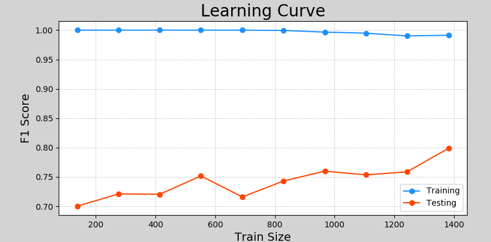
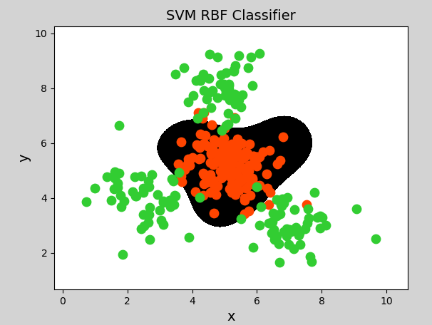

## 2. 模型优化


### 1）"验证曲线" 与 "学习曲线"


#### ① 验证曲线

```javascript

验证曲线是指根据不同的评估系数，来评估模型的优劣. 

例如，构建随机森林，树的数量不同，模型预测准确度有何不同？以下是一个验证曲线的示例：

```


```python
# 验证曲线示例
import numpy as np
import sklearn.preprocessing as sp
import sklearn.ensemble as se
import sklearn.model_selection as ms
import matplotlib.pyplot as mp

data = []
with open("../data/car.txt", "r") as f:
    for line in f.readlines():
        data.append(line.replace("\n", "").split(","))

data = np.array(data).T  # 转置
encoders, train_x = [], []

# 对样本数据进行标签编码
for row in range(len(data)):
    encoder = sp.LabelEncoder()  # 创建标签编码器
    encoders.append(encoder)
    if row < len(data) - 1:  # 不是最后一行，为样本特征
        lbl_code = encoder.fit_transform(data[row])  # 编码
        train_x.append(lbl_code)
    else:  # 最后一行，为样本输出
        train_y = encoder.fit_transform(data[row])

train_x = np.array(train_x).T  # 转置回来，变为编码后的矩阵
# print(train_x)

model = se.RandomForestClassifier(max_depth=8,  # 最大树高
                                  random_state=7)  # 随机种子
# 调用validation_curve，返回训练集、测试集得分矩阵
n_estimators = np.arange(50, 550, 50)  # 超参数值表
print("n_estimators.shape:", n_estimators.shape)
print("n_estimators:", n_estimators)


#====================================== 通过不同参数，构建多棵决策树，验证其准确性
#====================================== 通过不同参数，构建多棵决策树，验证其准确性
train_scores1, test_scores1 = ms.validation_curve(model, 		     # 模型
                                                  train_x, train_y,  # 全部的样本数据
                                                  'n_estimators',    # "模型参数" 名称，
                                                  					 # 要验证哪个参数，如弱模型数量
                                                  n_estimators,      # 模型参数值
                                                  cv=5               # 交叉验证次数
                                                 )
#返回一个训练集得分，返回一个测试集得分


train_mean = train_scores1.mean(axis=1)
print("train_mean:", train_mean)
test_mean = test_scores1.mean(axis=1)
print("test_mean:", test_mean)

# 可视化
mp.figure('n_estimators', facecolor='lightgray')
mp.title('n_estimators', fontsize=20)
mp.xlabel('n_estimators', fontsize=14)
mp.ylabel('F1 Score', fontsize=14)
mp.tick_params(labelsize=10)
mp.grid(linestyle=':')
mp.plot(n_estimators, test_mean, 'o-', c='blue', label='Testing')
mp.legend()
mp.show()
```

执行结果：



#### ② 学习曲线

```javascript

"学习曲线" 是用来评估 "不同大小的训练集" 下模型的 "优劣程度"，

如果 "预测结果" 随着 "训练集样本的增加" 而 "变化不大"，
那么 "增加样本数量" 不会对模型产生明 "显优化作用". 以下是一个学习曲线的示例：


如：

 100 ---> 0.74
 500 ---> 0.92
1000 ---> 0.920001

它可以到 训练集和测试集的占比


```


```python
# 学习曲线示例
import numpy as np
import sklearn.preprocessing as sp
import sklearn.ensemble as se
import sklearn.model_selection as ms
import matplotlib.pyplot as mp

data = []
with open("../data/car.txt", "r") as f:
    for line in f.readlines():
        data.append(line.replace("\n", "").split(","))

data = np.array(data).T  # 转置
encoders, train_x = [], []

# 对样本数据进行标签编码
for row in range(len(data)):
    encoder = sp.LabelEncoder()  # 创建标签编码器
    encoders.append(encoder)
    if row < len(data) - 1:  # 不是最后一行，为样本特征
        lbl_code = encoder.fit_transform(data[row])  # 编码
        train_x.append(lbl_code)
    else:  # 最后一行，为样本输出
        train_y = encoder.fit_transform(data[row])

train_x = np.array(train_x).T  # 转置回来，变为编码后的矩阵
print(train_x)

# 获得学习曲线
model = se.RandomForestClassifier(max_depth=9,  # 最大树高
                                  n_estimators=200, # 评估系数
                                  random_state=7)  # 随机种子

train_sizes = np.linspace(0.1, 1, 10)


//============================================================================ 学习曲线
//============================================================================ 学习曲线
train_sizes, train_scores, test_scores = ms.learning_curve(
                                                        model,
                                                        train_x, train_y,        #全部的数据
                                                        train_sizes=train_sizes, #训练集占比
                                                        cv=5)#交叉验证折叠数量

#返回三个值：
#（1）测试集得分
#（2）训练集得分
#（3）训练集占比


train_means = train_scores.mean(axis=1)
test_means = test_scores.mean(axis=1)
for size, score in zip(train_sizes, train_means):
    print(size, '->', score)

# 可视化
mp.figure('Learning Curve', facecolor='lightgray')
mp.title('Learning Curve', fontsize=20)
mp.xlabel('Train Size', fontsize=14)
mp.ylabel('F1 Score', fontsize=14)
mp.tick_params(labelsize=10)
mp.grid(linestyle=':')
mp.plot(train_sizes, train_means, 'o-', c='dodgerblue', label='Training')
mp.plot(train_sizes, test_means, 'o-', c='orangered', label='Testing')
mp.legend()
mp.show()
```

执行结果：



### 2）超参数优化

#### ① 什么是超参数

超参数是在开始学习过程之前设置值的参数，而不是通过训练得到的参数数据。超参数的设置主要依赖于经验、实验或经过比较的优选值。以下是一些模型中常见的超参数：

- 决策树模型树的最大深度；
- 随机森林模型树的数量；
- 交叉验证中折叠的额数量；
- 训练集/测试集的比例等等. 

超参数选择主要有随机搜索、网格搜索等方法。

#### ② 网格搜索

```javascript
就是双层for循环去找到最优的组合参数
```

网格搜索指将主要参数以及这些参数的主要取值，通
过穷举法产生不同组合，计算并比较预测结果，来寻找这些参数的最优组合。


以下是利用网格搜索法，寻找SVM的最优超参数的示例：

```python
# 网格搜索示例
import numpy as np
import sklearn.model_selection as ms
import sklearn.svm as svm
import sklearn.metrics as sm
import matplotlib.pyplot as mp

x, y = [], []
with open("../data/multiple2.txt", "r") as f:
    for line in f.readlines():
        data = [float(substr) for substr in line.split(",")]
        x.append(data[:-1])  # 输入
        y.append(data[-1])  # 输出

x = np.array(x)
y = np.array(y, dtype=int)

# 通过网格搜索确定最优参数组合
# 定义参数字典
params = [
    {"kernel": ["linear"],
     "C": [1, 10, 100, 1000]
     },
    {"kernel": ["poly"],
     "C": [1],
     "degree": [2, 3]
     },
    {"kernel": ["rbf"],
     "C": [1, 10, 100, 1000],
     "gamma": [1, 0.1, 0.01, 0.001]
     }
]


model = ms.GridSearchCV(svm.SVC(), params, cv=5)  # 创建网格搜索对象
		#GridSearchCV 网格、搜索、带交叉验证
model.fit(x, y)  # 训练，在训练的时候，才会开始寻找参数


print("best_score_:", model.best_score_)
print("best_params_:\n", model.best_params_)
#print("best_estimator_:\n", model.best_estimator_)

l, r, h = x[:, 0].min() - 1, x[:, 0].max() + 1, 0.005
b, t, v = x[:, 1].min() - 1, x[:, 1].max() + 1, 0.005
grid_x = np.meshgrid(np.arange(l, r, h), np.arange(b, t, v))
flat_x = np.c_[grid_x[0].ravel(), grid_x[1].ravel()]
flat_y = model.predict(flat_x)
grid_y = flat_y.reshape(grid_x[0].shape)

mp.figure("SVM RBF Classifier", facecolor="lightgray")
mp.title("SVM RBF Classifier", fontsize=14)
mp.xlabel("x", fontsize=14)
mp.ylabel("y", fontsize=14)
mp.tick_params(labelsize=10)
mp.pcolormesh(grid_x[0], grid_x[1], grid_y, cmap="gray")

C0, C1 = (y == 0), (y == 1)
mp.scatter(x[C0][:, 0], x[C0][:, 1], c="orangered", s=80)
mp.scatter(x[C1][:, 0], x[C1][:, 1], c="limegreen", s=80)

mp.show()
```

打印输出：

```
best_score_: 0.95
best_params_:
 {'C': 1, 'gamma': 1, 'kernel': 'rbf'}
```

执行结果可视化：



#### ③ 随机搜索

随机搜索的思想与网格搜索比较相似，只是不再测试上界和下界之间的所有值，而是在搜索范围中随机选取样本点。它的理论依据是，如果样本点集足够大，那么通过随机采样也能大概率地找到全局最优值，或其近似值。随机搜索一般会比网格搜索要快一些，但是和网格搜索的快速版一样，它的结果也是没法保证的。

### 