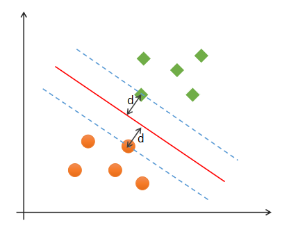
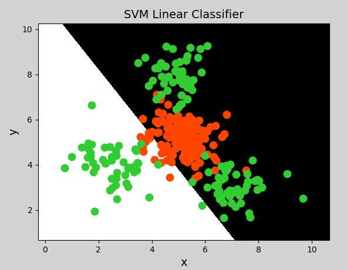

# **一**、支持向量机

## 1. 基本概念

### 1）什么是支持向量机

$$

$$

```


 //====================================
        它在人工智能发展过程中起到了决定性作用的。
        
 //====================================
        当前所学的都是传统的 "机器学习"
				线性回归
                岭回归/Lasso回归
				多项式回归
                决策树-回归
				逻辑回归
                决策树-分类       

                支持向量机
                朴素贝叶斯
                高斯混合模型
                k-nn
				kmiss
                ......
                //=================== "传统的机器学习"
                上面这些都是 "传统的机器学习"
                它们的核心都是以 "算法" 为核心 
                为了解决需求：设计一个算法出来。
                以 "算法" 为核心，就意味着，它跳不出 "算法这个圈"
                
                如：两个双包胎，看上去很像，但它深层次的东西有很多是不一样的。
                
                 以 "算法" 为核心
                 传统的机器学习 它只能学习到 "数据浅层特征"，
                 它没法跳出这个"算法"的核心

                 所以它的精度也就受到限制，
                 于是转换一下 "思路"
				 以 "数据为核心"，这就是深度学习
                 深度学习：如神经网络，
                  		它有个 "万能近似定理"，只要我的 "神经元足够的多"
						那我这个什么都能干
				
                 同样一个结构，同样一个模型，你把 "线性分布"的数据给我，
                 			 我能学习到 "线性分布的规律"
                             你把非线性的给我，我能学习到 "非线性分布的规律"
							 甚至：
                             	你把 "图像给我" ，我能学习到 "图像是什么"
								你把 "一段语音给我" 我能学习到语音什么
                                你把 "一段文字给我" 我能学习到文字的内容是什么
                  //=============================================== 什么叫 "神经网络"
	               生物学中有 "神经网络" ，一个一个的 "神经元" 组成的 "级联网络"


				   一个 "康耐尔心理大学" 的教授 费朗克*伯森*布拉特，在1937左右，提出了 感知机，
                   感知机也叫（神经元），它是对 "人类大脑去做了一个模仿"。
                   模仿出来在 "人工智能" 这个层面叫 "感知机"

				   深度学习：以 "算法" 和 "计算" 为核心的。 
                   		//同一个算法，不同的数据，不同的一个模型，它能学到不同的规律。
                  //=============================================== "感知机" 与 "分类任务"
	              当发现 感知机也叫 它也能做 "简单的分类任务"时  掀起了 "第一波AI浪潮"

				  感知机无法解决 "异或问题" （线性不可分）
                  					//线性可分:用 "一条直接" 把类别分出来，如：
                  					a  a
                                    _______
                                    b  b
                  					//线性不可分：这里一条直接就分不了了
                  					a  b
                                    b  a
                                    //==================================
                                    因为感知机就是 "一个线性模型"，y = w't * x + b
                                     "第一波AI浪潮" 跌落
		         //==============================================8年之后
                 提出了 "多层感知机串联" ，提出了 "多层感知机" 和神经网络
                 在理解上能够解决 "线性不可分" 的问题
                 //=================
                 "第二波AI浪潮" 掀起
                 由于当时在80年代，由于算力不够，算不出来
                 浪潮又下去了
                 //============================（1）机器学习
                 在同一时期："支持向量机" 的出现，解决了线性不可分的问题，
                 属于传统的 "机器学习"
                 //============================（2）深度学习
				 1998年，YanLecun 2018年 "图灵奖（计算机界的诺了贝尔）" 的获得者，（神经网络奠基人）
                 他提出了CNN（卷积神经网络）, 基于CNN提出 Lenet5 //5层的卷积神经网络
				 用它进行了 "邮政编码" 的识别。//手写体识别
                 
                 最开始 Lenet5  准确率不高，后面不断调整优化，准确率比 支持向量机 更高的
                 最初 Lenet5 并不火，
                 
                 直到了2006年杰弗里*辛顿（深度学习三巨头之一）"第三波AI浪潮" 
                 
                 
                 //===================================== ImageNet
                 2010，2011 参加比赛的，得奖者都是机器学习，
                 
                 2012 年杰弗里*辛顿和它的学生做出了 AlexNet（也是CNN,8层），
                 拿了冠军，错误率在15.7%
                 
                 2012年之后，就没有传统的机器学习去参加这两个比赛了
                 
                 2014年 VGG19(16-19层) 亚军 7.3%
                 2014年 GoogleNet22层 冠军  6.7%
                 
                 2015年  ResNet152层， 3.57%    人的错误率是：5%
                     
                 后来，这个CNN 1017 层了
                 
                 再后来这个比较没有再举办了，因为它无法再提升了。
```


```javascript

支持向量机：（经常被简写为SVM）
它是一个二分类模型，"逻辑回归" 也是："二分类"模型
//==============================

"支持向量机"，支持向量的一个机器，机器 就是指模型，
它比较出名。

//============================== 回顾
"线性模型"
	在 "二维空间" 是一条直线，
	在 "三维空间" 是一个平面，
    更高维度下的 "线性模型" 很难用几何图形来表示（称为超平面）
    //==============
    所以 "超平面" 指的是线性模型
//==============================    
支持向量机（Support Vector Machines）是一种 "二分类模型"，
		在机器学习、计算机视觉、数据挖掘中广泛应用，主要用于解决数据分类问题，
        //==============================    目的
        它的目的是寻找一个 "超平面" 来对样本进行分割，
        "分割的原则" 是 "间隔最大化"（即数据集的边缘点到分界线的距离d最大，如下图），
        最终转化为一个 "凸二次规划问题" 来求解。

        通常SVM用于 "二元分类问题" ，对于 "多元分类" 可将其分解为 "多个二元分类" 问题，再进行分类。
//==================================================== 什么叫 "支持向量"
        所谓 "支持向量" ， 就是下图中 "虚线穿过的边缘点"。
        			//指：虚线穿过边缘点，这是一个行为？
					//  "支持向量机" 划分两个类别边界，就是这个模型
        "支持向量机" 就对应着能将 "数据正确划分" 并且 "间隔最大的直线"（下图中红色直线）。
        
        			//
        
        //================================
        "支持向量" 到间隔的距离要最大
 

```


```javascript

	
    
```




### 2）最优分类边界

什么才是最优分类边界？什么条件下的分类边界为最优边界呢？


```javascript

如图中的  "A，B两个样本点"， "B点" 被预测为正类的 "确信度" 要大于 "A点"，
			//就是前面所说的 "置信概率" 要更高。


所以SVM的目标是寻找一个 "超平面" ，使得离 "超平面" 较近的 "异类点" 之间能有更大的间隔，
即不必考虑所有样本点，只需让求得的超平面使得离它近的点间隔最大。
超平面可以用如下线性方程来描述：
//========================================

要保证 "支持向量" 到 "分类边界的距离" 要最大


```

$$
w^T x + b = 0
$$
其中，$x=(x_1;x_2;...;x_n)$，$w=(w_1;w_2;...;w_n)$，$b$为偏置项.  可以从数学上证明，支持向量到超平面距离为：
$$
\gamma = \frac{1}{||w||}
$$


```javascript
为了使 "距离最大"，只需最小化 ||w|| 即可.
	//让分母最小


//找到一个边界，对类别进行划分


```


### 3）SVM最优边界要求

```javascript
SVM寻找最优边界时，需满足以下几个要求：

（1）正确性：对大部分样本都可以 "正确划分" 类别；
（2）安全性：支持向量，即离分类边界最近的样本之间的 "距离最远"；
（3）公平性：支持向量与分类边界的 "距离相等"；
（4）简单性：采用 "线性方程（直线、平面）表示分类边界"，也称分割超平面。
 	如果在 "原始维度" 中无法做 "线性划分"，那么就通过 "升维变换"，在 "更高维度空间" 寻求 "线性分割超平面".
 	从 "低纬度空间" 到 "高纬度空间的变换" 通过 "核函数" 进行。

    
//========================================================= 为什么说它不能处理异或问题
//========================================================= 为什么说它不能处理异或问题
    //======================================== and   
    //======================================== and  
    	1 and 1 --> 1
    	1 and 0 --> 0
    	0 and 1 --> 0
    	0 and 0 --> 0
		（1,1）
		（1,0）
		（0,1）
		（0,0）          
        这时4个点，可以通过 "一条直线" 分成 两类
    //======================================== or
    //======================================== or
    	1 or 1 --> 1
    	1 or 0 --> 1
    	0 or 1 --> 1
    	0 or 0 --> 0
		（1,1）
		（1,0）
		（0,1）
		（0,0） 
        这时4个点，也可以通过 "一条直线" 分成 两类        
    //========================================  xor 异或 ：相同返回0，不同返回1
    //========================================  xor 异或 ：相同返回0，不同返回1
    	1 ^ 1 --> 0
    	1 ^ 0 --> 1
    	0 ^ 1 --> 1
    	0 ^ 0 --> 0   
		（1,1）
		（1,0）
		（0,1）
		（0,0） 
        这时4个点，此时 "则不能使用一条直线划分"

    
```


### 4）线性可分与线性不可分


#### ① 线性可分

如果一组样本能使用 "一个线性函数" 将样本正确分类，

称这些数据样本是线性可分的。那么什么是线性函数呢？在二维空间中就是一条直线，

在三维空间中就是一个平面，以此类推，如果不考虑空间维数，这样的线性函数统称为超平面。


#### ② 线性不可分

如果一组样本，无法找到一个线性函数将样本正确分类，则称这些样本线性不可分。以下是一个一维线性不可分的示例：


<center><font size=2>一维线性不可分</font></center>
以下是一个二维不可分的示例：


<center><font size=2>二维线性不可分</font></center>


```javascript

//==================================================== 解决线性不可分问题
//==================================================== 解决线性不可分问题


```


对于该类线性不可分问题，可以通过升维，将低纬度特征空间映射为高纬度特征空间，实现线性可分，如下图所示：


<center><font size=2>一维空间升至二维空间实现线性可分</font></center>


<center><font size=2>二维空间升至三维空间实现线性可分</font></center>
那么如何实现升维？这就需要用到核函数。


## 2. 核函数

### 1）线性核函数

```javascript
"线性核函数（Linear）" 表示不通过核函数进行升维，仅在原始空间寻求线性分类边界，主要用于线性可分问题。


//================================================
意思是：
	在原来的 "数据维度上进行划分" ，一维的就是一维，二维的就是二维，
    如果是线性不可分，则硬分，只是分出的结果和效果不好。
	//因为有些需求是线性可分的。
    //它主要用来解决线性可分的问题


```


示例代码：


```python
# 支持向量机示例
import numpy as np
import sklearn.model_selection as ms
import sklearn.svm as svm
import sklearn.metrics as sm
import matplotlib.pyplot as mp

x, y = [], []
with open("../data/multiple2.txt", "r") as f:
    for line in f.readlines():
        data = [float(substr) for substr in line.split(",")]
        x.append(data[:-1])  # 输入
        y.append(data[-1])  # 输出

# 列表转数组
x = np.array(x)
y = np.array(y, dtype=int)

# 线性核函数支持向量机分类器
model = svm.SVC(kernel="linear")  # 线性核函数
# model = svm.SVC(kernel="poly", degree=3)  # 多项式核函数
# print("gamma:", model.gamma)
# 径向基核函数支持向量机分类器
# model = svm.SVC(kernel="rbf",
#                 gamma=0.01,  # 概率密度标准差
#                 C=200)  # 概率强度
model.fit(x, y)

# 计算图形边界
l, r, h = x[:, 0].min() - 1, x[:, 0].max() + 1, 0.005
b, t, v = x[:, 1].min() - 1, x[:, 1].max() + 1, 0.005

# 生成网格矩阵
grid_x = np.meshgrid(np.arange(l, r, h), np.arange(b, t, v))
flat_x = np.c_[grid_x[0].ravel(), grid_x[1].ravel()]  # 合并
flat_y = model.predict(flat_x)  # 根据网格矩阵预测分类
grid_y = flat_y.reshape(grid_x[0].shape)  # 还原形状

mp.figure("SVM Classifier", facecolor="lightgray")
mp.title("SVM Classifier", fontsize=14)

mp.xlabel("x", fontsize=14)
mp.ylabel("y", fontsize=14)
mp.tick_params(labelsize=10)
mp.pcolormesh(grid_x[0], grid_x[1], grid_y, cmap="gray")

C0, C1 = (y == 0), (y == 1)
mp.scatter(x[C0][:, 0], x[C0][:, 1], c="orangered", s=80)
mp.scatter(x[C1][:, 0], x[C1][:, 1], c="limegreen", s=80)
mp.show()
```

绘制图形：



### 2）多项式核函数


多项式核函数（Polynomial Kernel）用 "增加高次项特征的方法" 做升维变换，当多项式阶数高时复杂度会很高，其表达式为：


$$
K(x，y)=(αx^T·y+c)d
$$
$$
y = x_1 + x_2\\
y = x_1^2 + 2x_1x_2+x_2^2\\
y=x_1^3 + 3x_1^2x_2 + 3x_1x_2^2 + x_2^3
$$


其中，α表示调节参数，d表示最高次项次数，c为可选常数。


示例代码（将上一示例中创建支持向量机模型改为一下代码即可）：


```python
model = svm.SVC(kernel="poly", degree=3)  # 多项式核函数
```

生成图像：


### 3）径向基核函数

径向基核函数（Radial Basis Function Kernel）具有很强的灵活性，应用很广泛。与多项式核函数相比，

它的参数少，因此大多数情况下，都有比较好的性能。在不确定用哪种核函数时，

可优先验证 "高斯核函数"。


```javascript
由于类似于高斯函数，所以也称其为高斯核函数。

//================================  "高斯函数"， 。				           //================================  "高斯函数"，中间密集两边稀疏。
```


表达式如下：


示例代码（将上一示例中分类器模型改为如下代码即可）：

```python
# 径向基核函数支持向量机分类器
model = svm.SVC(kernel="rbf",
                gamma=0.01, # 概率密度标准差
                C=600)  # 概率强度，该值越大对错误分类的容忍度越小，分类精度越高，但泛化能力越差；该值越小，对错误分类容忍度越大，但泛化能力强
```

生成图像：


## 3. 总结

（1）支持向量机是二分类模型

（2）支持向量机通过寻找最优线性模型作为分类边界

（3）边界要求：正确性、公平性、安全性、简单性

（4）可以通过核函数将线性不可分转换为线性可分问题，核函数包括：线性核函数、多项式核函数、径向基核函数

（5）支持向量机适合少量样本的分类


网格搜索

获取一个最优超参数的方式可以绘制验证曲线，但是验证曲线只能每次获取一个最优超参数。如果多个超参数有很多排列组合的话，就可以使用网格搜索寻求最优超参数组合。

针对超参数组合列表中的每一个超参数组合，实例化给定的模型，做cv次交叉验证，将其中平均f1得分最高的超参数组合作为最佳选择，实例化模型对象。

网格搜索相关API：

```python
import sklearn.model_selection as ms
params = 
[{'kernel':['linear'], 'C':[1, 10, 100, 1000]},
 {'kernel':['poly'], 'C':[1], 'degree':[2, 3]}, 
 {'kernel':['rbf'], 'C':[1,10,100], 'gamma':[1, 0.1, 0.01]}]
 
 
model = ms.GridSearchCV(模型, params, cv=交叉验证次数)
model.fit(输入集，输出集)
# 获取网格搜索每个参数组合
model.cv_results_['params']
# 获取网格搜索每个参数组合所对应的平均测试分值
model.cv_results_['mean_test_score']
# 获取最好的参数
model.best_params_
model.best_score_
model.best_estimator_
```
