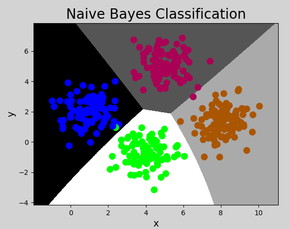

# 一、朴素贝叶斯


```javascript

“朴素贝叶斯”是一组功能强大且 "易于训练" 的分类器，
它使用贝叶斯定理来确定<u>**给定一组条件的结果的概率**</u>，

//=======================================

"朴素" 的含义是指 "所给定的条件都能独立存在" 和 "发生". 

朴素贝叶斯是 "多用途分类器" ，能在 "很多不同的情景" 下找到 "它的应用" ，例如 "垃圾邮件过滤"、 "自然语言处" 理等. 

//=======================================
前面给上一系列的文件，预测下面的文字应该填什么，下一个字应该填写什么

如： 中华人民共和_

它就是通过概率算出来的

//=================
贝叶斯 就是通过 "概率" 设计出来的公式，
给定 "一组条件的结果" 的概率
		
 做自然语言处理的时候，可以通过 贝叶斯 来计算概率
 
 		深度学习里面有，神经网络语言模型，基于神经网络预测概率
        
        
//================= 
        它主要用在自然语言处理
//======================================= 朴素贝叶斯
        学习 "朴素贝叶斯" 必须先会 "贝叶斯定理"
		学习 "贝叶斯定理" 必须先会 "概率"


```


## 1. 概率

### 1）定义

```javascript

//============================================== 概率
//============================================== 概率

"概率" 是反映  "随机事件" 出现的 "可能性大小" . 
		随机事件是指在  "相同条件下" ，可能 "出现" 也可能 "不出现" 的事件. 例如：

（1）抛一枚硬币，可能正面朝上，可能反面朝上，这是随机事件. 正/反面朝上的可能性称为 "概率"；
（2）掷骰子，掷出的点数为随机事件. 每个点数出现的可能性称为概率；
（3）一批商品包含良品、次品，随机抽取一件，抽得良品/次品为随机事件.
	经过大量反复试验，抽得次品率越来越接近于某个常数，则该常数为概率. 

//============================================== 事件的概率
//============================================== 事件的概率
我们可以将随机事件记为A或B，则
 P（A）//A的概率.
 P（B）//B的概率.

 
 
```


### 2）联合概率与条件概率


#### ① 联合概率

```javascript

//============================================== "联合概率" 
//============================================== "联合概率" 

指包含 "多个条件" 且 "所有条件同时成立"的概率，记作

```


$$
P ( A , B )
或
P(AB)
或
P(A \bigcap B)
$$


```javascript

A:你吃早饭
B:我吃早饭
P ( A , B )
或
P(AB)
或
P(A \bigcap B)

```


#### ② 条件概率

```javascript


//============================================== "条件概率"
//============================================== "条件概率"

在 "某个条件" 已经发生的情况下， "另一个事件" 的概率。
 


已知事件B发生的条件下，另一个事件A发生的概率称为条件概率，记为：


```

$$
P(A|B)
$$

​	


```javascript

如：在 "阴天" 的情况下，下雨的概率是多少

//========================================= P(A|B)
		// 竖线后面的就是 "已经发生的条件"
		// 竖线前面的是 "要求的概率"
		
		表示在 B 的条件下，A的概率是多少
```


#### ③ 事件的独立性

```javascript

//========================================================= 事件独立性
//========================================================= 事件独立性

两个事件互不影响，


A:你吃早饭 0.24  B:我吃早饭
这两个事件的发生，不相互影响。

//======================== 联合概率
//======================== 联合概率
某一天A和B同时吃早饭的概率就是：
		P(AB)=P(A) * P(B)

//======================== 条件概率
//======================== 条件概率
P(A|B) = P(A)
	//在B条件下，A的概率
 	//在我吃早饭条件下，你吃早饭的概率就是"A的事件概率"


		


"事件A" 不影响 "事件B" 的发生，称这两个 "事件独立"，记为：

```


$$
P(AB)=P(A)P(B)
$$
因为A和B不相互影响，则有：
$$
P(A|B) = P(A)
$$
可以理解为，给定或不给定B的条件下，A的概率都一样大.

### 3）先验概率与后验概率


```javascript

//=========================================================
//=========================================================

"后验概率" 要以 "先验证概率" 为基础
//========================================================= ① 先验概率
//========================================================= ① 先验概率

		大马路上来了一个人，我就问你他"姓什么"
		什么条件都没有，这就是先验概率

先验概率也是根据以往经验和分析得到的概率，
例如： "在没有任何信息前提的情况下，猜测对面来的陌生人姓氏"，
	  姓李的概率最大（因为全国李姓为占比最高的姓氏），这便是先验 "概率".
      
     //直接问你他姓什么
     P(姓)
//========================================================= ② 后验概率
//========================================================= ② 后验概率

后验概率是指 "在接收了一定条件 或 信息" 的情况下的 "修正概率"，

例如：在知道对面的人来自 "牛家村" 的情况下，
	 猜测他姓牛的概率最大，
     但不排除姓杨、李等等，这便是后验概率. 
    

     //问你来自牛家村的人，他姓什么
     P(姓|牛)


//========================================================= ③ 两者的关系
//========================================================= ③ 两者的关系
     

"事情还没有发生"，求这件事情发生的可能性的大小，是先验概率（可以理解为  "由因求果"）. 

"事情已经发生"，求 "这件事情发生的原因" 是由 "某个因素引起的可能性的大小" ，是后验概率（ "由果求因"）. 

     "先验概率与后验概率" 有 "不可分割" 的联系，后验概率的计算要以先验概率为基础. 


     
P((裙子项链)|女)

```


#### 

 


## 2. 贝叶斯定理

### 1）定义


```javascript

"贝叶斯定理" 由 "英国数学家" 托马斯.贝叶斯 ( Thomas Bayes)提出，用来描述 "两个条件概率之间" 的关系，
定理描述为：
```


$$
P(A|B) = \frac{P(A)P(B|A)}{P(B)}
$$
```java
//=========================说明
//B的条件下A发生的概率  =  A的事件概率 * A条件下B发生的概率  /  B的事件概率


P(A|B) 是一个 "后验概率"，P(A)是一个 "先验概率"。

```


```javascript


//===================================================================== 这个公司的推导过程
//===================================================================== 这个公司的推导过程

其中，$P(A)$和$P(B)$是A事件和B事件发生的概率.
$P(A|B)$称为条件概率，
表示B事件发生条件下，A事件发生的概率. 推导过程：

```

$$
P(A,B) =P(B)P(A|B)\\
P(B,A) =P(A)P(B|A)
$$
其中$P(A,B)$称为联合概率，指事件B发生的概率，乘以事件A在事件B发生的条件下发生的概率.

因为$P(A,B)=P(B,A)$, 所以有：
$$
P(B)P(A|B)=P(A)P(B|A)
$$
两边同时除以P(B)，则得到贝叶斯定理的表达式. 

其中，P(A)是先验概率，P(A|B)是已知 "B发生后" A的条件概率，也被称作 "后验概率". 


### 2）贝叶斯定理示例

```javascript

//=============================== 
【示例一】计算诈骗短信的概率

```


| 事件                                    | 概率 | 表达式        |
| --------------------------------------- | ---- | ------------- |
| 所有短信中，诈骗短信                    | 5%   | P（A）= 0.05  |
| 所有短信中，含有“中奖”两个字            | 4%   | P（B）= 0.04  |
| 所有 "诈骗短信" 中，含有  "中奖" 两个字 | 50%  | P(B\|A) = 0.5 |

求：收到一条新信息，含有“中奖”两个字，是诈骗短信的概率？

$P(A|B) = P(A) P(B|A) / P(B) = 0.05 * 0.5 / 0.04 = 0.625$

```
求(诈骗|中奖)
P(A|B) =  P(A) * P(B|A) / P(B)
       =  0.05 * 0.5 / 0.04
       =  0.625
```


【示例二】计算喝酒驾车的概率

| 事件                     | 概率 | 表达式          |
| ------------------------ | ---- | --------------- |
| 所有客人中，驾车         | 20%  | P（A）= 0.2     |
| 所有客人中，喝酒         | 10%  | P（B）= 0.1     |
| 所有客人中，开车并且喝酒 | 5%   | P（B\|A）= 0.05 |

 求：喝过酒仍然会开车的人的比例是多少？

$P(A|B) = P(A) P(B|A) / P(B) = 0.2 * 0.05 / 0.1 = 0.1$

```javascript
求(开车|喝酒)
P(A|B) =  P(A) * P(B|A) / P(B)
	   =  0.2 * 0.05 / 0.1
	   =  0.1 

```


-----


【示例三】

| 事件                                     | 概率                                                 | 表达式    |
| ---------------------------------------- | ---------------------------------------------------- | --------- |
| 在一个学校中，男生占比60%，女生占比40%。 | 0.4（女生的概率）                                    | P（A）    |
| 男生都是穿上校服裤子                     | 0.8（所有人穿裤子的概率0.6 +0.2 ）男生全部，女生一半 | P（B）    |
| 女生有一半人穿校服裤子，一半人穿校服裙子 | 0.5(女生穿裤子的概率)                                | P（B\|A） |

有一个人在，远处随机眺望，发现了一个穿裤子的学生，

请问这个人是女生 的概率是多少

```

求(女生|穿裤子) = P(女生) * P(穿裤子|女生) / P(穿裤子)
P(A|B) =  P(A) * P(B|A) / P(B)
	   =  0.4 * 0.5 / 0.8
	   =  0.25

```


## 3. 朴素贝叶斯分类器

### 1）分类原理


```javascript

"朴素贝叶斯" 分类器就是根据 "贝叶斯公式" 计算结果进行分类的模型，"朴素" 指 "事件之间相互独立" 无影响. 

例如：有如下数据集：

//============================================ 朴素贝叶斯

"朴素贝叶斯" 可以应用于 "自然语言处理"
		//人类在长期进化发展过程当中，形成的一套符号系统
		//中文、英文、日文、韩文

//============================================
"自然语言处理" 它要做的一件事就是， 如何让 "模型" 或者 "机器" 来理解我们所写的文字、文章、话

//============================================ 使用场景
//============================================ 使用场景

（1）给出一段文本，对它进行分类
（2）给出一封邮件，对它进行分类识别

//============================================ 

在文本处理中，"文本内容"它就是我们的X， "文本的类别" 就是Y值。

//============================================ 练习
//============================================ 练习

如下文件：哪些是体育运动，哪些不是体育运动？

```

| Text                                               | Category                   |
| -------------------------------------------------- | -------------------------- |
| A great game（一个伟大的比赛）                     | Sports（体育运动）         |
| The election was over（选举结束）                  | Not sports（不是体育运动） |
| Very clean match（没内幕的比赛）                   | Sports（体育运动）         |
| A clean but forgettable game（一场难以忘记的比赛） | Sports（体育运动）         |
| It was a close election（这是一场势均力敌的选举）  | Not sports（不是体育运动） |

```javascript

//============================================ 分析
//============================================ 分析

交给"机器学习"的时候，它就要算 "概率"，

首先就要将字符串转换成数字。

//============================================ 问题来了
//============================================ 问题来了

"体育运动" 怎么转，转成0 1，转成，标签编码

然后"文本内容" 转，标签编码：
		  (1)分词，把一句话，分成单词表示
		  (2)一个单词就是一个特征，
				之前每个样本的特征数量是相同的，
                现在分词之后，就不相同了。
                它是变长数据。


//============================================
//============================================
"标签编码" 是根据 "字符串" 在 "字符特征" 中的位置，来为其指定数值的一个类型，

要保证转 "换后的数值" ，能去表达 "当前这句话的语意信息" 
		//是好，还是不发
		//是体育，还是不是体育

这里不学 "自然语言处理" ，只是在学习 "朴素贝叶斯"的时候，了解一下


//============================================
//============================================

//============================================ （数字类型）数据预处理
//============================================ （数字类型）数据预处理
（1）均值移除
（2）范围缩放
（3）二值化
（4）标签编码
（5）独热编码

//============================================ （图像）数据预处理
//============================================ （图像）数据预处理
（1）旋转
（2）平移
（3）放大
（4）缩小
（5）二值化
（6）灰度化
//============================================ （文本）数据预处理
//============================================ （文本）数据预处理
 转成定长，且要能表达语义
（1）词频逆文档频率
（2）词模型
（3）共线矩阵
（4）等等
（5）词嵌入、词向量，把词转成数值类型的表示，
		//并且：词与词之间的关系我们是能计算出来的
		如：
        	国王 king    he
            女王 queen   she
            
        	

```


```javascript

求："A very close game" 是体育运动的概率？
数学上表示为 P(Sports | a very close game) .

根据 "贝叶斯定理"，
（1）"是运动" 的概率可以表示为：
```

$$
P(Sports | a \ very \ close \ game) = \frac{P(a \ very \ close \ game | sports) * P(sports)}{P(a \ very \ close \ game)}
$$
```javascript
（2）"不是运动"概率可以表示为：
```

$$
P(Not \ Sports | a \ very \ close \ game) = \frac{P(a \ very \ close \ game | Not \ sports) * P(Not \ sports)}{P(a \ very \ close \ game)}
$$
```javascript

"概率更大者" 即为 "分类结果" .
		//指： 是 和 不是，两个哪个更大。

由于 "分母相同"，即比较 "分子谁更大" 即可. 

我们只需统计 "A very close game" 多少次 "出现在Sports类别" 中，
就可以计算出 "上述两个概率".

但是”A very close game“ 并没有出现在 "数据集" 中，所以这个概率为0，

//==================================================== 核心 ，这就是 "朴素"
//==================================================== 核心 ，这就是 "朴素"
							
要解决这个问题，就 "假设每个句子的单词出现" 都与 "其它单词" 无关（ "事件独立" 即 "朴素" 的含义），
									//************* "事件" 就是指特征 
					/***
						长得帅不帅，不影响学习好不好
						学习好不好，不影响跑得快不快，
						跑得快不快，不影响吃得多不多
						吃得多不多，不影响蹦的高不高
						蹦的高不高，不影响你有没有女朋友
						......它们之前都没有影响 
						
						
						要是硬说有影响： "长得帅不帅" 与 "有没有女朋友" 有影响。
						那么，放在 "朴素贝叶斯" 里面，它也是强制认为它们没有影响。
						
						//=============
						所以当特征之前，它们相互独立的时候，结果会比较正确。


					*/

所以，P(a very close game)可以写成：
				//=====================================
				每个单词都认为它是独立的特征，就是求它们的联合概率
                P(a very close game) = P(a) * P(vary) * P(close) * P(a) 
				
				再加上 "条件"：
                P(a very close game|sport) = P(a|sport) * P(vary|sport) * P(close|sport) * P(a|sport) 
```

$$
P(a \ very \ close \ game) = P(a) * P(very) * P(close) * P(game)
$$

$$
P（a \ very \ close \ game|Sports)=  P(a|Sports)*P(very|Sports)*P(close|Sports)*P(game|Sports)
$$


```

```


统计出“a", "very", "close", "game"出现在"Sports"类别中的概率，就能算出其所属的类别. 具体计算过程如下：

- 第一步：计算总词频：	

  

  ```javascript
  				Sports类别词语总数	 ：11  
                  			//指sport类型里面文本单词总的数量
  				Not Sports类别词语总数 ：9
                  			//指sport类型里面文本单词总的数量
  
                  14指所有单词不重复单词数量
                  
  
  ```

  

- 第二步：计算每个类别的先验概率

  ```python
  # Sports和Not Sports概率
  P(Sports) = 3 / 5 = 0.6 
  P(Not Sports) = 2 / 5 = 0.4 
  
  # Sports条件下各个词语概率  得到： 0.00004608 * 0.6
  P(a | Sports) = (2 + 1) / (11 + 14) = 0.12
  P(very | Sports) = (1 + 1) / (11 + 14) = 0.08
  P(close | Sports) = (0 + 1) / (11 + 14) = 0.04
  P(game | Sports) = (2 + 1) / (11 + 14) = 0.12
  		//====================== 
  		close这个单词，在 "体育运动" 里面是没有的，防止它变成0
          所以分子都 +1 ，分母都 +14 。
  
  # Not Sports条件下各个词语概率
  P(a | Not Sports) = (1 + 1) / (9 + 14) = 0.087
  P(very | Not Sports) = (0 + 1) / (9 + 14) = 0.043
  P(close | Not Sports) = (1 + 1) / (9 + 14) =  = 0.087
  P(game | Not Sports) = (0 + 1) / (9 + 14) = 0.043
  		//======================
      	同理避免为0
  
  ```

  其中，分子部分加1，是为了避免分子为0的情况；分母部分都加了词语总数14，是为了避免分子增大的情况下计算结果超过1的可能. 

  

- 第三步：将先验概率带入贝叶斯定理，计算概率：

  是体育运动的概率：

$$
P（a \ very \ close \ game|Sports)= \\ P(a|Sports)*P(very|Sports)*P(close|Sports)*P(game|Sports)= \\
0.12 * 0.08 * 0.04 * 0.12 = 0.00004608
$$

​       不是体育运动的概率：
$$
P（a \ very \ close \ game|Not \ Sports)= \\ 
P(a|Not \ Sports)*P(very|Not \ Sports)*P(close|Not \ Sports)*P(game|Not \ Sports)= \\
0.087 * 0.043 * 0.087 * 0.043 = 0.000013996
$$
```javascript
分类结果：
	P(Sports) = 0.00004608 , P(Not Sports) = 0.000013996， 
是体育运动.

//============= P(Sports) 比 P(Not Sports)


```


### 2）实现朴素贝叶斯分类器

在sklearn中，提供了三个朴素贝叶斯分类器，分别是：


```javascript

（1）GaussianNB（高斯朴素贝叶斯分类器）：
		适合用于样本的值是连续的，
        数据呈正态分布的情况（比如人的身高、城市家庭收入、一次考试的成绩等等）
（2）MultinomialNB（多项式朴素贝叶斯分类器）：
		适合用于大部分属性为离散值的数据集
        
（3）BernoulliNB（伯努利朴素贝叶斯分类器）：
		适合用于特征值为二元离散值或是稀疏的多元离散值的数据集，

```


该示例中，样本的值为连续值，且呈正态分布，所以采用GaussianNB模型. 代码如下：

```python
# 朴素贝叶斯分类示例
import numpy as np
import sklearn.naive_bayes as nb
import matplotlib.pyplot as mp

# 输入，输出
x, y = [], []

# 读取数据文件
with open("../data/multiple1.txt", "r") as f:
    for line in f.readlines():
        data = [float(substr) for substr in line.split(",")]
        x.append(data[:-1])  # 输入样本：取从第一列到倒数第二列
        y.append(data[-1])  # 输出样本：取最后一列

x = np.array(x)
y = np.array(y, dtype=int)

# 创建高斯朴素贝叶斯分类器对象
model = nb.GaussianNB()
model.fit(x, y)  # 训练

# 计算显示范围
left = x[:, 0].min() - 1
right = x[:, 0].max() + 1

buttom = x[:, 1].min() - 1
top = x[:, 1].max() + 1

grid_x, grid_y = np.meshgrid(np.arange(left, right, 0.01),
                             np.arange(buttom, top, 0.01))

mesh_x = np.column_stack((grid_x.ravel(), grid_y.ravel()))
mesh_z = model.predict(mesh_x)
mesh_z = mesh_z.reshape(grid_x.shape)

mp.figure('Naive Bayes Classification', facecolor='lightgray')
mp.title('Naive Bayes Classification', fontsize=20)
mp.xlabel('x', fontsize=14)
mp.ylabel('y', fontsize=14)
mp.tick_params(labelsize=10)
mp.pcolormesh(grid_x, grid_y, mesh_z, cmap='gray')
mp.scatter(x[:, 0], x[:, 1], c=y, cmap='brg', s=80)
mp.show()
```

执行结果：




## 4. 总结

1）什么是朴素贝叶斯：朴素贝叶斯法是基于贝叶斯定理与特征条件独立假设的分类方法。“朴素”的含义为：假设问题的特征变量都是相互独立地作用于决策变量的，即问题的特征之间都是互不相关的。

2）朴素贝叶斯分类的特点

① 优点

- 逻辑性简单
- 算法较为稳定。当数据呈现不同的特点时，朴素贝叶斯的分类性能不会有太大的差异。
- 当样本特征之间的关系相对比较独立时，朴素贝叶斯分类算法会有较好的效果。

② 缺点

- 特征的独立性在很多情况下是很难满足的，因为样本特征之间往往都存在着相互关联，如果在分类过程中出现这种问题，会导致分类的效果大大降低。

3）什么情况下使用朴素贝叶斯：根据先验概率计算后验概率的情况，且样本特征之间独立性较强。