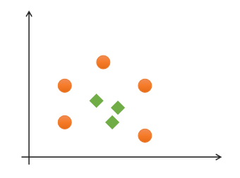
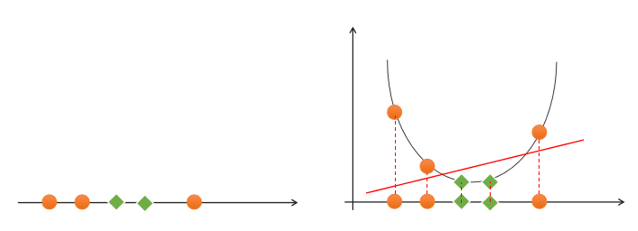
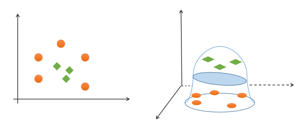

# **一**、支持向量机

## 1. 基本概念

### 1）什么是支持向量机

支持向量机（Support Vector Machines）是一种二分类模型，在机器学习、计算机视觉、数据挖掘中广泛应用，主要用于解决数据分类问题，它的目的是寻找一个超平面来对样本进行分割，分割的原则是间隔最大化（即数据集的边缘点到分界线的距离d最大，如下图），最终转化为一个凸二次规划问题来求解。通常SVM用于二元分类问题，对于多元分类可将其分解为多个二元分类问题，再进行分类。所谓“支持向量”，就是下图中虚线穿过的边缘点。支持向量机就对应着能将数据正确划分并且间隔最大的直线（下图中红色直线）。


### 2）最优分类边界

什么才是最优分类边界？什么条件下的分类边界为最优边界呢？


如图中的A，B两个样本点，B点被预测为正类的确信度要大于A点，所以SVM的目标是寻找一个超平面，使得离超平面较近的异类点之间能有更大的间隔，即不必考虑所有样本点，只需让求得的超平面使得离它近的点间隔最大。超平面可以用如下线性方程来描述：
$$
w^T x + b = 0
$$
其中，$x=(x_1;x_2;...;x_n)$，$w=(w_1;w_2;...;w_n)$，$b$为偏置项.  可以从数学上证明，支持向量到超平面距离为：
$$
\gamma = \frac{1}{||w||}
$$
为了使距离最大，只需最小化$||w||$即可.

### 3）SVM最优边界要求

SVM寻找最优边界时，需满足以下几个要求：

（1）正确性：对大部分样本都可以正确划分类别；

（2）安全性：支持向量，即离分类边界最近的样本之间的距离最远；

（3）公平性：支持向量与分类边界的距离相等；

（4）简单性：采用线性方程（直线、平面）表示分类边界，也称分割超平面。如果在原始维度中无法做线性划分，那么就通过升维变换，在更高维度空间寻求线性分割超平面. 从低纬度空间到高纬度空间的变换通过核函数进行。

### 4）线性可分与线性不可分

#### ① 线性可分

如果一组样本能使用一个线性函数将样本正确分类，称这些数据样本是线性可分的。那么什么是线性函数呢？在二维空间中就是一条直线，在三维空间中就是一个平面，以此类推，如果不考虑空间维数，这样的线性函数统称为超平面。

#### ② 线性不可分

如果一组样本，无法找到一个线性函数将样本正确分类，则称这些样本线性不可分。以下是一个一维线性不可分的示例：


<center><font size=2>一维线性不可分</font></center>
以下是一个二维不可分的示例：



<center><font size=2>二维线性不可分</font></center>
对于该类线性不可分问题，可以通过升维，将低纬度特征空间映射为高纬度特征空间，实现线性可分，如下图所示：



<center><font size=2>一维空间升至二维空间实现线性可分</font></center>


<center><font size=2>二维空间升至三维空间实现线性可分</font></center>
那么如何实现升维？这就需要用到核函数。


## 2. 核函数

### 1）线性核函数

线性核函数（Linear）表示不通过核函数进行升维，仅在原始空间寻求线性分类边界，主要用于线性可分问题。

示例代码：

```python
# 支持向量机示例
import numpy as np
import sklearn.model_selection as ms
import sklearn.svm as svm
import sklearn.metrics as sm
import matplotlib.pyplot as mp

x, y = [], []
with open("../data/multiple2.txt", "r") as f:
    for line in f.readlines():
        data = [float(substr) for substr in line.split(",")]
        x.append(data[:-1])  # 输入
        y.append(data[-1])  # 输出

# 列表转数组
x = np.array(x)
y = np.array(y, dtype=int)

# 线性核函数支持向量机分类器
model = svm.SVC(kernel="linear")  # 线性核函数
# model = svm.SVC(kernel="poly", degree=3)  # 多项式核函数
# print("gamma:", model.gamma)
# 径向基核函数支持向量机分类器
# model = svm.SVC(kernel="rbf",
#                 gamma=0.01,  # 概率密度标准差
#                 C=200)  # 概率强度
model.fit(x, y)

# 计算图形边界
l, r, h = x[:, 0].min() - 1, x[:, 0].max() + 1, 0.005
b, t, v = x[:, 1].min() - 1, x[:, 1].max() + 1, 0.005

# 生成网格矩阵
grid_x = np.meshgrid(np.arange(l, r, h), np.arange(b, t, v))
flat_x = np.c_[grid_x[0].ravel(), grid_x[1].ravel()]  # 合并
flat_y = model.predict(flat_x)  # 根据网格矩阵预测分类
grid_y = flat_y.reshape(grid_x[0].shape)  # 还原形状

mp.figure("SVM Classifier", facecolor="lightgray")
mp.title("SVM Classifier", fontsize=14)

mp.xlabel("x", fontsize=14)
mp.ylabel("y", fontsize=14)
mp.tick_params(labelsize=10)
mp.pcolormesh(grid_x[0], grid_x[1], grid_y, cmap="gray")

C0, C1 = (y == 0), (y == 1)
mp.scatter(x[C0][:, 0], x[C0][:, 1], c="orangered", s=80)
mp.scatter(x[C1][:, 0], x[C1][:, 1], c="limegreen", s=80)
mp.show()
```

绘制图形：


### 2）多项式核函数

多项式核函数（Polynomial Kernel）用增加高次项特征的方法做升维变换，当多项式阶数高时复杂度会很高，其表达式为：
$$
K(x，y)=(αx^T·y+c)d
$$
$$
y = x_1 + x_2\\
y = x_1^2 + 2x_1x_2+x_2^2\\
y=x_1^3 + 3x_1^2x_2 + 3x_1x_2^2 + x_2^3
$$


其中，α表示调节参数，d表示最高次项次数，c为可选常数。

示例代码（将上一示例中创建支持向量机模型改为一下代码即可）：

```python
model = svm.SVC(kernel="poly", degree=3)  # 多项式核函数
```

生成图像：


### 3）径向基核函数

径向基核函数（Radial Basis Function Kernel）具有很强的灵活性，应用很广泛。与多项式核函数相比，它的参数少，因此大多数情况下，都有比较好的性能。在不确定用哪种核函数时，可优先验证高斯核函数。由于类似于高斯函数，所以也称其为高斯核函数。表达式如下：


示例代码（将上一示例中分类器模型改为如下代码即可）：

```python
# 径向基核函数支持向量机分类器
model = svm.SVC(kernel="rbf",
                gamma=0.01, # 概率密度标准差
                C=600)  # 概率强度，该值越大对错误分类的容忍度越小，分类精度越高，但泛化能力越差；该值越小，对错误分类容忍度越大，但泛化能力强
```

生成图像：


## 3. 总结

（1）支持向量机是二分类模型

（2）支持向量机通过寻找最优线性模型作为分类边界

（3）边界要求：正确性、公平性、安全性、简单性

（4）可以通过核函数将线性不可分转换为线性可分问题，核函数包括：线性核函数、多项式核函数、径向基核函数

（5）支持向量机适合少量样本的分类


网格搜索

获取一个最优超参数的方式可以绘制验证曲线，但是验证曲线只能每次获取一个最优超参数。如果多个超参数有很多排列组合的话，就可以使用网格搜索寻求最优超参数组合。

针对超参数组合列表中的每一个超参数组合，实例化给定的模型，做cv次交叉验证，将其中平均f1得分最高的超参数组合作为最佳选择，实例化模型对象。

网格搜索相关API：

```python
import sklearn.model_selection as ms
params = 
[{'kernel':['linear'], 'C':[1, 10, 100, 1000]},
 {'kernel':['poly'], 'C':[1], 'degree':[2, 3]}, 
 {'kernel':['rbf'], 'C':[1,10,100], 'gamma':[1, 0.1, 0.01]}]
 
 
model = ms.GridSearchCV(模型, params, cv=交叉验证次数)
model.fit(输入集，输出集)
# 获取网格搜索每个参数组合
model.cv_results_['params']
# 获取网格搜索每个参数组合所对应的平均测试分值
model.cv_results_['mean_test_score']
# 获取最好的参数
model.best_params_
model.best_score_
model.best_estimator_
```
