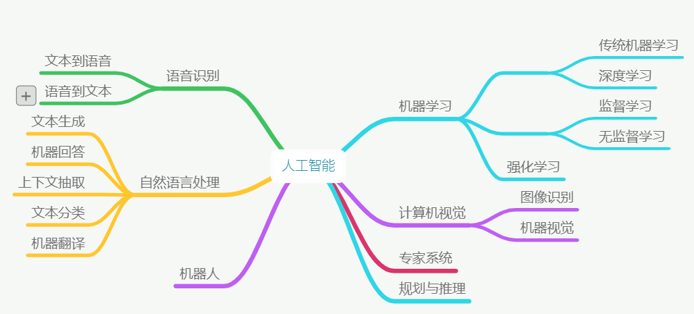
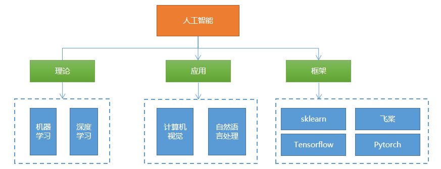
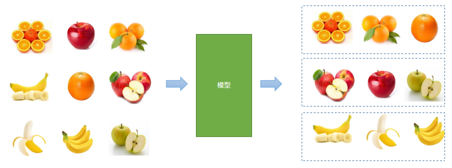
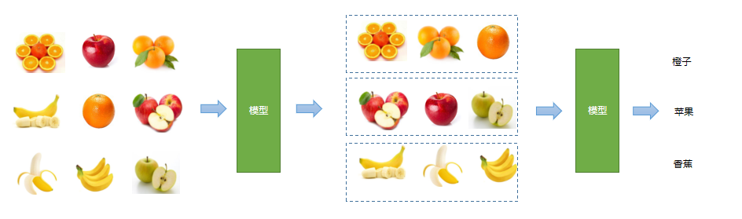
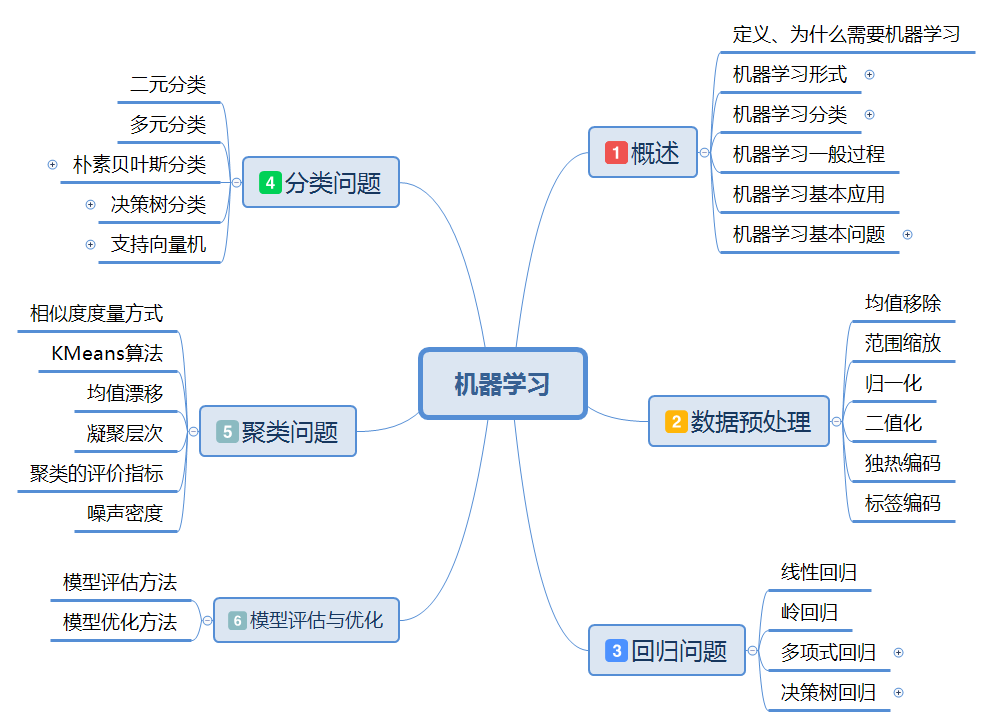

# 一、人工智能课程概述

## 1. 什么是人工智能

人工智能（Artificial Intelligence）是计算机科学的一个分支学科，主要研究用计算机模拟人的思考方式和行为方式，从而在某些领域代替人进行工作.

## 2. 人工智能的学科体系

以下是人工智能学科体系图：



- 机器学习（Machine Learning）：人工智能的一个子学科，研究人工智能领域的基本算法、原理、思想方法，机器学习研究的内容在其它子学科都会用到
- 计算机视觉（Computer Vision）：研究计算机处理、识别、理解图像、视频的相关技术
- 自然语言处理（Natural Language Processing）：研究计算机理解人类自然语言的相关技术
- 语言处理：研究计算机理解识别、理解、合成语音的相关技术

## 3. 人工智能与传统软件的区别

- 传统软件：执行人的指令和想法，在执行之前人已经有了解决方案，无法超越人的思想和认识范围
- 人工智能：尝试突破人的思想和认识范围，让计算机学习到新的能力，尝试解决传统软件的难题

## 4. 课程介绍

### 1）课程内容

课程内容主要包括：



### 2）课程特点

- 内容多：包括机器学习、深度学习、计算机视觉、NLP、常用框架
- 难度大：学习难度较大，入门难、提高难、应用难
- 需要部分数学知识：记住结论、会调用API、能分析公式、公式推导
- 需要反复学习：第一轮听懂主要内容、第二轮理解核心概念、第三轮熟悉代码编写、第四轮深入理解和应用
- 越学越深

### 3）学习方法

- 先听懂、重理解
- 先易后难，先听后写，先粗后细
- 跳过过难的知识点，抓大放小
- 多看不同作者的教材，多听不同老师的讲解


# 二、机器学习基本概念

## 1. 什么是机器学习

1975年图灵奖获得者、1978年诺贝尔经济学奖获得者、著名学者赫伯特.西蒙（Herbert Simon）曾下过一个定义：如果一个系统，能够通过执行某个过程，就此改进了它的性能，那么这个过程就是学习.由此可看出，学习的目的就是改善性能.

卡耐基梅隆大学机器学习和人工智能教授汤姆.米切尔（Tom Mitchell）在他的经典教材《机器学习》中，给出了更为具体的定义：对于某类任务（Task，简称T）和某项性能评价准则（Performance，简称P），如果一个计算机在程序T上，以P作为性能度量，随着经验（Experience，简称E）的积累，不断自我完善，那么我们称计算机程序从经验E中进行了学习.


例如，篮球运动员投篮训练过程：球员投篮（任务T），以准确率为性能度量（P），随着不断练习（经验E），准确率不断提高，这个过程称为学习.

## 2. 为什么需要机器学习

1）程序自我升级；

2）解决那些算法过于复杂，甚至没有已知算法的问题；

3）在机器学习的过程中，协助人类获得事物的洞见.

## 3. 机器学习的形式

### 1) 建模问题

所谓机器学习，在形式上可近似等同于在数据对象中通过统计、推理的方法，来寻找一个接受特定输入X，并给出预期输出Y功能函数f，即$ Y = f(x)$. 这个函数以及确定函数的参数被称为模型. 

### 2) 评估问题

针对已知的输入，函数给出的输出（预测值）与实际输出（目标值）之间存在一定误差，因此需要构建一个评估体系，根据误差大小判定函数的优劣.

### 3) 优化问题

学习的核心在与改善性能，通过数据对算法的反复锤炼，不断提升函数预测的准确性，直至获得能够满足实际需求的最优解，这个过程就是机器学习.

## 4. 机器学习的分类（重点）

### 1) 有监督、无监督、半监督学习

#### a) 有监督学习

在已知数据输出（经过标注的）的情况下对模型进行训练，根据输出进行调整、优化的学习方式称为有监督学习.


####b) 无监督学习

没有已知输出的情况下，仅仅根据输入信息的相关性，进行类别的划分.



####c) 半监督

先通过无监督学习划分类别，再人工标记通过有监督学习方式来预测输出.例如先对相似的水果进行聚类，再识别是哪个类别.




### 2) 批量学习、增量学习

#### a) 批量学习

将学习过程和应用过程分开，用全部训练数据训练模型，然后再在应用场景中进行预测，当预测结果不够理想时，重新回到学习过程，如此循环.

#### b) 增量学习

将学习过程和应用过程统一起来，在应用的同时，以增量的方式不断学习新的内容，边训练、边预测.

### 3) 基于模型学习、基于实例学习

#### a) 基于模型的学习

根据样本数据，建立用于联系输出和输出的某种数学模型，将待预测输入带入该模型，预测其结果. 例如有如下输入输出关系：

| 输入（x） | 输出（y） |
| --------- | --------- |
| 1         | 2         |
| 2         | 4         |
| 3         | 6         |
| 4         | 8         |

根据数据，得到模型 $y = 2x$

预测：输入9时，输出是多少？

#### b) 基于实例的学习

根据以往经验，寻找与待预测输入最接近的样本，以其输出作为预测结果（从数据中心找答案）. 例如有如下一组数据：

| 学历(x1) | 工作经验(x2) | 性别(x3) | 月薪(y) |
| :------: | :----------: | :------: | ------: |
|   本科   |      3       |    男    |    8000 |
|   硕士   |      2       |    女    |   10000 |
|   博士   |      2       |    男    |   15000 |

预测：本科，3，男   ==> 薪资？

## 5. 机器学习的一般过程(重点)

1) 数据收集，手段如手工采集、设备自动化采集、爬虫等

2) 数据清洗：数据规范、具有较大误差的、没有意义的数据进行清理

​	注：以上称之为数据处理，包括数据检索、数据挖掘、爬虫......

3) 选择模型（算法）

4) 训练模型

5) 模型评估

6) 测试模型

​	注：3~6步主要是机器学习过程，包括算法、框架、工具等......

7) 应用模型

8) 模型维护

## 6. 机器学习的典型应用

1) 股价预测

2) 推荐引擎

3) 自然语言处理

4) 语音处理：语音识别、语音合成

5) 图像识别、人脸识别

6) ……

## 7. 机器学习的基本问题(重点)

### 1) 回归问题

根据已知的输入和输出，寻找某种性能最佳的模型，将未知输出的输入代入模型，得到**<u>连续的输出</u>**.例如：

- 根据房屋面积、地段、修建年代以及其它条件预测房屋价格
- 根据各种外部条件预测某支股票的价格
- 根据农业、气象等数据预测粮食收成
- 计算两个人脸的相似度

### 2) 分类问题

根据已知的输入和输出，寻找性能最佳的模型，将未知输出的输入带入模型，得到**<u>离散的输出</u>**，例如：

- 手写体识别（10个类别分类问题）
- 水果、鲜花、动物识别
- 工业产品瑕疵检测（良品、次品二分类问题）
- 识别一个句子表达的情绪（正面、负面、中性）

### 3) 聚类问题

根据已知输入的相似程度，将其划分为不同的群落，例如：

- 根据一批麦粒的数据，判断哪些属于同一个品种
- 根据客户在电商网站的浏览和购买历史，判断哪些客户对某件商品感兴趣
- 判断哪些客户具有更高的相似度

### 4) 降维问题

在性能损失尽可能小的情况下，降低数据的复杂度，数据规模缩小都称为降维问题.

## 8. 课程内容




# 三、数据预处理

## 1. 数据预处理的目的

1）去除无效数据、不规范数据、错误数据

2）补齐缺失值

3）对数据范围、量纲、格式、类型进行统一化处理，更容易进行后续计算

## 2. 预处理方法

### 1）标准化（均值移除）

让样本矩阵中的每一列的平均值为0，标准差为1. 如有三个数a, b, c，则平均值为：

$$
m = (a + b + c) / 3 \\
a' = a - m \\
b' = b - m \\
c' = c - m
$$
预处理后的平均值为0：
$$
(a' + b' + c') / 3 =( (a + b + c) - 3m) / 3 = 0
$$
预处理后的标准差：$s = sqrt(((a - m)^2 + (b - m)^2 + (c - m)^2)/3)$

$a'' = a / s$

$b'' = b / s$

$c'' = c / s$

$$s'' = sqrt(((a' / s)^2 + (b' / s) ^ 2 + (c' / s) ^ 2) / 3) $$

   $=sqrt((a' ^ 2 + b' ^ 2 + c' ^ 2) / (3 *s ^2))$

   $=1$

标准差：又称均方差，是离均差平方的算术平均数的平方根，用σ表示 ，标准差能反映一个数据集的离散程度

代码示例：

```python
# 数据预处理之：均值移除示例
import numpy as np
import sklearn.preprocessing as sp

# 样本数据
raw_samples = np.array([
    [3.0, -1.0, 2.0],
    [0.0, 4.0, 3.0],
    [1.0, -4.0, 2.0]
])
print(raw_samples)
print(raw_samples.mean(axis=0))  # 求每列的平均值
print(raw_samples.std(axis=0))  # 求每列标准差

std_samples = raw_samples.copy()  # 复制样本数据
for col in std_samples.T:  # 遍历每列
    col_mean = col.mean()  # 计算平均数
    col_std = col.std()  # 求标准差
    col -= col_mean  # 减平均值
    col /= col_std  # 除标准差

print(std_samples)
print(std_samples.mean(axis=0))
print(std_samples.std(axis=0))
```

我们也可以通过sklearn提供sp.scale函数实现同样的功能，如下面代码所示：

```python
std_samples = sp.scale(raw_samples) # 求标准移除
print(std_samples)
print(std_samples.mean(axis=0))
print(std_samples.std(axis=0))
```

### 2）范围缩放

将样本矩阵中的每一列最小值和最大值设定为相同的区间，统一各特征值的范围.如有a, b, c三个数，其中b为最小值，c为最大值，则：
$$
a' = a - b
$$

$$
b' = b - b
$$

$$
c' = c - b
$$

缩放计算方式如下公式所示：

$$
a'' = a' / c'
$$

$$
b'' = b' / c'
$$

$$
c'' = c' / c'
$$

计算完成后，最小值为0，最大值为1.以下是一个范围缩放的示例.

```Python
# 数据预处理之：范围缩放
import numpy as np
import sklearn.preprocessing as sp

# 样本数据
raw_samples = np.array([
    [1.0, 2.0, 3.0],
    [4.0, 5.0, 6.0],
    [7.0, 8.0, 9.0]]).astype("float64")

# print(raw_samples)
mms_samples = raw_samples.copy()  # 复制样本数据

for col in mms_samples.T:
    col_min = col.min()
    col_max = col.max()
    col -= col_min
    col /= (col_max - col_min)
print(mms_samples)
```

我们也可以通过sklearn提供的对象实现同样的功能，如下面代码所示：

```Python
# 根据给定范围创建一个范围缩放器对象
mms = sp.MinMaxScaler(feature_range=(0, 1))# 定义对象(修改范围观察现象)
# 使用范围缩放器实现特征值范围缩放
mms_samples = mms.fit_transform(raw_samples) # 缩放
print(mms_samples)
```

执行结果：

```
[[0.  0.  0. ]
 [0.5 0.5 0.5]
 [1.  1.  1. ]]
[[0.  0.  0. ]
 [0.5 0.5 0.5]
 [1.  1.  1. ]]
```


### 3）归一化

反映样本所占比率.用每个样本的每个特征值，除以该样本各个特征值绝对值之和.变换后的样本矩阵，每个样本的特征值绝对值之和为1.例如如下反映编程语言热度的样本中，2018年也2017年比较，Python开发人员数量减少了2万，但是所占比率确上升了：

| 年份 | Python（万人） | Java（万人） | PHP（万人） |
| ---- | -------------- | ------------ | :---------- |
| 2017 | 10             | 20           | 5           |
| 2018 | 8              | 10           | 1           |

归一化预处理示例代码如下所示：

```Python
# 数据预处理之：归一化
import numpy as np
import sklearn.preprocessing as sp

# 样本数据
raw_samples = np.array([
    [10.0, 20.0, 5.0],
    [8.0, 10.0, 1.0]
])
print(raw_samples)
nor_samples = raw_samples.copy()  # 复制样本数据

for row in nor_samples:
    row /= abs(row).sum()  # 先对行求绝对值，再求和，再除以绝对值之和

print(nor_samples) # 打印结果
```

在sklearn库中，可以调用sp.normalize()函数进行归一化处理，函数原型为：

```Python
sp.normalize(原始样本, norm='l2')
# l1: l1范数，除以向量中各元素绝对值之和
# l2: l2范数，除以向量中各元素平方之和
```

使用sklearn库中归一化处理代码如下所指示：

```Python
nor_samples = sp.normalize(raw_samples, norm='l1')
print(nor_samples) # 打印结果
```


### 4）二值化

根据一个事先给定的阈值，用0和1来表示特征值是否超过阈值.以下是实现二值化预处理的代码：

```Python
# 二值化
import numpy as np
import sklearn.preprocessing as sp

raw_samples = np.array([[65.5, 89.0, 73.0],
                        [55.0, 99.0, 98.5],
                        [45.0, 22.5, 60.0]])
bin_samples = raw_samples.copy()  # 复制数组
# 生成掩码数组
mask1 = bin_samples < 60
mask2 = bin_samples >= 60
# 通过掩码进行二值化处理
bin_samples[mask1] = 0
bin_samples[mask2] = 1

print(bin_samples)  # 打印结果
```

同样，也可以利用sklearn库来处理：

```Python
bin = sp.Binarizer(threshold=59) # 创建二值化对象(注意边界值)
bin_samples = bin.transform(raw_samples) # 二值化预处理
print(bin_samples)
```

二值化编码会导致信息损失，是不可逆的数值转换.如果进行可逆转换，则需要用到独热编码.


### 5）独热编码

根据一个特征中值的个数来建立一个由一个1和若干个0组成的序列，用来序列对所有的特征值进行编码.例如有如下样本：
$$
\left[
    \begin{matrix}
    1 & 3 & 2\\
    7 & 5 & 4\\
    1 & 8 & 6\\
    7 & 3 & 9\\
    \end{matrix}
\right]
$$
对于第一列，有两个值，1使用10编码，7使用01编码

对于第二列，有三个值，3使用100编码，5使用010编码，8使用001编码

对于第三列，有四个值，2使用1000编码，4使用0100编码，6使用0010编码，9使用0001编码

编码字段，根据特征值的个数来进行编码，通过位置加以区分.通过独热编码后的结果为：
$$
\left[

    \begin{matrix}

    10 & 100 & 1000\\

    01 & 010 & 0100\\

    10 & 001 & 0010\\

    01 & 100  & 0001\\

    \end{matrix}

\right]
$$
使用sklearn库提供的功能进行独热编码的代码如下所示：

```Python
# 独热编码示例
import numpy as np
import sklearn.preprocessing as sp

raw_samples = np.array([[1, 3, 2],
                        [7, 5, 4],
                        [1, 8, 6],
                        [7, 3, 9]])

one_hot_encoder = sp.OneHotEncoder(
    sparse=False, # 是否采用稀疏格式
    dtype="int32",
    categories="auto")# 自动编码
oh_samples = one_hot_encoder.fit_transform(raw_samples) # 执行独热编码
print(oh_samples)

print(one_hot_encoder.inverse_transform(oh_samples)) # 解码
```

执行结果：

```
[[1 0 1 0 0 1 0 0 0]
 [0 1 0 1 0 0 1 0 0]
 [1 0 0 0 1 0 0 1 0]
 [0 1 1 0 0 0 0 0 1]]
 
[[1 3 2]
 [7 5 4]
 [1 8 6]
 [7 3 9]]
```


### 6）标签编码

根据字符串形式的特征值在特征序列中的位置，来为其指定一个数字标签，用于提供给基于数值算法的学习模型.代码如下所示：

```Python
# 标签编码
import numpy as np
import sklearn.preprocessing as sp

raw_samples = np.array(['audi', 'ford', 'audi',
                        'bmw','ford', 'bmw'])

lb_encoder = sp.LabelEncoder() # 定义标签编码对象
lb_samples = lb_encoder.fit_transform(raw_samples) # 执行标签编码
print(lb_samples)

print(lb_encoder.inverse_transform(lb_samples)) # 逆向转换
```

执行结果：

```
[0 2 0 1 2 1]
['audi' 'ford' 'audi' 'bmw' 'ford' 'bmw']
```


# 四、练习

1）判断以下哪个是回归问题，哪个是分类问题，哪个是聚类问题：

- 判断一封邮件是否为垃圾邮件

- 在图像上检测出人脸的位置
- 视频网站根据用户观看记录，找出喜欢看战争电影的用户

2）分类和聚类主要区别是什么？

3）判断以下哪些是数据降维问题

- 将8\*8的矩阵缩小为4\*4的矩阵
- 将二维矩阵变形为一维向量
- 将高次方程模型转换为低次方程模型

