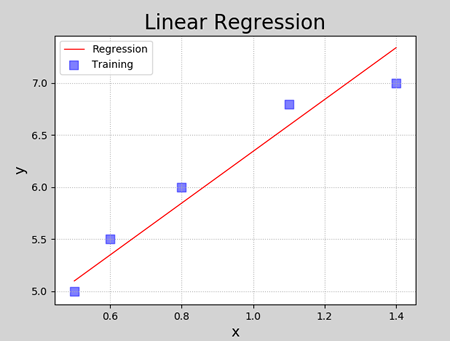

# 一、线性模型

## 1. 概述

线性模型是自然界最简单的模型之一，它描述了一个（或多个）自变量对另一个因变量的影响是呈简单的比例、线性关系.例如：

- 住房每平米单价为1万元，100平米住房价格为100万元，120平米住房为120万元；
- 一台挖掘机每小时挖$100m^3$沙土，工作4小时可以挖掘$400m^3$沙土. 

线性模型在二维空间内表现为一条直线，在三维空间内表现为一个平面，更高维度下的线性模型很难用几何图形来表示（称为超平面）.如下图所示：


<center><font size=2>二维空间下线性模型表现为一条直线</font></center>


<center><font size=2>三维空间下线性模型表现为一个平面</font></center>
线性回归是要根据一组输入值和输出值（称为样本），寻找一个线性模型，能最佳程度上拟合于给定的数值分布，从而再给定新的输入时预测输出.样本如下表所示：

| 输入(x) | 输出(y) |
| ------- | ------- |
| 0.5     | 5.0     |
| 0.6     | 5.5     |
| 0.8     | 6.0     |
| 1.1     | 6.8     |
| 1.4     | 6.8     |

根据样本拟合的线性模型如下图所示：


## 2. 线性模型定义

设给定一组属性$x, x=(x_1;x_2;...;x_n)$，线性方程的一般表达形式为：
$$
y = w_1x_1 + w_2x_2 + w_3x_3 + ... + w_nx_n + b
$$
写成向量形式为：
$$
y = w^Tx + b
$$
其中，$w=(w_1;w_2;...;w_n), x=(x_1;x_2;...;x_n)$，w和b经过学习后，模型就可以确定. 当自变量数量为1时，上述线性模型即为平面下的直线方程：
$$
y = wx + b
$$
线性模型形式简单、易于建模，却蕴含着机器学习中一些重要的基本思想. 许多功能强大的非线性模型可以在线性模型基础上引入层级结构或高维映射而得. 此外，由于$w$直观表达了各属性在预测中的重要性，因此线性模型具有很好的可解释性.例如，判断一个西瓜是否为好瓜，可以用如下表达式来判断：
$$
f_{好瓜}(x) = 0.2x_{色泽} + 0.5x_{根蒂} + 0.3x_{敲声} + 1
$$
上述公式可以解释为，一个西瓜是否为好瓜，可以通过色泽、根蒂、敲声等因素共同判断，其中根蒂最重要(权重最高)，其次是敲声和色泽.

## 3. 模型训练

在二维平面中，给定两点可以确定一条直线.但在实际工程中，可能有很多个样本点，无法找到一条直线精确穿过所有样本点，只能找到一条与样本”足够接近“或”距离足够小“的直线，近似拟合给定的样本.如下图所示：


如何确定直线到所有样本足够近呢？可以使用损失函数来进行度量.

### 1）损失函数

损失函数用来度量真实值（由样本中给出）和预测值（由模型算出）之间的差异.损失函数值越小，表明模型预测值和真实值之间差异越小，模型性能越好；损失函数值越大，模型预测值和真实值之间差异越大，模型性能越差.在回归问题中，均方差是常用的损失函数，其表达式如下所示：
$$
E = \frac{1}{2}\sum_{i=1}^{n}{(y - y')^2}
$$
其中，y为模型预测值，y'为真实值. 均方差具有非常好的几何意义，对应着常用的欧几里得距离（简称欧式距离）. 线性回归的任务是要寻找最优线性模型，是的损失函数值最小，即：
$$
(w^*, b^*) = arg min \frac{1}{2}\sum_{i=1}^{n}{(y - y')^2} \\
 = arg min \frac{1}{2}\sum_{i=1}^{n}{(y' - wx_i - b)^2}
$$
基于均方误差最小化来进行模型求解的方法称为“最小二乘法”. 线性回归中，最小二乘法就是试图找到一条直线，是所有样本到直线的欧式距离之和最小.  可以将损失函数对w和b分别求导，得到损失函数的导函数，并令导函数为0即可得到w和b的最优解.

### 2）梯度下降法

#### ① 为什么使用梯度下降

在实际计算中，通过最小二乘法求解最优参数有一定的问题：

（1）最小二乘法需要计算逆矩阵，有可能逆矩阵不存在；

（2）当样本特征数量较多时，计算逆矩阵非常耗时甚至不可行. 

所以，在实际计算中，通常采用梯度下降法来求解损失函数的极小值，从而找到模型的最优参数.

#### ② 什么是梯度下降

梯度（gradient）是一个向量（矢量，有方向），表示某一函数在该点处的方向导数沿着该方向取得最大值，即函数在该点处沿着该方向（此梯度的方向）变化最快，变化率最大.损失函数沿梯度相反方向收敛最快（即能最快找到极值点）.当梯度向量为零（或接近于零），说明到达一个极值点，这也是梯度下降算法迭代计算的终止条件.

这种按照负梯度不停地调整函数权值的过程就叫作“梯度下降法”.通过这样的方法，改变权重让损失函数的值下降得更快，进而将值收敛到损失函数的某个极小值.

通过损失函数，我们将“寻找最优参数”问题，转换为了“寻找损失函数最小值”问题.梯度下降法算法描述如下：

（1）损失是否足够小？如果不是，计算损失函数的梯度.
（2）按梯度的反方向走一小步，以缩小损失.
（3）循环到（1）.


梯度下降法中通过沿着梯度负方向不断调整参数，从而逐步接近损失函数极小值所在点. 如下图所示：


#### ③ 参数更新法则

在直线方程中，有两个参数需要学习，$w_0$和$w_1$，梯度下降过程中，分别对这两个参数单独进行调整，调整法则如下：
$$
w_0 = w_0 + \Delta w_0\\
w_1 = w_1 + \Delta w_1
$$
$\Delta w_0$和$\Delta w_1$可表示为：
$$
\Delta w_0 = -\eta \frac{\Delta loss}{\Delta w_0}\\
\Delta w_1 = -\eta \frac{\Delta loss}{\Delta w_1}\\
$$
其中，$\eta$称为学习率，$\frac{\Delta loss}{\Delta w_i}$为梯度（即损失函数关于参数$w_i$的偏导数）. 损失函数表达式为：
$$
loss =\frac{1}{2}\sum(y - y')^2 =  \frac{1}{2}\sum((y-(w_0+w_1x))^2)
$$
对损失函数求导（求导过程见补充知识），可得$w_0, w_1$的偏导数为：
$$
\frac{\Delta loss}{\Delta w_0} = \sum((y - y')(-1)) = -\sum(y - y')\\
\frac{\Delta loss}{\Delta w_1} = \sum((y - y')(-x)) = -\sum(x(y - y'))
$$


## 4. 实现线性回归

#### ① 自己编码实现

以下是实现线性回归的代码：

```Python
# 线性回归示例
import numpy as np
import matplotlib.pyplot as mp
from mpl_toolkits.mplot3d import axes3d
import sklearn.preprocessing as sp

# 训练数据集
train_x = np.array([0.5, 0.6, 0.8, 1.1, 1.4])  # 输入集
train_y = np.array([5.0, 5.5, 6.0, 6.8, 7.0])  # 输出集

n_epochs = 1000  # 迭代次数
lrate = 0.01  # 学习率
epochs = []  # 记录迭代次数
losses = []  # 记录损失值

w0, w1 = [1], [1]  # 模型初始值

for i in range(1, n_epochs + 1):
    epochs.append(i)  # 记录第几次迭代

    y = w0[-1] + w1[-1] * train_x  # 取出最新的w0,w1计算线性方程输出
    # 损失函数(均方差)
    loss = (((train_y - y) ** 2).sum()) / 2
    losses.append(loss)  # 记录每次迭代的损失值

    print("%d: w0=%f, w1=%f, loss=%f" % (i, w0[-1], w1[-1], loss))

    # 计算w0,w1的偏导数
    d0 = -(train_y - y).sum()
    d1 = -(train_x * (train_y - y)).sum()

    # 更新w0,w1
    w0.append(w0[-1] - (d0 * lrate))
    w1.append(w1[-1] - (d1 * lrate))
```

程序执行结果：

```
1 w0=1.00000000 w1=1.00000000 loss=44.17500000
2 w0=1.20900000 w1=1.19060000 loss=36.53882794
3 w0=1.39916360 w1=1.36357948 loss=30.23168666
4 w0=1.57220792 w1=1.52054607 loss=25.02222743
5 w0=1.72969350 w1=1.66296078 loss=20.71937337
......
996 w0=4.06506160 w1=2.26409126 loss=0.08743506
997 w0=4.06518850 w1=2.26395572 loss=0.08743162
998 w0=4.06531502 w1=2.26382058 loss=0.08742820
999 w0=4.06544117 w1=2.26368585 loss=0.08742480
1000 w0=4.06556693 w1=2.26355153 loss=0.08742142
```

可以给数据加上可视化，让结果更直观.添加如下代码：

```Python
###################### 训练过程可视化 ######################
# 训练过程可视化
## 损失函数收敛过程
w0 = np.array(w0[:-1])
w1 = np.array(w1[:-1])

mp.figure("Losses", facecolor="lightgray")  # 创建一个窗体
mp.title("epoch", fontsize=20)
mp.ylabel("loss", fontsize=14)
mp.grid(linestyle=":")  # 网格线：虚线
mp.plot(epochs, losses, c="blue", label="loss")
mp.legend()  # 图例
mp.tight_layout()  # 紧凑格式

## 显示模型直线
pred_y = w0[-1] + w1[-1] * train_x  # 根据x预测y
mp.figure("Linear Regression", facecolor="lightgray")
mp.title("Linear Regression", fontsize=20)
mp.xlabel("x", fontsize=14)
mp.ylabel("y", fontsize=14)
mp.grid(linestyle=":")
mp.scatter(train_x, train_y, c="blue", label="Traing")  # 绘制样本散点图
mp.plot(train_x, pred_y, c="red", label="Regression")
mp.legend()

# 显示梯度下降过程(复制粘贴即可，不需要编写)
# 计算损失函数曲面上的点 loss = f(w0, w1)
arr1 = np.linspace(0, 10, 500)  # 0~9间产生500个元素的均匀列表
arr2 = np.linspace(0, 3.5, 500)  # 0~3.5间产生500个元素的均匀列表

grid_w0, grid_w1 = np.meshgrid(arr1, arr2)  # 产生二维矩阵

flat_w0, flat_w1 = grid_w0.ravel(), grid_w1.ravel()  # 二维矩阵扁平化
loss_metrix = train_y.reshape(-1, 1)  # 生成误差矩阵（-1,1）表示自动计算维度
outer = np.outer(train_x, flat_w1)  # 求外积（train_x和flat_w1元素两两相乘的新矩阵）
# 计算损失：((w0 + w1*x - y)**2)/2
flat_loss = (((flat_w0 + outer - loss_metrix) ** 2).sum(axis=0)) / 2
grid_loss = flat_loss.reshape(grid_w0.shape)

mp.figure('Loss Function')
ax = mp.gca(projection='3d')
mp.title('Loss Function', fontsize=14)
ax.set_xlabel('w0', fontsize=14)
ax.set_ylabel('w1', fontsize=14)
ax.set_zlabel('loss', fontsize=14)
ax.plot_surface(grid_w0, grid_w1, grid_loss, rstride=10, cstride=10, cmap='jet')
ax.plot(w0, w1, losses, 'o-', c='orangered', label='BGD', zorder=5)
mp.legend(loc='lower left')

mp.show()
```

数据可视化结果如下图所示：



<center><font size=2>回归得到的线性模型</font></center>


<center><font size=2>损失函数收敛过程</font></center>


<center><font size=2>梯度下降过程</font></center>
#### ② 通过sklearn API实现

同样，可以使用sklearn库提供的API实现线性回归.代码如下：

```Python
# 利用LinearRegression实现线性回归
import numpy as np
import sklearn.linear_model as lm  # 线性模型# 线性模型
import sklearn.metrics as sm  # 模型性能评价模块
import matplotlib.pyplot as mp

train_x = np.array([[0.5], [0.6], [0.8], [1.1], [1.4]])  # 输入集
train_y = np.array([5.0, 5.5, 6.0, 6.8, 7.0])  # 输出集

# 创建线性回归器
model = lm.LinearRegression()
# 用已知输入、输出数据集训练回归器
model.fit(train_x, train_y)
# 根据训练模型预测输出
pred_y = model.predict(train_x)

print("coef_:", model.coef_)  # 系数
print("intercept_:", model.intercept_)  # 截距

# 可视化回归曲线
mp.figure('Linear Regression', facecolor='lightgray')
mp.title('Linear Regression', fontsize=20)
mp.xlabel('x', fontsize=14)
mp.ylabel('y', fontsize=14)
mp.tick_params(labelsize=10)
mp.grid(linestyle=':')

# 绘制样本点
mp.scatter(train_x, train_y, c='blue', alpha=0.8, s=60, label='Sample')

# 绘制拟合直线
mp.plot(train_x,  # x坐标数据
        pred_y,  # y坐标数据
        c='orangered', label='Regression')

mp.legend()
mp.show()
```

执行结果：


## 5. 模型评价指标

（1）平均绝对误差（Mean Absolute Deviation）：单个观测值与算术平均值的偏差的绝对值的平均；

（2）均方误差：单个样本到平均值差值的平方平均值；

（3）MAD(中位数绝对偏差)：与数据中值绝对偏差的中值；


（4）R2决定系数：趋向于1，模型越好；趋向于0，模型越差. 


# 二、多项式回归

## 1. 什么是多项式回归

线性回归适用于数据呈线性分布的回归问题.如果数据样本呈明显非线性分布，线性回归模型就不再适用（下图左），而采用多项式回归可能更好（下图右）.例如：


## 2. 多项式模型定义

与线性模型相比，多项式模型引入了高次项，自变量的指数大于1，例如一元二次方程：
$$
y = w_0 + w_1x + w_2x^2
$$
一元三次方程：
$$
y = w_0 + w_1x + w_2x^2 + w_3x ^ 3
$$
推广到一元n次方程：
$$
y = w_0 + w_1x + w_2x^2 + w_3x ^ 3 + ... + w_nx^n
$$
上述表达式可以简化为：
$$
y = \sum_{i=1}^N w_ix^i
$$

## 3. 与线性回归的关系

多项式回归可以理解为线性回归的扩展，在线性回归模型中添加了新的特征值.例如，要预测一栋房屋的价格，有$x_1, x_2, x_3$三个特征值，分别表示房子长、宽、高，则房屋价格可表示为以下线性模型：
$$
y = w_1 x_1 + w_2 x_2 + w_3 x_3 + b
$$
对于房屋价格，也可以用房屋的体积，而不直接使用$x_1, x_2, x_3$三个特征：
$$
y = w_0 + w_1x + w_2x^2 + w_3x ^ 3
$$
相当于创造了新的特征$x, x$ = 长 * 宽 * 高.  以上两个模型可以解释为：

- 房屋价格是关于长、宽、高三个特征的线性模型
- 房屋价格是关于体积的多项式模型

因此，可以将一元n次多项式变换成n元一次线性模型.

## 4. 多项式回归实现

对于一元n次多项式，同样可以利用梯度下降对损失值最小化的方法，寻找最优的模型参数$w_0, w_1, w_2, ..., w_n$.可以将一元n次多项式，变换成n元一次线性模型，求线性回归.以下是一个多项式回归的实现.

```python
# 多项式回归示例
import numpy as np
# 线性模型
import sklearn.linear_model as lm
# 模型性能评价模块
import sklearn.metrics as sm
import matplotlib.pyplot as mp
# 管线模块
import sklearn.pipeline as pl
import sklearn.preprocessing as sp

train_x, train_y = [], []   # 输入、输出样本
with open("poly_sample.txt", "rt") as f:
    for line in f.readlines():
        data = [float(substr) for substr in line.split(",")]
        train_x.append(data[:-1])
        train_y.append(data[-1])

train_x = np.array(train_x)  # 二维数据形式的输入矩阵，一行一样本，一列一特征
train_y = np.array(train_y)  # 一维数组形式的输出序列，每个元素对应一个输入样本
# print(train_x)
# print(train_y)

# 将多项式特征扩展预处理，和一个线性回归器串联为一个管线
# 多项式特征扩展：对现有数据进行的一种转换，通过将数据映射到更高维度的空间中
# 进行多项式扩展后，我们就可以认为，模型由以前的直线变成了曲线
# 从而可以更灵活的去拟合数据
# pipeline连接两个模型
model = pl.make_pipeline(sp.PolynomialFeatures(3), # 多项式特征扩展，扩展最高次项为3
                         lm.LinearRegression())

# 用已知输入、输出数据集训练回归器
model.fit(train_x, train_y)
# print(model[1].coef_)
# print(model[1].intercept_)

# 根据训练模型预测输出
pred_train_y = model.predict(train_x)

# 评估指标
err4 = sm.r2_score(train_y, pred_train_y)  # R2得分, 范围[0, 1], 分值越大越好
print(err4)

# 在训练集之外构建测试集
test_x = np.linspace(train_x.min(), train_x.max(), 1000)
pre_test_y = model.predict(test_x.reshape(-1, 1)) # 对新样本进行预测

# 可视化回归曲线
mp.figure('Polynomial Regression', facecolor='lightgray')
mp.title('Polynomial Regression', fontsize=20)
mp.xlabel('x', fontsize=14)
mp.ylabel('y', fontsize=14)
mp.tick_params(labelsize=10)
mp.grid(linestyle=':')
mp.scatter(train_x, train_y, c='dodgerblue', alpha=0.8, s=60, label='Sample')

mp.plot(test_x, pre_test_y, c='orangered', label='Regression')

mp.legend()
mp.show()
```

打印输出：

```
0.9224401504764776
```

执行结果：


## 5. 过拟合与欠拟合

### 1）什么是欠拟合、过拟合

在上一小节多项式回归示例中，多项特征扩展器PolynomialFeatures()进行多项式扩展时，指定了最高次数为3，该参数为多项式扩展的重要参数，如果选取不当，则可能导致不同的拟合效果.下图显示了该参数分别设为1、20时模型的拟合图像：


这两种其实都不是好的模型. 前者没有学习到数据分布规律，模型拟合程度不够，预测准确度过低，这种现象称为“欠拟合”；后者过于拟合更多样本，以致模型泛化能力（新样本的适应性）变差，这种现象称为“过拟合”. **欠拟合模型一般表现为训练集、测试集下准确度都比较低；过拟合模型一般表现为训练集下准确度较高、测试集下准确度较低.  **一个好的模型，不论是对于训练数据还是测试数据，都有接近的预测精度，而且精度不能太低.


【思考1】以下哪种模型较好，哪种模型较差，较差的原因是什么？

| 训练集R2值 | 测试集R2值 |
| ---------- | ---------- |
| 0.6        | 0.5        |
| 0.9        | 0.6        |
| 0.9        | 0.88       |

【答案】第一个模型欠拟合；第二个模型过拟合；第三个模型适中，为可接受的模型.


【思考2】以下哪个曲线为欠拟合、过拟合，哪个模型拟合最好？


【答案】第一个模型欠拟合；第三个模型过拟合；第二个模型拟合较好.

### 2）如何处理欠拟合、过拟合

- 欠拟合：提高模型复杂度，如增加特征、增加模型最高次幂等等；
- 过拟合：降低模型复杂度，如减少特征、降低模型最高次幂等等. 

# 三、线性回归模型变种


$$
 loss = \frac{1}{2}\sum_{i=1}^{n}(\hat{y_i} - y_i)^2 + \lambda \sum{\omega}_i^2
$$


## 1. 正则化

### 1）什么是正则化

过拟合还有一个常见的原因，就是模型参数值太大，所以可以通过抑制参数的方式来解决过拟合问题.如下图所示，右图产生了一定程度过拟合，可以通过弱化高次项的系数（但不删除）来降低过拟合. 


例如，可以通过在$\theta_3, \theta_4$的系数上添加一定的系数，来压制这两个高次项的系数，这种方法称为正则化. 但在实际问题中，可能有更多的系数，我们并不知道应该压制哪些系数，所以，可以通过收缩所有系数来避免过拟合.

### 2）正则化的定义

正则化是指，在目标函数后面添加一个范数，来防止过拟合的手段


当p=1时，称为L1范数（即所有系数绝对值之和）：
$$
||x||_1 = (\sum_{i=1}^N |x|)
$$
当p=2是，称为L2范数（即所有系数平方之和再开方）：
$$
||x||_2 = (\sum_{i=1}^N |x|^2)
$$
通过对目标函数添加正则项，整体上压缩了参数的大小，从而防止过拟合.

## 2. Lasso回归与岭回归

Lasso 回归和岭回归（Ridge Regression）都是在标准线性回归的基础上修改了损失函数的回归算法. Lasso回归全称为 Least absolute shrinkage and selection operator，又译“最小绝对值收敛和选择算子”、”套索算法”，其损失函数如下所示：
$$
E = \frac{1}{n}(\sum_{i=1}^N y_i - y_i')^2 + \lambda ||w||_1
$$
岭回归损失函数为：
$$
E = \frac{1}{n}(\sum_{i=1}^N y_i - y_i')^2 + \lambda ||w||_2
$$
从逻辑上说，Lasso回归和岭回归都可以理解为通过调整损失函数，减小函数的系数，从而避免过于拟合于样本，降低偏差较大的样本的权重和对模型的影响程度.


线性模型变种模型： 在损失函数后面 + 正则项	

​					损失函数  + L1范数  ----》  Lasso回归

​					损失函数  + L2范数  ----》  岭回归				


以下关于Lasso回归于岭回归的sklearn实现：

```python
# Lasso回归和岭回归示例
import numpy as np
# 线性模型
import sklearn.linear_model as lm
# 模型性能评价模块
import sklearn.metrics as sm
import matplotlib.pyplot as mp

x, y = [], []  # 输入、输出样本
with open("abnormal.txt", "rt") as f:
    for line in f.readlines():
        data = [float(substr) for substr in line.split(",")]
        x.append(data[:-1])
        y.append(data[-1])

x = np.array(x)  # 二维数据形式的输入矩阵，一行一样本，一列一特征
y = np.array(y)  # 一维数组形式的输出序列，每个元素对应一个输入样本
# print(x)
# print(y)

# 创建线性回归器
model = lm.LinearRegression()
# 用已知输入、输出数据集训练回归器
model.fit(x, y)
# 根据训练模型预测输出
pred_y = model.predict(x)

# 创建岭回归器并进行训练
# Ridge: 第一个参数为正则强度，该值越大，异常样本权重就越小
model_2 = lm.Ridge(alpha=200, max_iter=1000)  # 创建对象, max_iter为最大迭代次数
model_2.fit(x, y)  # 训练
pred_y2 = model_2.predict(x)  # 预测

# lasso回归
model_3 = lm.Lasso(alpha=0.5,  # L1范数相乘的系数
                   max_iter=1000)  # 最大迭代次数
model_3.fit(x, y)  # 训练
pred_y3 = model_3.predict(x)  # 预测

# 可视化回归曲线
mp.figure('Linear & Ridge & Lasso', facecolor='lightgray')
mp.title('Linear & Ridge & Lasso', fontsize=20)
mp.xlabel('x', fontsize=14)
mp.ylabel('y', fontsize=14)
mp.tick_params(labelsize=10)
mp.grid(linestyle=':')
mp.scatter(x, y, c='dodgerblue', alpha=0.8, s=60, label='Sample')
sorted_idx = x.T[0].argsort()

mp.plot(x[sorted_idx], pred_y[sorted_idx], c='orangered', label='Linear')  # 线性回归
mp.plot(x[sorted_idx], pred_y2[sorted_idx], c='limegreen', label='Ridge')  # 岭回归
mp.plot(x[sorted_idx], pred_y3[sorted_idx], c='blue', label='Lasso')  # Lasso回归

mp.legend()
mp.show()
```

以下是执行结果：


# 四、模型保存与加载

可以使用Python提供的功能对模型对象进行保存.使用方法如下：

```Python
import pickle
# 保存模型
pickle.dump(模型对象, 文件对象)   
# 加载模型
model_obj = pickle.load(文件对象)
```

保存训练模型应该在训练完成或评估完成之后，完整代码如下：

```Python
# 模型保存示例
import numpy as np
import sklearn.linear_model as lm # 线性模型
import pickle

x = np.array([[0.5], [0.6], [0.8], [1.1], [1.4]])  # 输入集
y = np.array([5.0, 5.5, 6.0, 6.8, 7.0])  # 输出集

# 创建线性回归器
model = lm.LinearRegression()
# 用已知输入、输出数据集训练回归器
model.fit(x, y)

print("训练完成.")

# 保存训练后的模型
with open('linear_model.pkl', 'wb') as f:
    pickle.dump(model, f)
    print("保存模型完成.")
```

执行完成后，可以看到与源码相同目录下多了一个名称为linear_model.pkl的文件，这就是保存的训练模型.使用该模型代码：

```Python
# 模型加载示例
import numpy as np
import sklearn.linear_model as lm  # 线性模型
import sklearn.metrics as sm  # 模型性能评价模块
import matplotlib.pyplot as mp
import pickle

x = np.array([[0.5], [0.6], [0.8], [1.1], [1.4]])  # 输入集
y = np.array([5.0, 5.5, 6.0, 6.8, 7.0])  # 输出集

# 加载模型
with open('linear_model.pkl', 'rb') as f:
    model = pickle.load(f)
    print("加载模型完成.")

# 根据加载的模型预测输出
pred_y = model.predict(x)

# 可视化回归曲线
mp.figure('Linear Regression', facecolor='lightgray')
mp.title('Linear Regression', fontsize=20)
mp.xlabel('x', fontsize=14)
mp.ylabel('y', fontsize=14)
mp.tick_params(labelsize=10)
mp.grid(linestyle=':')
mp.scatter(x, y, c='blue', alpha=0.8, s=60, label='Sample')

mp.plot(x, pred_y, c='orangered', label='Regression')

mp.legend()
mp.show()
```

执行结果和训练模型预测结果一样.


# 五、总结

（1）什么是线性模型：线性模型是自然界最简单的模型之一，反映自变量、因变量之间的等比例增长关系

（2）什么时候使用线性回归：线性模型只能用于满足线性分布规律的数据中

（3）如何实现线性回归：给定一组样本，给定初始的w和b，通过梯度下降法求最优的w和b


# 六、练习

（1）说明线性回归的特点、过程

（2）列举生活中常见的线性回归应用场景

（3）什么是梯度下降？梯度下降的作用是什么？为什么要使用梯度下降？

（4）已知某公司电视广告投入和营业收入之间的关系如下表格所示：

| 广告投入 | 销售收入 |
| -------- | -------- |
| 230.1    | 22.1     |
| 44.5     | 10.4     |
| 17.2     | 9.3      |
| 151.5    | 18.5     |
| 180.8    | 12.9     |
| 57.5     | 11.8     |
| 120.2    | 13.2     |
| 8.6      | 4.8      |

编写代码，使用线性回归模型预测，电视广告投入300/400/500，销售收入为多少？计算并打印.

（5）编写代码，实现以下功能：

- 给出10个x值，计算y， y=2x

- 在计算出的y值上加入噪声值（噪声值范围1~3之间）

- 使用第一步、第二步产生的x,y作为样本数据，执行线性回归

- 可视化原始样本、预测结果

  

# 补充知识

## 1. R2系数详细计算

R2系数详细计算过程如下：

若用$y_i$表示真实的观测值，用$\bar{y}$表示真实观测值的平均值，用$\hat{y_i}$表示预测值则，有以下评估指标：

- 回归平方和（SSR）

$$
SSR = \sum_{i=1}^{n}(\hat{y_i} - \bar{y})^2
$$

估计值与平均值的误差，反映自变量与因变量之间的相关程度的偏差平方和.

- 残差平方和（SSE）

$$
SSE = \sum_{i=1}^{n}(y_i-\hat{y_i} )^2
$$


即估计值与真实值的误差，反映模型拟合程度.

- 总离差平方和（SST）

$$
SST =SSR + SSE= \sum_{i=1}^{n}(y_i - \bar{y})^2
$$

即平均值与真实值的误差，反映与数学期望的偏离程度.

- R2_score计算公式

R2_score，即决定系数，反映因变量的全部变异能通过回归关系被自变量解释的比例.计算公式：
$$
R^2=1-\frac{SSE}{SST}
$$
即：
$$
R^2 = 1 - \frac{\sum_{i=1}^{n} (y_i - \hat{y}_i)2}{\sum_{i=1}{n} (y_i - \bar{y})^2}
$$
进一步化简为：
$$
R^2 = 1 - \frac{\sum\limits_i(y_i - y_i)^2 / n}{\sum\limits_i(y_i - \hat{y})^2 / n} = 1 - \frac{RMSE}{Var}
$$
分子就变成了常用的评价指标均方误差MSE，分母就变成了方差，对于$R^2$可以通俗地理解为使用均值作为误差基准，看预测误差是否大于或者小于均值基准误差.

R2_score = 1，样本中预测值和真实值完全相等，没有任何误差，表示回归分析中自变量对因变量的解释越好.

R2_score = 0，此时分子等于分母，样本的每项预测值都等于均值.

## 2. 线性回归损失函数求导过程

线性函数定义为：
$$
y = w_0 + w_0 x_1
$$
采用均方差损失函数：
$$
loss = \frac{1}{2} (y - y')^2
$$
其中，y为真实值，来自样本；y'为预测值，即线性方程表达式，带入损失函数得：
$$
loss = \frac{1}{2} (y - (w_0 + w_1 x_1))^2
$$
将该式子展开：
$$
loss = \frac{1}{2} (y^2 - 2y(w_0 + w_1 x_1) + (w_0 + w_1 x_1)^2) \\
\frac{1}{2} (y^2 - 2y*w_0 - 2y*w_1x_1 + w_0^2 + 2w_0*w_1 x_1 + w_1^2x_1^2) \\
$$
对$w_0$求导：
$$
\frac{\partial loss}{\partial w_0} = \frac{1}{2}(0-2y-0+2w_0 + 2w_1 x_1 +0) \\
=\frac{1}{2}(-2y + 2 w_0 + 2w_1 x_1) \\
= \frac{1}{2} * 2(-y + (w_0 + w_1 x_1)) \\
=(-y + y') = -(y - y')
$$
对$w_1$求导：
$$
\frac{\partial loss}{\partial w_1} = \frac{1}{2}(0-0-2y*x_1+0+2 w_0 x_1 + 2 w_1 x_1^2) \\
= \frac{1}{2} (-2y x_1 + 2 w_0 x_1 + 2w_1 x_1^2) \\
= \frac{1}{2} * 2 x_1(-y + w_0 + w_1 x_1) \\
= x_1(-y + y') = - x_1(y - y')
$$
推导完毕.

