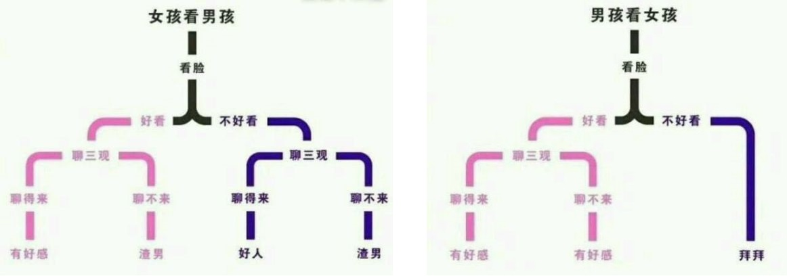
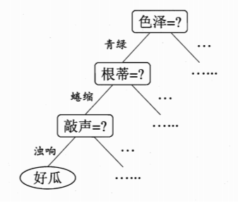
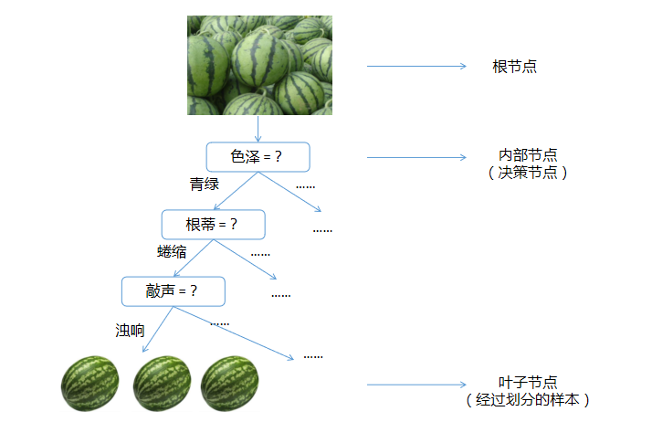
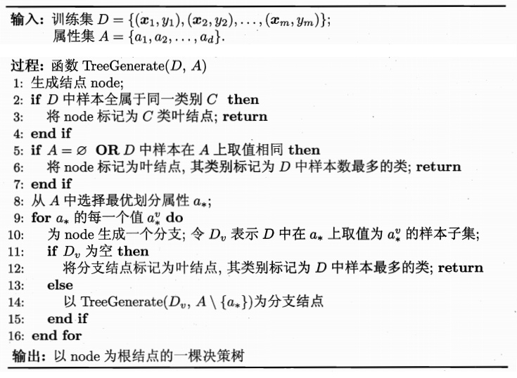
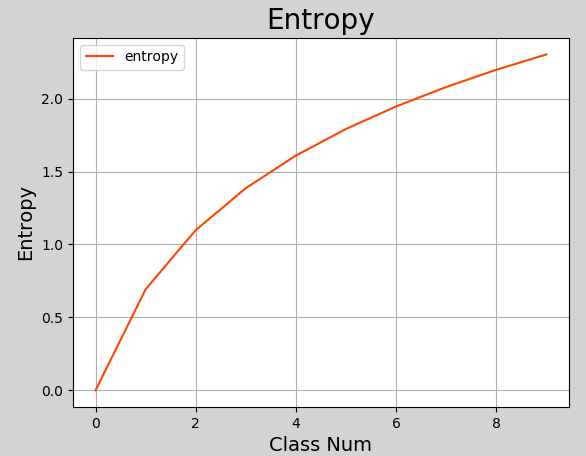
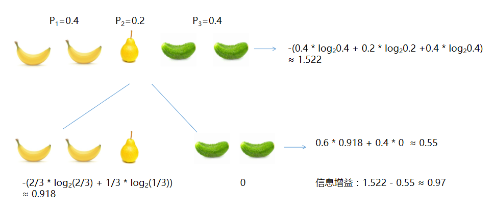
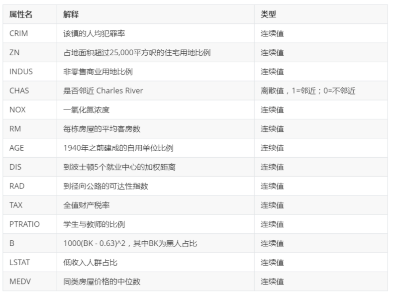
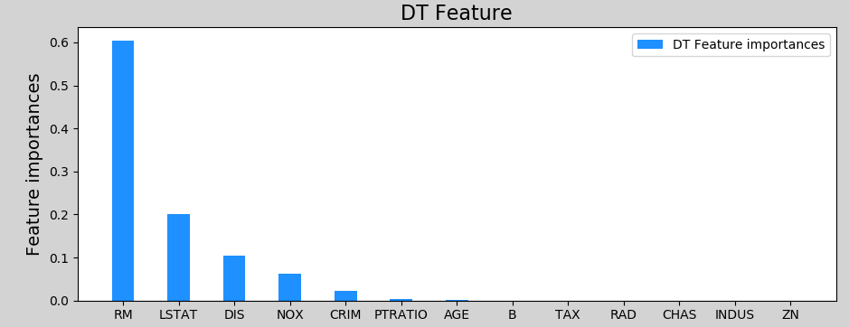
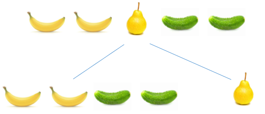

# 一、决策树

## 1. 什么是决策树

决策树是一种常见的机器学习方法，其核心思想是相同（或相似）的输入产生相同（或相似）的输出，通过树状结构来进行决策，其目的是通过对样本不同属性的判断决策，将具有相同属性的样本划分到一个叶子节点下，从而实现分类或回归. 以下是几个生活中关于决策树的示例.

【示例1】



<center><font size=2>男生看女生与女生看男生的决策树模型</font></center>
【示例2】



<center><font size=2>挑选西瓜的决策树模型</font></center>
在上述示例模型中，通过对西瓜一系列特征（色泽、根蒂、敲声等）的判断，最终我们得出结论：这是否为一个好瓜. 决策过程中提出的每个判定问题都是对某个属性的“测试”，例如“色泽=？”，“根蒂=？”. 每个测试的结果可能得到最终结论，也可能需要进行下一步判断，其考虑问题的范围是在上次决策结果限定范围之内. 例如若在“色泽=青绿”之后再判断“根蒂=？”. 

## 2. 决策树的结构

一般来说，一棵决策树包含一个根节点、若干个内部节点和若干个叶子节点. 叶子节点对应最终的决策结果，其它每个节点则对应与一个属性的测试. 最终划分到同一个叶子节点上的样本，具有相同的决策属性，可以对这些样本的值求平均值来实现回归，对这些样本进行投票（选取样本数量最多的类别）实现分类. 



## 3. 如何构建决策树

### 1）构建决策树算法

决策树的构建，就是不断选取好的特征作为决策节点，构建一颗泛化能力较强的树结构，其基本算法描述如下：



显然，决策树的构建是一个递归的过程，核心是以下两个问题：

- 如何选取特征. 决策树构建的每一步，应该挑选最优的特征，进行决策对数据集划分效果最好；
- 决定何时停止分裂子节点.


classification and regression tree

​	回归： 划分最优分割特征的方式：均方误差


### 2）如何选择特征

#### ① 信息熵

信息熵（information entropy）是度量样本集合纯度的常用指标，该值越大，表示该集合纯度越低（或越混乱），该值越小，表示该集合纯度越高（或越有序）. 信息熵定义如下：
$$
H = -\sum_{i=1}^{n}{P(x_i)log_2P(x_i)}
$$
其中，$P(x_i)$表示集合中第i类样本所占比例，当$P(x_i)$为1时（只有一个类别，比例为100%）, $log_2P(x_i)$的值为0，整个系统信息熵为0；当类别越多，则$P(x_i)$的值越接近于0，$log_2P(x_i)$趋近去负无穷大，整个系统信息熵就越大.以下代码，展示了类别数量从1...10的集合信息熵变化：

```python
# 信息熵计算演示
import math
import numpy as np
import matplotlib.pyplot as mp

class_num = 10  # 类别最大数量


def entropy_calc(n):
    p = 1.0 / n  # 计算每个类别的概率
    entropy_value = 0.0  # 信息熵

    for i in range(n):
        p_i = p * math.log(p)
        entropy_value += p_i

    return -entropy_value  # 返回熵值


entropies = []
for i in range(1, class_num + 1):
    entropy = entropy_calc(i)  # 计算类别为i的熵值
    entropies.append(entropy)

print(entropies)

# 可视化回归曲线
mp.figure('Entropy', facecolor='lightgray')
mp.title('Entropy', fontsize=20)
mp.xlabel('Class Num', fontsize=14)
mp.ylabel('Entropy', fontsize=14)
mp.tick_params(labelsize=10)
mp.grid(linestyle='-')
x = np.arange(0, 10, 1)
print(x)
mp.plot(x, entropies, c='orangered', label='entropy')

mp.legend()
mp.show()
```

执行结果：




随着决策树的节点划分，纯度是在不断的提升，熵值不断的减小


#### ② 信息增益

决策树根据属性进行判断，将具有相同属性的样本划分到相同节点下，此时，样本比划分之前更加有序（混乱程度降低），信息熵的值有所降低。用划分前的信息熵减去划分后的信息熵，就是决策树获得的信息增益。可以用以下表达式表示：
$$
Gain(D, a) = Ent(D) - \sum_{v=1}^{V} \frac{|D^v|}{|D|} Ent(D^v)
$$
其中，D表示样本集合，a表示属性，v表示属性可能的取值${v^1, v^2,...,v^n}$, $\frac{|D^v|}{|D|}$表示权重，样本越多的分支对分类结果影响更大，赋予更高的权重,  $Gain(D, a)$表示在样本集合D上使用属性a来划分子节点所获得的信息增益. 以下是一个关于信息增益计算的示例.



说明：

- 香蕉占2/5，所以$P_1=0.4$；梨占1/5，所以$P_2 = 0.2$；黄瓜占1/5，所以$P_3 = 0.4$
- 根节点信息熵：$-(0.4 * log_2 0.4 + 0.2 * log_2 0.2 + 0.4 * log_2 0.4) \approx 1.522$
- 根据颜色划分后：黄色分支信息熵$-(\frac{2}{3} * log_2 \frac{2}{3} + \frac{1}{3} * log_2 \frac{1}{3}) \approx 0.918$；绿色分支信息熵$-(1.0 * log_2 1.0) = 0$；整个第二层信息熵为$0.6 * 0.918 + 0.4 * 0 \approx 0.55$
- 根据颜色划分后的信息增益：$1.522 - 0.55 \approx 0.97$

由以上示例可知，经过对样本按颜色进行类别划分，划分后的信息熵比原来下降了，下降的值就是信息增益。一般来说，信息增益越大，以该属性划分所获得的“纯度提升”越大. 著名的ID3决策树学习算法就是以信息增益为准则来划分属性. 

#### ③ 增益率

增益率不直接采用信息增益，而采用信息增益与熵值的比率来作为衡量特征优劣的标准. C4.5算法就是使用增益率作为标准来划分属性. 增益率定义为：
$$
Gain\_ratio(D, a) = \frac{Gain(D, a)}{IV(a)}
$$
其中
$$
IV(a) = - \sum_{v=1}^{V} \frac{|D^v|}{|D|} log_2 \frac{|D^v|}{|D|}
$$

#### ④ 基尼系数

信息熵越大，数据越混乱，信息熵越小，数据越纯

Gini系数越大，数据越混乱，Gini系数越小，数据越纯


基尼系数定义为：
$$
Gini(p) = \sum_{k=1}^{k} p_k (1-p_k) = 1 - \sum_{k=1}^{k} p_k^2
$$
直观来说，基尼系数反映了从数据集D中随机抽取两个样本，类别标记不一致的概率. 因此，基尼系数越小，数据集的纯度越高. CART决策树（Classification And Regression Tree）使用基尼系数来选择划分属性，选择属性时，选择划分后基尼值最小的属性作为最优属性. 采用和上式相同的符号表示，数据集D下属性a的基尼系数定义为：
$$
Gini\_index(D, a) =  \sum_{v=1}^{V} \frac{|D^v|}{|D|} Gini(D^v)
$$

cart		回归：均方误差mse

​		分类：Gini系数

ID3		信息增益

C4.5	增益率


### 3）如何停止分裂

以下几种情况会停止决策树子节点的构建：

- 当前节点所有样本属于同一个类别，无需划分
- 当前属性集为空，或者所有样本取值相同，无法划分
- 当前节点包含的样本集合为空，不能划分
- 当前节点样本数量少于指定数量

## 4. 如何实现决策树

scikit-learn中决策树相关API：

```python
# 模型
model = st.DecisionTreeRegressor(max_depth=4)  # 决策树回归器
model = st.DecisionTreeClassifier(max_depth=4)

# 训练
model.fit(train_x, train_y)
# 预测
pre_test_y = model.predict(test_x)
```


【案例】波士顿房价预测

- 数据集介绍

  该数据集为一个开放房价数据集，包含506笔样本，每个样本包含13个特征和1个标签，具体如下所示：



- 代码实现

```python
# 决策树回归示例
# 使用决策树预测波士顿房价

import sklearn.datasets as sd
import sklearn.utils as su
import sklearn.tree as st
import sklearn.ensemble as se
import sklearn.metrics as sm


boston = sd.load_boston()  # 加载boston地区房价数据
print(boston.feature_names)
print(boston.data.shape)
print(boston.target.shape)

random_seed = 7  # 随机种子，计算随机值，相同的随机种子得到的随机值一样
x, y = su.shuffle(boston.data, boston.target, random_state = random_seed)
# 计算训练数据的数量
train_size = int(len(x) * 0.8) # 以boston.data中80%的数据作为训练数据
# 构建训练数据、测试数据
train_x = x[:train_size]  # 训练输入, x前面80%的数据
test_x = x[train_size:]   # 测试输入, x后面20%的数据
train_y = y[:train_size]  # 训练输出
test_y = y[train_size:]   # 测试输出

######## 单棵树进行预测 ########
# 模型
model = st.DecisionTreeRegressor(max_depth=4)  # 决策回归器

# 训练
model.fit(train_x, train_y)
# 预测
pre_test_y = model.predict(test_x)
# 打印预测输出和实际输出的R2值
print(sm.r2_score(test_y, pre_test_y))
```

- 执行结果

```
['CRIM' 'ZN' 'INDUS' 'CHAS' 'NOX' 'RM' 'AGE' 'DIS' 'RAD' 'TAX' 'PTRATIO'
 'B' 'LSTAT']
(506, 13)
(506,)
0.8202560889408634
```

- 特征重要性

作为决策树模型训练过程中的副产品，根据每个特征划分子表前后信息熵减少量就标志了该特征的重要程度，此即为该特征重要性的指标。训练后得到的模型对象提供了属性feature_importances_来存储每个特征的重要性。在工程应用上，可以对决策树做一些优化，不必让每一个特征都参与子表划分，而只选择其中较重要的（或者说影响因素较大的）的特征作为子表划分依据。特征重要性的评价指标，就是根据该特征划分子表后所带来的信息熵减少量，熵减越大的就越重要，也就越优先参与子表的划分。

在上述示例中加入如下代码：

```python
import matplotlib.pyplot as mp
import numpy as np
fi = model.feature_importances_  # 获取特征重要性
print("fi:", fi)

# 特征重要性可视化
mp.figure("Feature importances", facecolor="lightgray")
mp.plot()
mp.title("DT Feature", fontsize=16)
mp.ylabel("Feature importances", fontsize=14)
mp.grid(linestyle=":", axis=1)
x = np.arange(fi.size)
sorted_idx = fi.argsort()[::-1]  # 重要性排序(倒序)
fi = fi[sorted_idx]  # 根据排序索引重新排特征值
mp.xticks(x, boston.feature_names[sorted_idx])
mp.bar(x, fi, 0.4, color="dodgerblue", label="DT Feature importances")

mp.legend()
mp.tight_layout()
mp.show()
```

执行结果：




## 5. 决策树的剪枝

剪枝（pruning）是决策树学习算法对付“过拟合”的主要手段. 在决策树学习中，为了尽可能正确分类训练样本，节点划分过程将不断重复，有时会造成决策树分支过多，这时就可能因训练样本学的“太好了”，以至于把训练集本身的一些特点当做数据所具有的一般性质而导致过拟合. 因此，可通过主动去掉一些分支来降低过拟合风险. 

（1）预剪枝. 决策树生成过程中，对每个节点在划分前进行评估，若当前节点不能带来决策树泛化性能的提升，则停止划分并将当前节点标记为叶子节点.

（2）后剪枝. 先训练为一颗完整的决策树，然后自低向上对非叶子节点进行考察，若将该节点对应的子树替换为叶节点能带来决策树泛化能力提升，则将该子树替换为叶节点.


# 二、集成学习与随机森林

## 1. 集成学习

集成学习（ensemble learning）通过构建并合并多个模型来完成学习任务，从而获得比单一学习模型更显著优越的泛化性能，简言之，集成学习就是利用模型的“集体智慧”，提升预测的准确率.  根据单个模型方式，集成学习可以分为两大类：

- 个体间存在强依赖关系，必须串行生成的序列化方法，其代表为Boosting算法；
- 个体之间不存在强依赖关系，可同时生成的并行化方法，代表是Bagging和随机森林算法.

## 2. Boosting

### 1）什么是Boosting

Boosting（直译为推进、提升）是一族可以将弱学习器提升为强学习器的算法，其工作原理是：

- 先训练出一个初始模型；
- 根据模型的表现进行调整，使得模型预测错误的数据获得更多的关注，再重新训练下一个模型；
- 不断重复第二步，直到模型数量达到预先设定的数目T，最终将这T个模型加权结合. 

AdaBoosting是Boosting算法族中最著名的算法，它根据每次训练集之中每个样本的分类是否正确，以及上次的总体分类的准确率，来确定每个样本的权值。将修改过权值的新数据集送给下层分类器进行训练，最后将每次训练得到的分类器最后融合起来，作为最后的决策分类器。

### 2）实现Boosting

sklearn中，AdaBoosting相关API：

```python
import sklearn.tree as st
import sklearn.ensemble as se

# model: 决策树模型（单个模型，基学习器）
model = st.DecisionTreeRegressor(max_depth=4)

# n_estimators：构建400棵不同权重的决策树，训练模型
model = se.AdaBoostRegressor(model, # 单模型
                             n_estimators=400, # 决策树数量
                             random_state=7)# 随机种子

# 训练模型
model.fit(train_x, train_y)

# 测试模型
pred_test_y = model.predict(test_x)
```


代码：

```python
# AdaBoosting示例
# 使用AdaBoosting预测波士顿房价
import sklearn.datasets as sd
import sklearn.utils as su
import sklearn.tree as st
import sklearn.ensemble as se
import sklearn.metrics as sm

boston = sd.load_boston()  # 加载boston地区房价数据
print(boston.feature_names)
print(boston.data.shape)
print(boston.target.shape)

random_seed = 7  # 随机种子，计算随机值，相同的随机种子得到的随机值一样
x, y = su.shuffle(boston.data, boston.target, random_state = random_seed)
# 计算训练数据的数量
train_size = int(len(x) * 0.8) # 以boston.data中80%的数据作为训练数据
# 构建训练数据、测试数据
train_x = x[:train_size]  # 训练输入, x前面80%的数据
test_x = x[train_size:]   # 测试输入, x后面20%的数据
train_y = y[:train_size]  # 训练输出
test_y = y[train_size:]   # 测试输出

model2 = se.AdaBoostRegressor(st.DecisionTreeRegressor(max_depth=4),
                              n_estimators=400,   # 决策树数量
                              random_state=random_seed) # 随机种子
# 训练
model2.fit(train_x, train_y)
# 预测
pre_test_y2 = model2.predict(test_x)
# 打印预测输出和实际输出的R2值
print(sm.r2_score(test_y, pre_test_y2))
```


执行结果：

```
['CRIM' 'ZN' 'INDUS' 'CHAS' 'NOX' 'RM' 'AGE' 'DIS' 'RAD' 'TAX' 'PTRATIO'
 'B' 'LSTAT']
(506, 13)
(506,)
0.9068598725149652
```

可以看到，通过AdaBoosting算法，回归模型获得了更高的R2值.


## 3. 随机森林

### 1）什么是随机森林

随机森林（Random Forest，简称RF）是专门为决策树设计的一种集成方法，是Bagging法的一种拓展，它是指每次构建决策树模型时，不仅随机选择部分样本，而且还随机选择部分特征来构建多棵决策树.  这样不仅规避了强势样本对预测结果的影响，而且也削弱了强势特征的影响，使模型具有更强的泛化能力. 

随机森林简单、容易实现、计算开销小，在很多现实任务中展现出强大的性能，被誉为“代表集成学习技术水平的方法”.

### 2）如何实现随机森林

sklearn中，随机森林相关API：

```python
import sklearn.ensemble as se

model = se.RandomForestRegressor(
    max_depth, # 决策树最大深度
    n_estimators, # 决策树数量
    min_samples_split)# 子表中最小样本数 若小于这个数字，则不再继续向下拆分
```

以下是利用随机森林实现波士顿房价预测的代码：

```python
# 使用随机森林预测波士顿房价
import sklearn.datasets as sd
import sklearn.utils as su
import sklearn.tree as st
import sklearn.ensemble as se
import sklearn.metrics as sm

boston = sd.load_boston()  # 加载boston地区房价数据
print(boston.feature_names)
print(boston.data.shape)
print(boston.target.shape)

random_seed = 7  # 随机种子，计算随机值，相同的随机种子得到的随机值一样
x, y = su.shuffle(boston.data, boston.target, random_state=random_seed)
# 计算训练数据的数量
train_size = int(len(x) * 0.8)  # 以boston.data中80%的数据作为训练数据
# 构建训练数据、测试数据
train_x = x[:train_size]  # 训练输入, x前面80%的数据
test_x = x[train_size:]  # 测试输入, x后面20%的数据
train_y = y[:train_size]  # 训练输出
test_y = y[train_size:]  # 测试输出

# 创建随机森林回归器，并进行训练
model = se.RandomForestRegressor(max_depth=10,  # 最大深度
                                 n_estimators=1000,  # 树数量
                                 min_samples_split=2)  # 最小样本数量，小于该数就不再划分子节点
model.fit(train_x, train_y)  # 训练

# 基于天统计数据的特征重要性
fi_dy = model.feature_importances_
# print(fi_dy)
pre_test_y = model.predict(test_x)
print(sm.r2_score(test_y, pre_test_y))  # 打印r2得分
```

打印输出：

```
['CRIM' 'ZN' 'INDUS' 'CHAS' 'NOX' 'RM' 'AGE' 'DIS' 'RAD' 'TAX' 'PTRATIO'
 'B' 'LSTAT']
(506, 13)
(506,)
0.9271955403309159
```


# 三、总结

1）什么是决策树：利用样本特征进行决策归类，将具有相同属性的样本划入一个子节点

2）决策树的用途：用作分类器、回归器

3）如何构建决策树：根据信息增益、增益率、基尼系数构建

4）什么情况下使用决策树：实用性较广，课用于一般回归、分类问题

5）决策树优化：集成学习、随机森林


# 四、练习

（1）有一批水果（如下图所示），按照形状进行分类，将长条形、椭圆形各划分到不同子节点中，计算划分后的信息增益.



（2）一批样本包含A和B两个类别，计算：当A类别比率依次占0%, 10%, 20%, ..., 100%时，这批样本信息熵值，并以占比作为x轴数值、信息熵作为y轴数值绘制图像.


# 延伸阅读

- VMware公司使用定制的决策树进行定价优化

```
VMware（VMW）是一家提供虚拟化技术、终端服务和云处理的公司，它将产品销售给B2B客户。长期以来，VMW公司的产品价格罕有变动。当接收到大订单的时候，销售代表会通过销售人员特别折扣（Sales Person Specific discount，SPF）标识来给出特定折扣。而VMW的定价部门则希望找到一种方法来优化其产品定价。在各个商业领域，市场上都有着对应的解决定价问题的数据挖掘解决方案。解决方案的目标不仅是优化定价，同时还要让客户的利益最大化。

VMW公司的分析和数据科学小组通过分析历史价格和相应的销量变化，来理解折扣百分比与SPF标识的关联性，并以此为依据归纳出所有产品的推荐定价。传统的定价优化会根据数量变化来进行价格变动，但是VMW公司并不会改变价格，而是使用折扣作为替代方法，但是使用折扣需要额外的步骤来确定是否需要给出折扣以及折扣率。
小组使用决策树的方法，基于折扣率和SPF标识的使用情况来对所有订单进行分类。根据业务的需求，以一种特定顺序构建出多分支（非二元）决策树。各种可能订单定价的属性都在决策树构建中被考虑进来。决策树构建过程中，基于均方误差、熵、log-loss、Gini指标等确定了决策树构建过程中分支属性的顺序。相比于使用标准分裂标准，使用的是根据业务需求定制的分裂标准。分裂停止标准是最小化观测对象数目。针对完成的分块，基于分块的属性特性观察其折扣百分比与SPF使用情况的关联性，并完成产品平台级的定价推荐。
```

