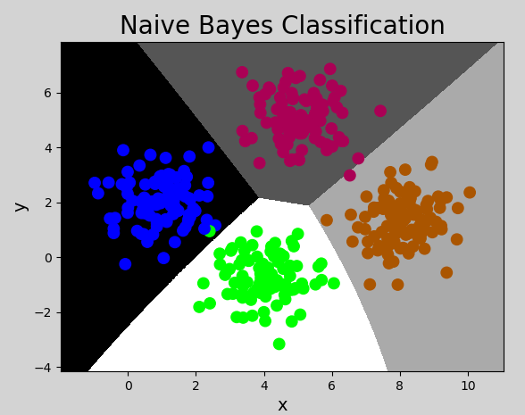

# 一、朴素贝叶斯

朴素贝叶斯是一组功能强大且易于训练的分类器，它使用贝叶斯定理来确定<u>**给定一组条件的结果的概率**</u>，“朴素”的含义是指所给定的条件都能独立存在和发生. 朴素贝叶斯是多用途分类器，能在很多不同的情景下找到它的应用，例如垃圾邮件过滤、自然语言处理等. 

## 1. 概率

### 1）定义

概率是反映随机事件出现的可能性大小. 随机事件是指在相同条件下，可能出现也可能不出现的事件. 例如：

（1）抛一枚硬币，可能正面朝上，可能反面朝上，这是随机事件. 正/反面朝上的可能性称为概率；

（2）掷骰子，掷出的点数为随机事件. 每个点数出现的可能性称为概率；

（3）一批商品包含良品、次品，随机抽取一件，抽得良品/次品为随机事件. 经过大量反复试验，抽得次品率越来越接近于某个常数，则该常数为概率. 

我们可以将随机事件记为A或B，则P（A）, P（B）表示事件A或B的概率. 

### 2）联合概率与条件概率

#### ① 联合概率

指包含多个条件且所有条件同时成立的概率，记作$P ( A , B )$ ，或$P(AB)$，或$P(A \bigcap B)$

#### ② 条件概率

已知事件B发生的条件下，另一个事件A发生的概率称为条件概率，记为：$P(A|B)$

p(下雨|阴天)

#### ③ 事件的独立性

事件A不影响事件B的发生，称这两个事件独立，记为：
$$
P(AB)=P(A)P(B)
$$
因为A和B不相互影响，则有：
$$
P(A|B) = P(A)
$$
可以理解为，给定或不给定B的条件下，A的概率都一样大.

### 3）先验概率与后验概率

#### ① 先验概率

先验概率也是根据以往经验和分析得到的概率，例如：在没有任何信息前提的情况下，猜测对面来的陌生人姓氏，姓李的概率最大（因为全国李姓为占比最高的姓氏），这便是先验概率. 

#### ② 后验概率

后验概率是指在接收了一定条件或信息的情况下的修正概率，例如：在知道对面的人来自“牛家村”的情况下，猜测他姓牛的概率最大，但不排除姓杨、李等等，这便是后验概率. 

#### ③ 两者的关系

事情还没有发生，求这件事情发生的可能性的大小，是先验概率（可以理解为由因求果）. 事情已经发生，求这件事情发生的原因是由某个因素引起的可能性的大小，是后验概率（由果求因）. 先验概率与后验概率有不可分割的联系，后验概率的计算要以先验概率为基础. 


## 2. 贝叶斯定理

### 1）定义

贝叶斯定理由英国数学家托马斯.贝叶斯 ( Thomas Bayes)提出，用来描述两个条件概率之间的关系，定理描述为：
$$
P(A|B) = \frac{P(A)P(B|A)}{P(B)}
$$
其中，$P(A)$和$P(B)$是A事件和B事件发生的概率. $P(A|B)$称为条件概率，表示B事件发生条件下，A事件发生的概率. 推导过程：
$$
P(A,B) =P(B)P(A|B)\\
P(B,A) =P(A)P(B|A)
$$
其中$P(A,B)$称为联合概率，指事件B发生的概率，乘以事件A在事件B发生的条件下发生的概率. 因为$P(A,B)=P(B,A)$, 所以有：
$$
P(B)P(A|B)=P(A)P(B|A)
$$
两边同时除以P(B)，则得到贝叶斯定理的表达式. 其中，$P(A)$是先验概率，$P(A|B)$是已知B发生后A的条件概率，也被称作后验概率. 

### 2）贝叶斯定理示例

【示例一】计算诈骗短信的概率

| 事件                                         | 概率 | 表达式        |
| -------------------------------------------- | ---- | ------------- |
| 所有短信中，诈骗短信                         | 5%   | P（A）= 0.05  |
| 所有短信中，含有“中奖”两个字                 | 4%   | P（B）= 0.04  |
| 所有短信中，是诈骗短信，并且含有“中奖”两个字 | 50%  | P(B\|A) = 0.5 |

求：收到一条新信息，含有“中奖”两个字，是诈骗短信的概率？

$P(A|B) = P(A) P(B|A) / P(B) = 0.05 * 0.5 / 0.04 = 0.625$


【示例二】计算喝酒驾车的概率

| 事件                     | 概率 | 表达式          |
| ------------------------ | ---- | --------------- |
| 所有客人中，驾车         | 20%  | P（A）= 0.2     |
| 所有客人中，喝酒         | 10%  | P（B）= 0.1     |
| 所有客人中，开车并且喝酒 | 5%   | P（B\|A）= 0.05 |

 求：喝过酒仍然会开车的人的比例是多少？

$P(A|B) = P(A) P(B|A) / P(B) = 0.2 * 0.05 / 0.1 = 0.1$


## 3. 朴素贝叶斯分类器

### 1）分类原理

朴素贝叶斯分类器就是根据贝叶斯公式计算结果进行分类的模型，“朴素”指事件之间相互独立无影响. 例如：有如下数据集：

| Text                                               | Category                   |
| -------------------------------------------------- | -------------------------- |
| A great game（一个伟大的比赛）                     | Sports（体育运动）         |
| The election was over（选举结束）                  | Not sports（不是体育运动） |
| Very clean match（没内幕的比赛）                   | Sports（体育运动）         |
| A clean but forgettable game（一场难以忘记的比赛） | Sports（体育运动）         |
| It was a close election（这是一场势均力敌的选举）  | Not sports（不是体育运动） |

求：”A very close game“ 是体育运动的概率？数学上表示为 P(Sports | a very close game)​. 根据贝叶斯定理，是运动的概率可以表示为：
$$
P(Sports | a \ very \ close \ game) = \frac{P(a \ very \ close \ game | sports) * P(sports)}{P(a \ very \ close \ game)}
$$
不是运动概率可以表示为：
$$
P(Not \ Sports | a \ very \ close \ game) = \frac{P(a \ very \ close \ game | Not \ sports) * P(Not \ sports)}{P(a \ very \ close \ game)}
$$
概率更大者即为分类结果. 由于分母相同，即比较分子谁更大即可.  我们只需统计”A very close game“ 多少次出现在Sports类别中，就可以计算出上述两个概率.  但是”A very close game“ 并没有出现在数据集中，所以这个概率为0，要解决这个问题，就假设每个句子的单词出现都与其它单词无关（事件独立即朴素的含义），所以，P(a very close game)可以写成：
$$
P(a \ very \ close \ game) = P(a) * P(very) * P(close) * P(game) 
$$

$$
P（a \ very \ close \ game|Sports)= \\ P(a|Sports)*P(very|Sports)*P(close|Sports)*P(game|Sports)
$$

统计出“a", "very", "close", "game"出现在"Sports"类别中的概率，就能算出其所属的类别. 具体计算过程如下：

- 第一步：计算总词频：Sports类别词语总数14，Not Sports类别词语总数9

- 第二步：计算每个类别的先验概率

  ```python
  # Sports和Not Sports概率
  P(Sports) = 3 / 5 = 0.6 
  P(Not Sports) = 2 / 5 = 0.4 
  
  # Sports条件下各个词语概率
  P(a | Sports) = (2 + 1) / (11 + 14) = 0.12
  P(very | Sports) = (1 + 1) / (11 + 14) = 0.08
  P(close | Sports) = (0 + 1) / (11 + 14) = 0.04
  P(game | Sports) = (2 + 1) / (11 + 14) = 0.12
  
  # Not Sports条件下各个词语概率
  P(a | Not Sports) = (1 + 1) / (9 + 14) = 0.087
  P(very | Not Sports) = (0 + 1) / (9 + 14) = 0.043
  P(close | Not Sports) = (1 + 1) / (9 + 14) =  = 0.087
  P(game | Not Sports) = (0 + 1) / (9 + 14) = 0.043
  ```

  其中，分子部分加1，是为了避免分子为0的情况；分母部分都加了词语总数14，是为了避免分子增大的情况下计算结果超过1的可能. 

- 第三步：将先验概率带入贝叶斯定理，计算概率：

  是体育运动的概率：

$$
P（a \ very \ close \ game|Sports)= \\ P(a|Sports)*P(very|Sports)*P(close|Sports)*P(game|Sports)= \\
0.12 * 0.08 * 0.04 * 0.12 = 0.00004608
$$

​       不是体育运动的概率：
$$
P（a \ very \ close \ game|Not \ Sports)= \\ 
P(a|Not \ Sports)*P(very|Not \ Sports)*P(close|Not \ Sports)*P(game|Not \ Sports)= \\
0.087 * 0.043 * 0.087 * 0.043 = 0.000013996
$$
分类结果：P(Sports) = 0.00004608 , P(Not Sports) = 0.000013996， 是体育运动.

### 2）实现朴素贝叶斯分类器

在sklearn中，提供了三个朴素贝叶斯分类器，分别是：

- GaussianNB（高斯朴素贝叶斯分类器）：适合用于样本的值是连续的，数据呈正态分布的情况（比如人的身高、城市家庭收入、一次考试的成绩等等）
- MultinominalNB（多项式朴素贝叶斯分类器）：适合用于大部分属性为离散值的数据集
- BernoulliNB（伯努利朴素贝叶斯分类器）：适合用于特征值为二元离散值或是稀疏的多元离散值的数据集

该示例中，样本的值为连续值，且呈正态分布，所以采用GaussianNB模型. 代码如下：

```python
# 朴素贝叶斯分类示例
import numpy as np
import sklearn.naive_bayes as nb
import matplotlib.pyplot as mp

# 输入，输出
x, y = [], []

# 读取数据文件
with open("../data/multiple1.txt", "r") as f:
    for line in f.readlines():
        data = [float(substr) for substr in line.split(",")]
        x.append(data[:-1])  # 输入样本：取从第一列到倒数第二列
        y.append(data[-1])  # 输出样本：取最后一列

x = np.array(x)
y = np.array(y, dtype=int)

# 创建高斯朴素贝叶斯分类器对象
model = nb.GaussianNB()
model.fit(x, y)  # 训练

# 计算显示范围
left = x[:, 0].min() - 1
right = x[:, 0].max() + 1

buttom = x[:, 1].min() - 1
top = x[:, 1].max() + 1

grid_x, grid_y = np.meshgrid(np.arange(left, right, 0.01),
                             np.arange(buttom, top, 0.01))

mesh_x = np.column_stack((grid_x.ravel(), grid_y.ravel()))
mesh_z = model.predict(mesh_x)
mesh_z = mesh_z.reshape(grid_x.shape)

mp.figure('Naive Bayes Classification', facecolor='lightgray')
mp.title('Naive Bayes Classification', fontsize=20)
mp.xlabel('x', fontsize=14)
mp.ylabel('y', fontsize=14)
mp.tick_params(labelsize=10)
mp.pcolormesh(grid_x, grid_y, mesh_z, cmap='gray')
mp.scatter(x[:, 0], x[:, 1], c=y, cmap='brg', s=80)
mp.show()
```

执行结果：




## 4. 总结

1）什么是朴素贝叶斯：朴素贝叶斯法是基于贝叶斯定理与特征条件独立假设的分类方法。“朴素”的含义为：假设问题的特征变量都是相互独立地作用于决策变量的，即问题的特征之间都是互不相关的。

2）朴素贝叶斯分类的特点

① 优点

- 逻辑性简单
- 算法较为稳定。当数据呈现不同的特点时，朴素贝叶斯的分类性能不会有太大的差异。
- 当样本特征之间的关系相对比较独立时，朴素贝叶斯分类算法会有较好的效果。

② 缺点

- 特征的独立性在很多情况下是很难满足的，因为样本特征之间往往都存在着相互关联，如果在分类过程中出现这种问题，会导致分类的效果大大降低。

3）什么情况下使用朴素贝叶斯：根据先验概率计算后验概率的情况，且样本特征之间独立性较强。