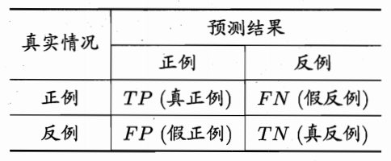
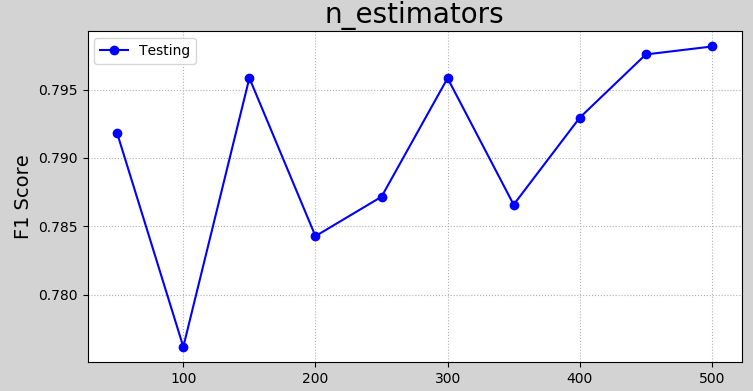
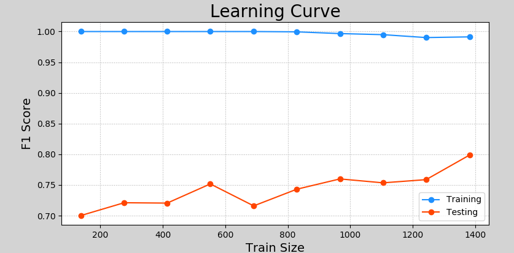
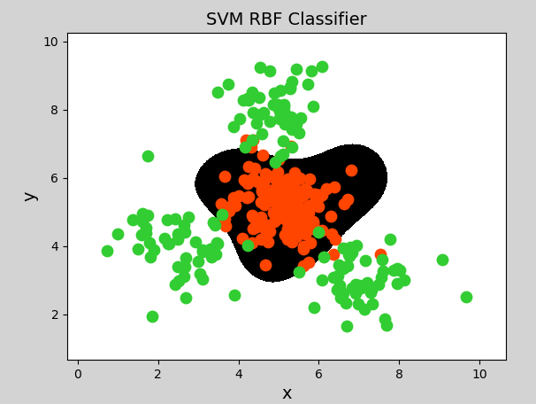

# 一、模型评估与优化

## 1. 模型评估

### 1）性能度量

#### ① 错误率与精度

错误率和精度是分类问题中常用的性能度量指标，既适用于二分类任务，也适用于多分类任务. 

- 错误率（error rate）：指分类错误的样本占样本总数的比例，即 （ 分类错误的数量 / 样本总数数量）

- 精度（accuracy）：指分类正确的样本占样本总数的比例，即 （分类正确的数量 / 样本总数数量）

  $$精度 = 1 - 错误率$$

#### ② 查准率、召回率与F1得分

错误率和精度虽然常用，但并不能满足所有的任务需求。例如，在一次疾病检测中，我们更关注以下两个问题：

- 检测出感染的个体中有多少是真正病毒携带者？
- 所有真正病毒携带者中，有多大比例被检测了出来？

类似的问题在很多分类场景下都会出现，“查准率”（precision）与“召回率”（recall）是更为适合的度量标准。对于二分类问题，可以将真实类别、预测类别组合为“真正例”（true positive）、“假正例”（false positive）、“真反例”（true negative）、“假反例”（false negative）四种情形，见下表：



- 样例总数：TP + FP + TN + FN

- 查准率： TP / (TP + FP)，表示分的准不准

- 召回率：TP / (TP + FN)，表示分的全不全，又称为“查全率”

- F1得分：
  $$
  f1 = \frac{2 * 查准率 * 召回率}{查准率 + 召回率}
  $$


查准率和召回率是一对矛盾的度量。一般来说，查准率高时，召回率往往偏低；召回率高时，查准率往往偏低。例如，在病毒感染者检测中，若要提高查准率，只需要采取更严格的标准即可，这样会导致漏掉部分感染者，召回率就变低了；反之，放松检测标准，更多的人被检测为感染，召回率升高了，查准率又降低了. 通常只有在一些简单任务中，才能同时获得较高查准率和召回率。

查准率和召回率在不同应用中重要性也不同。例如，在商品推荐中，为了尽可能少打扰客户，更希望推荐的内容是用户感兴趣的，此时查准率更重要；而在逃犯信息检索系统中，希望让更少的逃犯漏网，此时召回率更重要。

#### ③ 混淆矩阵

混淆矩阵也称误差矩阵，是表示精度评价的一种标准格式，用n行n列的矩阵形式来表示。每一行（数量之和）表示一个真实类别的样本，每一列（数量之和）表示一个预测类别的样本。

以下是一个预测结果准确的混淆矩阵：


对的个数   ：主对角线上的值

预测出来的个数 ：当前列的和

真实的样本个数 ：当前行的和

|       | A类别 | B类别 | C类别 |
| ----- | ----- | ----- | ----- |
| A类别 | 5     | 0     | 0     |
| B类别 | 0     | 6     | 0     |
| C类别 | 0     | 0     | 7     |

上述表格表示的含义为：A类别实际有5个样本，B类别实际有6个样本，C类别实际有7个样本；预测结果中，预测结果为A类别的为5个，预测结果为B类别的为6个，预测结果为C类别的为7个。


以下是一个预测结果不准确的混淆矩阵：

|       | A类别 | B类别 | C类别 |
| ----- | ----- | ----- | ----- |
| A类别 | 3     | 1     | 1     |
| B类别 | 0     | 4     | 2     |
| C类别 | 0     | 0     | 7     |

上述表格表示的含义为：A类别实际有5个样本，B类别实际有6个样本，C类别实际有7个样本；预测结果中，A类别有3个样本预测准确，另外各有1个被预测成了B和C；B类别有4个预测准确，另外2个被预测成了C类别；C类别7个全部预测准确，但有1个本属于A类别、2个本属于B类别的被预测成了C类别。

根据混淆矩阵，查准率、召回率也可表示为：

查准率 = 主对角线上的值 / 该值所在列的和

召回率 = 主对角线上的值 / 该值所在行的和

#### ④ 实验

利用sklearn提供的朴素贝叶斯分类器分类，并打印查准率、召回率、R2得分和混淆矩阵：

```python
# 混淆矩阵示例
import numpy as np
import sklearn.model_selection as ms
import sklearn.metrics as sm
import sklearn.naive_bayes as nb

# 输入，输出
x, y = [], []

# 读取数据文件
with open("../data/multiple1.txt", "r") as f:
    for line in f.readlines():
        data = [float(substr) for substr in line.split(",")]
        x.append(data[:-1])  # 输入样本：取从第一列到导数第二列
        y.append(data[-1])  # 输出样本：取最后一列

# 样本转数组
x = np.array(x)
y = np.array(y, dtype=int)

# 划分训练集和测试集
train_x, test_x, train_y, test_y = ms.train_test_split(
    x, y, test_size=0.25, random_state=7)

# 创建高斯朴素贝叶斯分类器对象
model = nb.GaussianNB()
model.fit(train_x, train_y)  # 使用划分的训练集来训练模型
pred_test_y = model.predict(test_x)  # 预测

print("recall:", sm.recall_score(test_y,  # 真实值
                                 pred_test_y,  # 预测值
                                 average="macro"))  # 计算平均值，不考虑样本权重
print("precision:", sm.precision_score(test_y,  # 真实值
                                       pred_test_y,  # 预测值
                                       average="macro"))  # 计算平均值，不考虑样本权重
print("F1:", sm.f1_score(test_y, pred_test_y,average="macro"))

# 计算并打印模型预测的混淆矩阵
print("\n Confusion Matrix:")
cm = sm.confusion_matrix(test_y, pred_test_y)
print(cm)
```

打印输出：

```
recall: 0.9910714285714286
precision: 0.9903846153846154
F1: 0.9905525846702318

 Confusion Matrix:
[[22  0  0  0]
 [ 0 27  1  0]
 [ 0  0 25  0]
 [ 0  0  0 25]]
```


### 2）训练集与测试集

通常情况下，评估一个模型性能的好坏，将样本数据划分为两部分，一部分专门用于模型训练，这部分称为“训练集”，一部分用于对模型进行测试，这部分被称为“测试集”，训练集和测试集一般不存在重叠部分. 常用的训练集、测试集比例有：9:1, 8:2, 7:3等. 训练集和测试的划分，尽量保持均衡、随机，不能集中于某个或少量类别. 

有些公共数据集在创建时，已经进行了划分. 有时候，我们需要自己对数据集进行划分，划分的方式是先打乱数据集，然后使用一种计算方法，将一部分数据划入训练集，一部分数据划入测试集. 


### 3）交叉验证法

#### ① 什么是交叉验证

在样本数量较少的情况下，如果将样本划分为训练集、测试集，可能导致单个集合样本数量更少，可以采取交叉验证法来训练和测试模型. 


将所有数据，划分成N等分，用每份都去训练，用每份都去测试

所有的数据，都去训练，所有的数据都去测试


"交叉验证法"（cross validation）先将数据集D划分为k个大小相同（或相似）的、互不相交的子集，每个子集称为一个"折叠"（fold），每次训练，轮流使用其中的一个作为测试集、其它作为训练集. 这样，就相当于获得了k组训练集、测试集，最终的预测结果为k个测试结果的平均值.


#### ② 如何实现交叉验证

sklearn中，提供了cross_val_score函数来实现交叉验证并返回评估指标值：

```python
import sklearn.model_selection as ms

n = ms.cross_val_score(model, #模型
                       train_x, train_y,# 样本输入、输出
                       cv,  # 折叠数量
                       scoring) # 指定返回的指标
```


拿到鸢尾花数据集，想要去做分类预测

我想用  逻辑回归

先用交叉验证，验证一下当前模型是否可用

再去进行训练。。。。。。。


以下是关于朴素贝叶斯模型的交叉验证实现：

```python
# 交叉验证示例
import numpy as np
import sklearn.model_selection as ms
import sklearn.naive_bayes as nb
import matplotlib.pyplot as mp

x, y = [], []  # 输入，输出

# 读取数据文件
with open("../data/multiple1.txt", "r") as f:
    for line in f.readlines():
        data = [float(substr) for substr in line.split(",")]
        x.append(data[:-1])  # 输入样本：取从第一列到导数第二列
        y.append(data[-1])  # 输出样本：取最后一列

train_x = np.array(x)
train_y = np.array(y, dtype=int)

# 划分训练集和测试集
#train_x, test_x, train_y, test_y = ms.train_test_split(
#    x, y, test_size=0.25, random_state=7)

# 创建高斯朴素贝叶斯分类器对象
model = nb.GaussianNB()
# 先做交叉验证，如果得分结果可以接受，再执行训练和预测
pws = ms.cross_val_score(model, x, y,
                         cv=5,  # 折叠数量
                         scoring='precision_weighted')  # 查准率
print("precision:", pws.mean())

rws = ms.cross_val_score(model, x, y, cv=5,
                         scoring='recall_weighted')  # 召回率
print("recall:", rws.mean())

f1s = ms.cross_val_score(model, x, y, cv=5,
                         scoring='f1_weighted')  # F1得分
print("f1:", f1s.mean())

acc = ms.cross_val_score(model, x, y,
                         cv=5, scoring='accuracy')  # 准确率
print("acc:", acc.mean())
```

执行结果：

```
precision: 0.996822033898305
recall: 0.9966101694915255
f1: 0.9966063988235516
acc: 0.9966101694915255
```


## 2. 模型优化

### 1）验证曲线与学习曲线

#### ① 验证曲线

验证曲线是指根据不同的评估系数，来评估模型的优劣. 例如，构建随机森林，树的数量不同，模型预测准确度有何不同？以下是一个验证曲线的示例：

```python
# 验证曲线示例
import numpy as np
import sklearn.preprocessing as sp
import sklearn.ensemble as se
import sklearn.model_selection as ms
import matplotlib.pyplot as mp

data = []
with open("../data/car.txt", "r") as f:
    for line in f.readlines():
        data.append(line.replace("\n", "").split(","))

data = np.array(data).T  # 转置
encoders, train_x = [], []

# 对样本数据进行标签编码
for row in range(len(data)):
    encoder = sp.LabelEncoder()  # 创建标签编码器
    encoders.append(encoder)
    if row < len(data) - 1:  # 不是最后一行，为样本特征
        lbl_code = encoder.fit_transform(data[row])  # 编码
        train_x.append(lbl_code)
    else:  # 最后一行，为样本输出
        train_y = encoder.fit_transform(data[row])

train_x = np.array(train_x).T  # 转置回来，变为编码后的矩阵
# print(train_x)

model = se.RandomForestClassifier(max_depth=8,  # 最大树高
                                  random_state=7)  # 随机种子
# 调用validation_curve，返回训练集、测试集得分矩阵
n_estimators = np.arange(50, 550, 50)  # 超参数值表
print("n_estimators.shape:", n_estimators.shape)
print("n_estimators:", n_estimators)

# 通过不同参数，构建多棵决策树，验证其准确性
train_scores1, test_scores1 = ms.validation_curve(model,  # 模型
                                                  train_x, train_y,
                                                  'n_estimators',  # 模型参数名称
                                                  n_estimators,  # 模型参数值
                                                  cv=5)
train_mean = train_scores1.mean(axis=1)
print("train_mean:", train_mean)
test_mean = test_scores1.mean(axis=1)
print("test_mean:", test_mean)

# 可视化
mp.figure('n_estimators', facecolor='lightgray')
mp.title('n_estimators', fontsize=20)
mp.xlabel('n_estimators', fontsize=14)
mp.ylabel('F1 Score', fontsize=14)
mp.tick_params(labelsize=10)
mp.grid(linestyle=':')
mp.plot(n_estimators, test_mean, 'o-', c='blue', label='Testing')
mp.legend()
mp.show()
```

执行结果：



#### ② 学习曲线

学习曲线是用来评估不同大小的训练集下模型的优劣程度，如果预测结果随着训练集样本的增加而变化不大，那么增加样本数量不会对模型产生明显优化作用. 以下是一个学习曲线的示例：

```python
# 学习曲线示例
import numpy as np
import sklearn.preprocessing as sp
import sklearn.ensemble as se
import sklearn.model_selection as ms
import matplotlib.pyplot as mp

data = []
with open("../data/car.txt", "r") as f:
    for line in f.readlines():
        data.append(line.replace("\n", "").split(","))

data = np.array(data).T  # 转置
encoders, train_x = [], []

# 对样本数据进行标签编码
for row in range(len(data)):
    encoder = sp.LabelEncoder()  # 创建标签编码器
    encoders.append(encoder)
    if row < len(data) - 1:  # 不是最后一行，为样本特征
        lbl_code = encoder.fit_transform(data[row])  # 编码
        train_x.append(lbl_code)
    else:  # 最后一行，为样本输出
        train_y = encoder.fit_transform(data[row])

train_x = np.array(train_x).T  # 转置回来，变为编码后的矩阵
print(train_x)

# 获得学习曲线
model = se.RandomForestClassifier(max_depth=9,  # 最大树高
                                  n_estimators=200, # 评估系数
                                  random_state=7)  # 随机种子

train_sizes = np.linspace(0.1, 1, 10)
train_sizes, train_scores, test_scores = ms.learning_curve(
                                                        model,
                                                        train_x, train_y,
                                                        train_sizes=train_sizes,
                                                        cv=5)#交叉验证折叠数量
train_means = train_scores.mean(axis=1)
test_means = test_scores.mean(axis=1)
for size, score in zip(train_sizes, train_means):
    print(size, '->', score)

# 可视化
mp.figure('Learning Curve', facecolor='lightgray')
mp.title('Learning Curve', fontsize=20)
mp.xlabel('Train Size', fontsize=14)
mp.ylabel('F1 Score', fontsize=14)
mp.tick_params(labelsize=10)
mp.grid(linestyle=':')
mp.plot(train_sizes, train_means, 'o-', c='dodgerblue', label='Training')
mp.plot(train_sizes, test_means, 'o-', c='orangered', label='Testing')
mp.legend()
mp.show()
```

执行结果：



### 2）超参数优化

#### ① 什么是超参数

超参数是在开始学习过程之前设置值的参数，而不是通过训练得到的参数数据。超参数的设置主要依赖于经验、实验或经过比较的优选值。以下是一些模型中常见的超参数：

- 决策树模型树的最大深度；
- 随机森林模型树的数量；
- 交叉验证中折叠的额数量；
- 训练集/测试集的比例等等. 

超参数选择主要有随机搜索、网格搜索等方法。

#### ② 网格搜索

网格搜索指将主要参数以及这些参数的主要取值，通过穷举法产生不同组合，计算并比较预测结果，来寻找这些参数的最优组合。


以下是利用网格搜索法，寻找SVM的最优超参数的示例：

```python
# 网格搜索示例
import numpy as np
import sklearn.model_selection as ms
import sklearn.svm as svm
import sklearn.metrics as sm
import matplotlib.pyplot as mp

x, y = [], []
with open("../data/multiple2.txt", "r") as f:
    for line in f.readlines():
        data = [float(substr) for substr in line.split(",")]
        x.append(data[:-1])  # 输入
        y.append(data[-1])  # 输出

x = np.array(x)
y = np.array(y, dtype=int)

# 通过网格搜索确定最优参数组合
# 定义参数字典
params = [
    {"kernel": ["linear"],
     "C": [1, 10, 100, 1000]
     },
    {"kernel": ["poly"],
     "C": [1],
     "degree": [2, 3]
     },
    {"kernel": ["rbf"],
     "C": [1, 10, 100, 1000],
     "gamma": [1, 0.1, 0.01, 0.001]
     }
]

model = ms.GridSearchCV(svm.SVC(), params, cv=5)  # 创建网格搜索对象
model.fit(x, y)  # 训练

print("best_score_:", model.best_score_)
print("best_params_:\n", model.best_params_)
#print("best_estimator_:\n", model.best_estimator_)

l, r, h = x[:, 0].min() - 1, x[:, 0].max() + 1, 0.005
b, t, v = x[:, 1].min() - 1, x[:, 1].max() + 1, 0.005
grid_x = np.meshgrid(np.arange(l, r, h), np.arange(b, t, v))
flat_x = np.c_[grid_x[0].ravel(), grid_x[1].ravel()]
flat_y = model.predict(flat_x)
grid_y = flat_y.reshape(grid_x[0].shape)

mp.figure("SVM RBF Classifier", facecolor="lightgray")
mp.title("SVM RBF Classifier", fontsize=14)
mp.xlabel("x", fontsize=14)
mp.ylabel("y", fontsize=14)
mp.tick_params(labelsize=10)
mp.pcolormesh(grid_x[0], grid_x[1], grid_y, cmap="gray")

C0, C1 = (y == 0), (y == 1)
mp.scatter(x[C0][:, 0], x[C0][:, 1], c="orangered", s=80)
mp.scatter(x[C1][:, 0], x[C1][:, 1], c="limegreen", s=80)

mp.show()
```

打印输出：

```
best_score_: 0.95
best_params_:
 {'C': 1, 'gamma': 1, 'kernel': 'rbf'}
```

执行结果可视化：



#### ③ 随机搜索

随机搜索的思想与网格搜索比较相似，只是不再测试上界和下界之间的所有值，而是在搜索范围中随机选取样本点。它的理论依据是，如果样本点集足够大，那么通过随机采样也能大概率地找到全局最优值，或其近似值。随机搜索一般会比网格搜索要快一些，但是和网格搜索的快速版一样，它的结果也是没法保证的。

### 