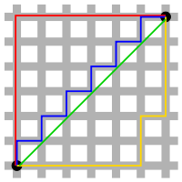
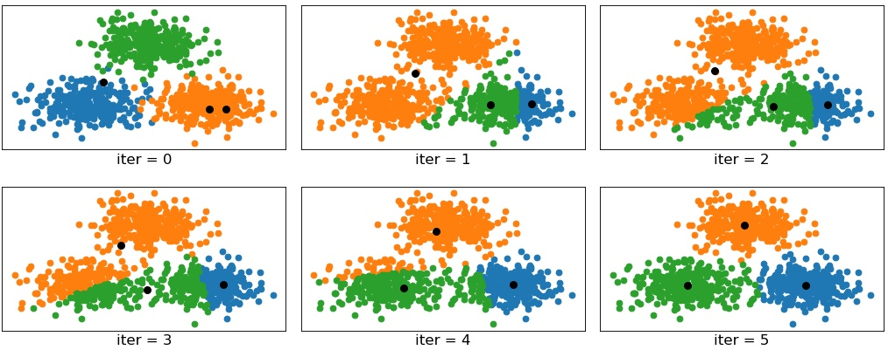
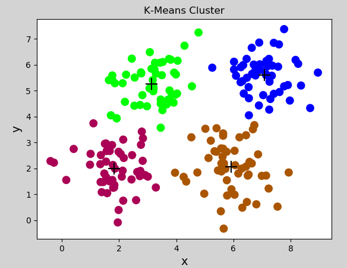
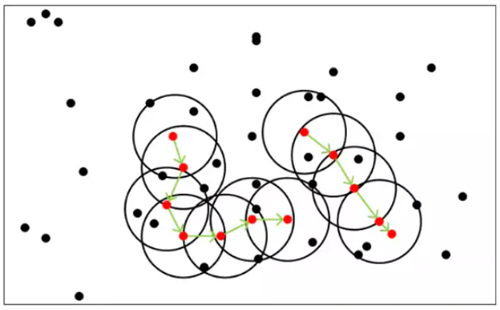
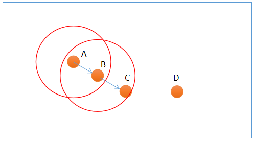
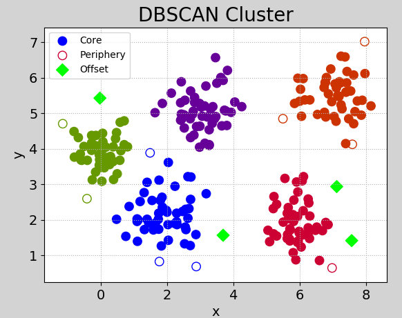
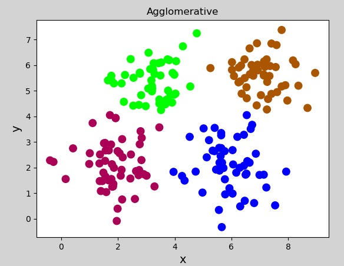
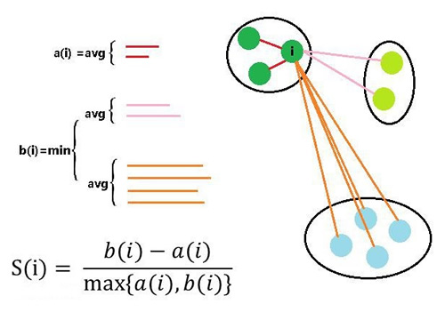

# 一、聚类问题

## 1. 概述

聚类（cluster）与分类（class）问题不同，聚类是属于无监督学习模型，而分类属于有监督学习。聚类使用一些算法把样本分为N个群落，群落内部相似度较高，群落之间相似度较低。在机器学习中，通常采用“距离”来度量样本间的相似度，距离越小，相似度越高；距离越大，相似度越低.

### 1）相似度度量方式

#### ① 欧氏距离

相似度使用欧氏距离来进行度量. 坐标轴上两点$x_1, x_2$之间的欧式距离可以表示为：
$$
|x_1-x_2| = \sqrt{(x_1-x_2)^2}
$$
平面坐标中两点$(x_1, y_1), (x_2, y_2)$欧式距离可表示为：
$$
|(x_1,y_1)-(x_2, y_2)| = \sqrt{(x_1-x_2)^2+(y_1-y_2)^2}
$$
三维坐标系中$(x_1, y_1, z_1), (x_2, y_2, z_2)$欧式距离可表示为：
$$
|(x_1, y_1, z_1),(x_2, y_2, z_2)| = \sqrt{(x_1-x_2)^2+(y_1-y_2)^2+(z_1-z_2)^2}
$$
以此类推，可以推广到N维空间.
$$
|(x_1, y_1, z_1...,n_1),(x_2, y_2, z_2,...n_2)| = \sqrt{(x_1-x_2)^2+(y_1-y_2)^2+(z_1-z_2)^2+...(n_1-n_2)^2}
$$


#### ② 曼哈顿距离

二维平面两点$a(x_1, y_1)$与$b(x_2, y_2)$两点间的曼哈顿距离为：
$$
d(a, b) = |x_1 - x_2| + |y_1 - y_2|
$$
推广到N维空间，$x(x_1, x_2, ..., x_n)$与$y(y_1, y_2, ..., y_n)$之间的曼哈顿距离为：
$$
d(x,y) = |x_1 - y_1| + |x_2 - y_2| + ... + |x_n - y_n| = \sum_{i=1}^n|x_i - y_i|
$$


在上图中，绿色线条表示的为欧式距离，红色线条表示的为曼哈顿距离，黄色线条和蓝色线条表示的为曼哈顿距离的等价长度。

#### ③ 闵可夫斯基距离

闵可夫斯基距离（Minkowski distance）又称闵氏距离，其定义为：
$$
D(x, y) = (\sum_{i=1}^n |x_i - y_i|^p)^{\frac{1}{p}}
$$

- 当$p=1$时，即为曼哈顿距离

- 当$p=2$时，即为欧式距离
- 当$p \rightarrow \infty$时，即为切比雪夫距离

可见，曼哈顿距离、欧氏距离、切比雪夫距离都是闵可夫斯基的特殊形式.

#### ④ 距离的性质

如果$dist(x,y)$度量标准为一个距离，它应该满足以下几个条件：

- 非负性：距离一般不能为负，即 $dist(x, y) >= 0$
- 同一性：$dist(x_i, y_i) = 0$，当且仅当$x_i = y_i$
- 对称性：$dist(x_i, y_i) = dist(y_i, x_i)$
- 直递性：$dist(x_i, x_j) <= dist(x_i, x_k) + dist(x_k, x_j)$

### 2）聚类算法的划分

#### ① 原型聚类

原型聚类也称“基于原型的聚类”（prototype-based clustering），此类算法假设聚类结构能通过一组原型刻画，在现实聚类任务中极为常用. 通常情况下，算法先对原型进行初始化，然后对原型进行迭代更新求解. 采用不同的原型表示、不同的求解方式，将产生不同的算法. 最著名的原型聚类算法有K-Means.

#### ② 密度聚类

密度聚类也称“基于密度的聚类”（density-based clustering），此类算法假定聚类结构能通过样本分布的紧密程度确定. 通常情况下，密度聚类算法从样本密度的角度来考察样本之间的可连接性，并基于可连接样本不断扩展聚类簇以获得最终的聚类结果. 著名的密度聚类算法有DBSCAN.

#### ③ 层次聚类

层次聚类（hierarchical clustering）试图在不同层次对数据集进行划分，从而形成树形的聚类结构. 数据集的划分可以采用“自底向上”或“自顶向下”的策略. 常用的层次聚类有凝聚层次算法等.


## 2. 常用聚类算法

### 1）K均值聚类

#### ① 定义

K均值聚类（k-means clustering）算法是一种常用的、基于原型的聚类算法，简单、直观、高效。其步骤为：

第一步：根据事先已知的聚类数，随机选择若干样本作为聚类中心，计算每个样本与每个聚类中心的欧式距离，离哪个聚类中心近，就算哪个聚类中心的聚类，完成一次聚类划分.

第二步：计算每个聚类的几何中心，如果几何中心与聚类中心不重合，再以几何中心作为新的聚类中心，重新划分聚类. 重复以上过程，直到某一次聚类划分后，所得到的各个几何中心与其所依据的聚类中心重合或足够接近为止.  聚类过程如下图所示：



注意事项：

（1）聚类数（K）必须事先已知，来自业务逻辑的需求或性能指标. 

（2）最终的聚类结果会因初始中心的选择不同而异，初始中心尽量选择离中心最远的样本.

#### ② 实现

sklearn关于k-means算法API：

```python
import sklearn.cluster as sc

# 创建模型
model = sc.KMeans(n_clusters)  # n_cluster为聚类数量

 # 获取聚类(几何)中心
centers = model.cluster_centers_  

 # 获取聚类标签（聚类结果）
pred_y = model.labels_  
```


示例代码：

```python
# k-means示例
import numpy as np
import sklearn.cluster as sc
import matplotlib.pyplot as mp
import sklearn.metrics as sm

x = []  # 没有输出（无监督学习）
with open("../data/multiple3.txt", "r") as f:
    for line in f.readlines():
        line = line.replace("\n", "")
        data = [float(substr) for substr in line.split(",")]
        x.append(data)

x = np.array(x)

# K均值聚类器
model = sc.KMeans(n_clusters=4)  # n_cluster为聚类数量
model.fit(x)  # 训练

pred_y = model.labels_  # 聚类标签（聚类结果）
centers = model.cluster_centers_  # 获取聚类(几何)中心

print("centers:", centers)
print("labels.shape:", pred_y.shape)
#print("labels:", pred_y)

# 计算并打印轮廓系数
score = sm.silhouette_score(x, pred_y,
                            sample_size=len(x),
                            metric="euclidean")  # 欧式距离度量
print("silhouette_score:", score)

# 可视化
mp.figure("K-Means Cluster", facecolor="lightgray")
mp.title("K-Means Cluster")
mp.xlabel("x", fontsize=14)
mp.ylabel("y", fontsize=14)
mp.tick_params(labelsize=10)
mp.scatter(x[:, 0], x[:, 1], s=80, c=pred_y, cmap="brg")
mp.scatter(centers[:, 0], centers[:, 1], marker="+",
           c="black", s=200, linewidths=1)
mp.show()
```

打印输出：

```
centers: [[7.07326531 5.61061224]
 [1.831      1.9998    ]
 [5.91196078 2.04980392]
 [3.1428     5.2616    ]]
labels.shape: (200,)
silhouette_score: 0.5773232071896658
```

生成图像：



#### ③ 特点及使用

- 优点

（1）原理简单，实现方便，收敛速度快；

（2）聚类效果较优，模型的可解释性较强；

- 缺点

（1）需要事先知道聚类数量；

（2）聚类初始中心的选择对聚类结果有影响；

（3）采用的是迭代的方法，只能得到局部最优解；

（4）对于噪音和异常点比较敏感. 

- 什么时候选择k-means

（1）事先知道聚类数量

（2）数据分布有明显的中心

### 2）噪声密度

#### ① 定义

噪声密度（Density-Based Spatial Clustering of Applications with Noise， 简写DBSCAN）随机选择一个样本做圆心，以事先给定的半径做圆，凡被该圆圈中的样本都被划为与圆心样本同处一个聚类，再以这些被圈中的样本做圆心，以事先给定的半径继续做圆，不断加入新的样本，扩大聚类的规模，知道再无新的样本加入为止，即完成一个聚类的划分. 以同样的方法，在其余样本中继续划分新的聚类，直到样本空间被耗尽为止，即完成整个聚类划分过程. 示意图如下：



DBSCAN算法中，样本点被分为三类：

- 边界点（Border point）：可以划分到某个聚类，但无法发展出新的样本；
- 噪声点（Noise）：无法划分到某个聚类中的点；
- 核心点（Core point）：除了孤立样本和外周样本以外的样本都是核心点；



上图中，A和B为核心点，C为边界点，D为噪声点.  此外，DBSCAN还有两个重要参数：

- 邻域半径：设置邻域半径大小；
- 最少样本数目：邻域内最小样本数量，某个样本邻域内的样本超过该数，才认为是核心点.

#### ② 实现

sklearn提供了DBSCAN模型来实现噪声密度聚类，原型如下：

```python
model = sc.DBSCAN(eps,   # 半径
                  min_samples) # 最小样本数
```

示例代码：

```python
# 噪声密度聚类示例
import numpy as np
import sklearn.cluster as sc
import matplotlib.pyplot as mp
import sklearn.metrics as sm

# 读取样本
x = []
with open("../data/perf.txt", "r") as f:
    for line in f.readlines():
        line = line.replace("\n", "")
        data = [float(substr) for substr in line.split(",")]
        x.append(data)

x = np.array(x)

epsilon = 0.8  # 邻域半径
min_samples = 5  # 最小样本数

# 创建噪声密度聚类器
model = sc.DBSCAN(eps=epsilon,  # 半径
                  min_samples=min_samples)  # 最小样本数
model.fit(x)
score = sm.silhouette_score(x,
                            model.labels_,
                            sample_size=len(x),
                            metric='euclidean')  # 计算轮廓系数
pred_y = model.labels_
print(pred_y) # 打印所有样本类别
# print(model.core_sample_indices_) # 打印所有核心样本索引

# 区分样本
core_mask = np.zeros(len(x), dtype=bool)
core_mask[model.core_sample_indices_] = True  # 核心样本下标

offset_mask = (pred_y == -1)  # 孤立样本
periphery_mask = ~(core_mask | offset_mask)  # 核心样本、孤立样本之外的样本

# 可视化
mp.figure('DBSCAN Cluster', facecolor='lightgray')
mp.title('DBSCAN Cluster', fontsize=20)
mp.xlabel('x', fontsize=14)
mp.ylabel('y', fontsize=14)
mp.tick_params(labelsize=14)
mp.grid(linestyle=':')
labels = set(pred_y)
print(labels)
cs = mp.get_cmap('brg', len(labels))(range(len(labels)))
print("cs:", cs)

# 核心点
mp.scatter(x[core_mask][:, 0],  # x坐标值数组
           x[core_mask][:, 1],  # y坐标值数组
           c=cs[pred_y[core_mask]],
           s=80, label='Core')
# 边界点
mp.scatter(x[periphery_mask][:, 0],
           x[periphery_mask][:, 1],
           edgecolor=cs[pred_y[periphery_mask]],
           facecolor='none', s=80, label='Periphery')
# 噪声点
mp.scatter(x[offset_mask][:, 0],
           x[offset_mask][:, 1],
           marker='D', c=cs[pred_y[offset_mask]],
           s=80, label='Offset')
mp.legend()
mp.show()
```

执行图像：




#### ③ 特点及使用

- 算法优点

（1）不用人为提前确定聚类类别数K；
（2）聚类速度快；
（3）能够有效处理噪声点（因为异常点不会被包含于任意一个簇，则认为是噪声）；
（4）能够应对任意形状的空间聚类.

- 算法缺点

（1）当数据量过大时，要求较大的内存支持I/O消耗很大；
（2）当空间聚类的密度不均匀、聚类间距差别很大时、聚类效果有偏差；
（3）邻域半径和最少样本数量两个参数对聚类结果影响较大.

- 何时选择噪声密度

（1）数据稠密、没有明显中心；

（2）噪声数据较多；

（3）未知聚簇的数量. 


### 3）凝聚层次聚类

#### ① 定义

凝聚层次（Agglomerative）算法，首先将每个样本看做独立的聚类，如果聚类数大于预期，则合并两个距离最近的样本作为一个新的聚类，如此反复迭代，不断扩大聚类规模的同时，减少聚类的总数，直到聚类数减少到预期值为止.  这里的关键问题是如何计算聚类之间的距离.

依据对距离的不同定义，将Agglomerative Clustering的聚类方法分为三种：

- ward：默认选项，挑选两个簇来合并，是的所有簇中的方差增加最小。这通常会得到大小差不多相等的簇。
- average链接：将簇中所有点之间平均距离最小的两个簇合并。
- complete链接：也称为最大链接，将簇中点之间最大距离最小的两个簇合并。

ward适用于大多数数据集。如果簇中的成员个数非常不同（比如其中一个比其他所有都大得多），那么average或complete可能效果更好。

#### ② 实现

sklearn提供了AgglomerativeClustering聚类器来实现凝聚层次聚类，示例代码如下：

```python
# 凝聚层次聚类示例
import numpy as np
import sklearn.cluster as sc
import matplotlib.pyplot as mp

x = []
with open("../data/multiple3.txt", "r") as f:
    for line in f.readlines():
        line = line.replace("\n", "")
        data = [float(substr) for substr in line.split(",")]
        x.append(data)

x = np.array(x)

# 凝聚聚类
model = sc.AgglomerativeClustering(n_clusters=4)  # n_cluster为聚类数量
model.fit(x)  # 训练
pred_y = model.labels_  # 聚类标签（聚类结果）

# 可视化
mp.figure("Agglomerative", facecolor="lightgray")
mp.title("Agglomerative")
mp.xlabel("x", fontsize=14)
mp.ylabel("y", fontsize=14)
mp.tick_params(labelsize=10)
mp.scatter(x[:, 0], x[:, 1], s=80, c=pred_y, cmap="brg")
mp.show()
```

执行结果：




#### ③ 特点及使用

（1）需要事先给定期望划分的聚类数（k），来自业务或指标优化；

（2）没有聚类中心，无法进行聚类预测，因为不依赖于中心的划分，所以对于中心特征不明显的样本，划分效果更佳稳定.

（3）适合于中心不明显的聚类.


## 3. 聚类的评价指标

理想的聚类可以用四个字概况：内密外疏，即同一聚类内部足够紧密，聚类之间足够疏远. 学科中使用“轮廓系数”来进行度量，见下图：



假设我们已经通过一定算法，将待分类数据进行了聚类，对于簇中的每个样本，分别计算它们的轮廓系数。对于其中的一个点 i 来说：
    a(i) = average(i向量到所有它属于的簇中其它点的距离)
    b(i) = min (i向量到各个非本身所在簇的所有点的平均距离)
那么 i 向量轮廓系数就为：
$$
S(i)=\frac{b(i)-a(i)}{max(b(i), a(i))}
$$
由公式可以得出:

（1）当$b(i)>>a(i)$时，$S(i)$越接近于1，这种情况聚类效果最好；

（2）当$b(i)<<a(i)$时，$S(i)$越接近于-1，这种情况聚类效果最差；

（3）当$b(i)=a(i)$时，$S(i)$的值为0，这种情况分类出现了重叠. 

sklearn提供的计算轮廓系数API：

```python
score = sm.silhouette_score(x, # 样本
                            pred_y, # 标签
                            sample_size=len(x), # 样本数量
                            metric="euclidean")  # 欧式距离度量
```


## 4. 总结

（1）聚类属于无监督学习；

（2）聚类是根据数据的特征，将相似度最高的样本划分到一个聚簇中；

（3）相似度的度量方式：曼哈顿距离、欧式距离、切比雪夫距离，都可以用闵式距离公式表示；

（4）聚类算法

- 基于原型聚类：k-means算法
- 基于密度聚类：DBSCAN算法
- 基金层次聚类：凝聚算法

（5）评价指标：轮廓系数

